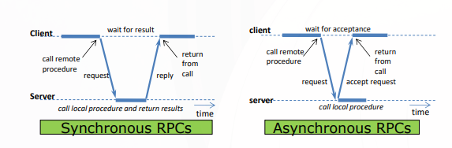
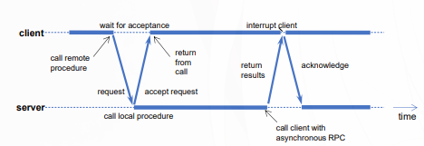

RPC（Remote Procedure Call，远程过程调用）是一种允许程序调用另一个地址空间（通常在另一台计算机上）的子程序或服务的协议。RPC 使得分布式系统中的通信变得更简单，就像调用本地函数一样。

## RPC 的基本原理

:::tip

RPC通信模块（或传输）主要基于一组通信原语(IPC): makerpc(.),
getRequest(.),和sendResponse(.)

:::

客户端存根（Client Stub）：客户端调用远程函数时，实际上调用的是客户端存根。客户端存根负责将函数调用的参数打包成消息，并通过网络发送给服务器。

1. 参数打包（封送/序列化）：把参数转换成能在网络上传输的字节流（例如把整数、浮点数、结构体等变成二进制数据包）。

2. 调用传输层：调用类似 makerpc(request_pkt, &reply_pkt) 的底层通信函数，把请求包发给服务器。

3. 等待回复（同步 RPC 时）：阻塞直到服务器返回结果包。

4. 解包结果：把收到的回复字节流反序列化成返回值或输出参数。

5. 返回给用户代码：像普通函数一样返回。

服务器存根（Server Stub）：服务器端有一个对应的服务器存根，负责接收客户端发送的请求消息，解包参数，调用实际的服务函数，并将结果打包成回复消息发送回客户端。

1. 等待请求：服务器主循环调用 getrequest(&p) 阻塞等待消息。

2. 解包请求：服务器存根将收到的字节流反序列化，提取出参数和操作码（opcode，表示要调用哪个函数）。

3. 调用本地实现：根据操作码，调用本地真正的函数，传入解包后的参数。

4. 打包结果：把函数的返回值或输出参数序列化成字节流。

5. 发送回复：调用 sendresponse() 把结果包发回客户端。

回到循环：继续等待下一个请求.

## 通过封送处理传递参数

- 程序参数和结果必须以比特的形式通过网络传输

RPC中可传递两种参数：值参数 和 引用参数

### 值参数的传递

参数本身包含了完整的数值信息，例如 int、float、char，或者按值传递的结构体。按值调用（call by value）。被调用方（服务器）对该参数的任何修改不会反映回调用方（客户端）。因为双方各有一份独立的副本。

封送方式：直接将值编码成字节序列，放入消息中。接收方解码后得到值的副本。

### 引用参数的传递

指向内存地址的引用（例如 C 语言的指针、C++ 的引用、Java 的对象引用）。在本地调用时，被调用函数可以通过指针修改调用方的变量。但是在 RPC 中，客户端和服务器是分布在不同地址空间的，无法直接共享内存地址。

| 参数类型 | 封送内容           | 网络传输          | 是否返回修改    | 语义           |
| -------- | ------------------ | ----------------- | --------------- | -------------- |
| 值参数   | 值的副本           | 单向（请求时）    | 否              | 按值调用       |
| 引用参数 | 引用指向的数据副本 | 双向（请求+响应） | 是（复制/恢复） | 模拟按引用调用 |

#### 问题1：服务器上引用参数无效

引用参数（指针）的值是客户端进程地址空间中的一个内存地址。在服务器进程中，这个地址毫无意义（甚至可能指向非法内存）。

**解决方法：** 复制机制：不能直接传递地址值，而是 **复制** 引用所指向的数据，将**数据本身**传递给服务器。

#### 问题2：引用参数的更改不会反映回客户端

即使服务器收到了数据的副本并修改了它，这些修改只存在于服务器端的副本中，客户端原来的变量不会自动更新。

**解决方法：** “复制/恢复”（copy/restore）机制：

1. 复制：客户端将引用参数所指向的数据复制出来，序列化后发送给服务器。服务器反序列化得到数据副本，修改它。
2. 恢复：服务器将修改后的数据重新序列化，发回客户端。客户端用收到的数据覆盖原引用参数指向的内存。

## 数据表示

- 数据表示必须统一
- 发送机和接收机的架构可能不同

例如，发送机是小端序（little-endian）的 x86 机器，接收机是大端序（big-endian）的 PowerPC 机器。两者对多字节数据的存储顺序不同。

## 失败独立性

- 客户端和服务器可能独立失败

## RPC的异步/同步/延迟同步

### 同步 RPC（Synchronous RPC）

客户端发出 RPC 调用后立即阻塞（停止执行），直到服务器处理完成并返回结果。交互模式是严格的请求-应答。

客户端线程被挂起，不消耗 CPU，但浪费了等待时间（客户端不能做其他工作）。

### 异步 RPC（Asynchronous RPC）

客户端发出调用后不阻塞，继续执行后面的代码。服务器收到请求后**立即返回一个确认**（ACK），表示“已收到请求，会处理”，但并**不返回实际结果**。客户端不等结果，直接继续运行。

适合不需要返回值的操作（如发送日志、触发通知、提交一个不需要确认的任务）。

### 延迟同步 RPC（Delayed Synchronous RPC）

异步 RPC 的扩展：客户端不想阻塞等待结果，但最终需要拿到结果。需要客户端和服务端两个异步rpc：

1. 客户端发起一个异步调用，服务器确认收到（ACK），客户端继续执行。
2. 当服务器处理完毕后，主动回调（callback）客户端，将结果推送给客户端（通过服务器的call-client 异步RPC）,客户端确认收到（ACK），之后处理结果

| 特性           | 同步 RPC         | 异步 RPC                | 延迟同步 RPC                         |
| -------------- | ---------------- | ----------------------- | ------------------------------------ |
| 客户端是否阻塞 | 是，直到结果返回 | 否（发送完 ACK 即继续） | 否（发送完 ACK 即继续）              |
| 能否获得结果   | 能               | 不能                    | 能（通过回调）                       |
| 服务器行为     | 处理完后回复结果 | 立即回复 ACK，异步处理  | 立即回复 ACK，处理完后主动回调客户端 |
| 网络往返次数   | 2（请求+应答）   | 2（请求+ACK）           | 2（请求+ACK）+ 2（回调+ACK）= 4      |
| 编程复杂度     | 低               | 低                      | 高（需处理回调、重试、超时）         |
| 典型应用       | 普通查询、计算   | 日志、通知、触发任务    | 长时间任务、批处理作业               |

## 拓展：RMI

RMI（Remote Method Invocation，远程方法调用）是 Java 语言中的一种 RPC 实现，允许 Java 程序调用远程对象的方法。RMI 提供了面向对象的分布式计算模型，**支持对象的远程引用和传递**。通过**远程引用模块**负责在本地和远程对象引用之间转换
