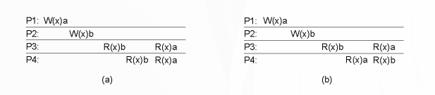
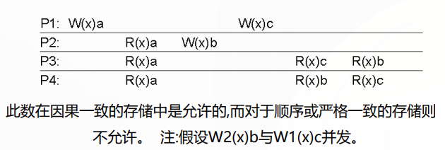
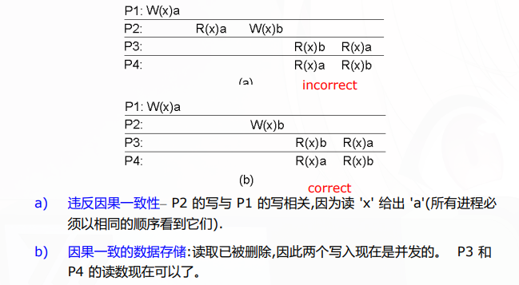
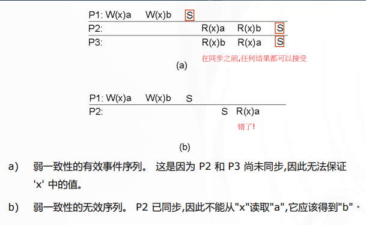
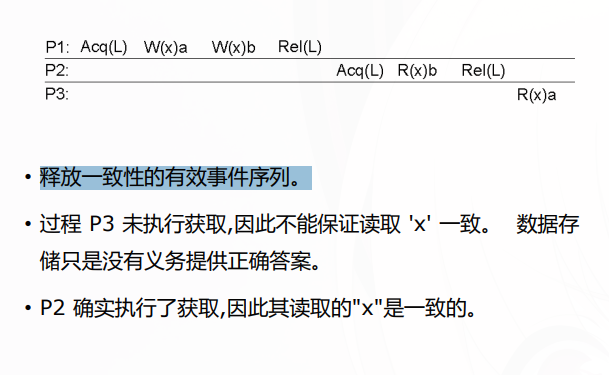

## 复制以及一致性问题

复制：

1. 提高可靠性：某个副本挂了，其他副本还能继续服务；防止数据损坏或丢失。

2. 提高性能 / 可扩展性：把数据放到离用户更近的地方（如 CDN）；分担读请求压力（如数据库读写分离）。

复制带来的问题：一致性。答案不是“完全一致”，而是选择合适的一致性模型，在性能和一致性之间做权衡。

## 一致性模型的大致分类

以数据为中心（Data-centric consistency）关注：所有副本之间的一致性

一致性模型定义了在什么条件下，多个副本对数据的访问结果是一致的。

典型模型（后面章节会细讲）：

- 严格一致性
- 顺序一致性
- 因果一致性
- FIFO一致性

以客户端为中心（Client-centric consistency）关注：单个用户看到的数据是否一致

典型模型：

- 单调读
- 单调写
- 读己之写
- 写后读

最终一致性（Eventual Consistency）只要没有新的更新，最终所有副本会一致

## 以数据为中心的一致性模型

核心抽象：操作顺序（Order）下面介绍的所有模型都在控制读写顺序

定义符号：

- `Pi` : 进程 `i`
- `x` : 数据项
- `Ri(x)v`：由进程 `i` 对数据项 `x` 的读操作，返回值 `b`

- `Wi(x)v`：由进程 `i` 对数据项 `x` 的写操作，写入值 `a`

### 严格一致性（Strict Consistency）

定义：任何对数据项 `x` 的读取,都会返回与**最近**对 `x` 的写入结果
相对应的值(无论写入发生在何处)

局限：所有写入对所有进程都**立即**可见,并且在整个 DS 中保持绝对全局时间顺序。现实中几乎不可能实现（受限于网络延迟）。

```plaintext
P1: W(x)1
------------------------------------------
P2:             R(x)1  // 立即看到 P1 的写入
```

### 顺序一致性（Sequential Consistency）

定义：任何执行的结果都是一样的,就像数据存储上所有进程的(读写)操作都以相同的顺序执行,并且每个进程的操作都按照其程序指定的顺序出现在此顺序中。所有进程都看到**相同的交错操作集**,而不管交错是什么



例如这张图里面，P1和P2的操作顺序不同，但他们的交错操作集是一样的，要么是ab，要么是ba，因此在W完成后的R操作必须看到对应的ab或ba。b)中R的交错集就不同，因此不满足顺序一致性。

局限：有了这种一致性模型,调整协议以偏向读取而不是写入(反之亦然),可能会对性能产生毁灭性的影响

### 因果一致性（Causal Consistency）

先补充一下因果和并发的概念：

- 因果关系：如果操作A的结果影响了操作B，那么A和B之间存在因果关系。比如，P1写了x=1，P2读了x=1并基于这个值写了y=2，那么P1的写操作和P2的写操作之间就有因果关系。P1的写和P2的读之间也有因果关系。
- 并发关系：非因果关系的操作称为并发。比如，P1写了x=1，P2写了y=2，这两个操作之间没有因果关系，因此是并发的。

定义：可能因果相关的写入,必须由所有进程以相同的顺序看到。 并发写入在不同的机器上可能以不同的顺序(即不同的进程)看到。

只保证有因果关系的操作（比如：我先写 a，你再读 a 再写 b）在所有副本上顺序一致。没有因果关系的操作（并发写）可以不同顺序出现。





### FIFO一致性（FIFO Consistency）

定义：单个进程所写,所有其他进程都按其发出的顺序看到,但不同进程的写入,不同进程可能以不同的顺序看到

### 弱一致性

引入同步变量

1. 对与数据存储相关的同步变量的访问是按顺序一致的。
2. 在所有先前的写入都完成之前,不允许对同步变量进行任何操作。
3. 在对同步变量的所有先前操作都执行完毕之前,不允许对数据项执行读取或写入操作



### 发布一致性（Release Consistency）

定义：

1. 当一个进程执行“获取”操作时，数据存储将确保所有受保护数据的本地副本在必要时更新，以与远程副本保持一致。
2. 当执行“释放”操作时，已更改的受保护数据将传播到数据存储的本地副本



分布式数据存储如果遵守以下规则,则为"发布一致":

1. 在对共享数据执行读写操作之前,该进程之前所做的所有获取都必须成功完成。
2. 在允许执行发布之前,进程之前的所有读取和写入都必须完成。
3. 对同步变量的访问是 FIFO 一致的(不需要顺序一致性)。

### 条目一致性（Entry Consistency）

仍使用发布获取机制

1. 在对受保护的共享数据执行所有更新之前,不允许对该进程执行同
步变量的获取访问。
2. 在允许进程对同步变量进行独占模式访问之前,其他进程不得持有
该同步变量,即使在非独占模式下也是如此。
3. 在对同步变量执行了独占模式访问之后,任何其他进程对该同步变
量的下一个非独占模式访问,在对该变量的所有者执行之前,不得执
行。

锁是和变量相关联的，获取锁之前必须保证之前对这个变量的更新已经完成，释放锁之后必须保证这个变量的更新已经传播到其他副本。

## 以客户端为中心的一致性模型

单调读

单调写

读写

写后读

