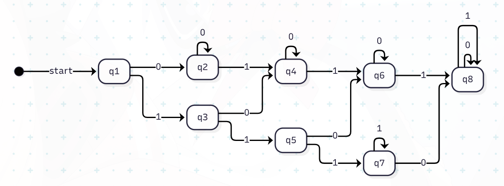
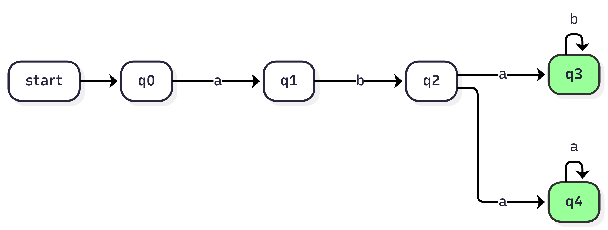
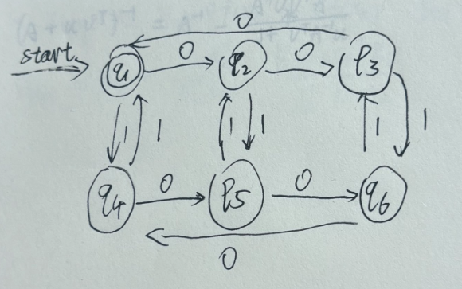
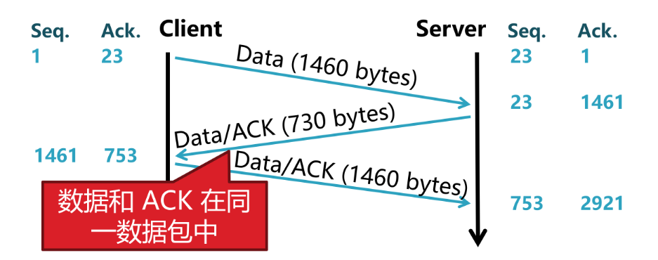

传输层（Transport Layer）是网络协议栈中的第四层，负责在网络中提供端到端的通信服务。它的主要功能包括数据传输、错误检测和纠正、流量控制以及连接管理。传输层协议主要有两种：TCP（Transmission Control Protocol）和UDP（User Datagram Protocol）。

# TCP（Transmission Control Protocol）

“TCP 报文段结构”就是 TCP 协议为每一份数据准备的一个标准化的封装格式

定义如下：



一一解读：

1. **源端口号（Source Port）**：16 位，表示发送数据的应用程序的端口号。

    :::tip

    电脑上有好多程序在用网络，端口号就是用来区分把数据交给哪个程序的。比如网页服务通常是 80 或 443。

    :::

2. **目的端口号（Destination Port）**：16 位，表示接收数据的应用程序的端口号。
3. **序列号（Sequence Number）**：32 位，表示数据在整个数据流中的位置，用于确保数据的正确顺序和重传。
4. **确认号（Acknowledgment Number）**：32 位，表示期望接收的下一个字节的序列号，用于确认已收到的数据。
5. **数据偏移（Data Offset）**：4 位，表示 TCP 头部的长度，以 32 位字为单位，指示数据开始的位置。
6. **控制标志（Control Flags）**：6 位，表示 TCP 报文段的控制信息，如 SYN、ACK、FIN 等。
7. **窗口大小（Window Size）**：16 位，表示接收方的缓冲区大小，用于流量控制。
8. **校验和（Checksum）**：16 位，表示 TCP 报文段的错误检测码，用于确保数据的完整性。
9. **紧急指针（Urgent Pointer）**：16 位，表示紧急数据的偏移量，用于指示紧急数据的位置。
10. **选项（Options）**：可选字段，长度不固定，用于扩展 TCP 的功能。

## 三次握手（Three-Way Handshake）

这个流程主要用到 序列号(Seq)、确认号(Ack) 和 控制标志中的 SYN 位。

初始状态：服务器listen某个端口，等待客户端连接。



第一步：Client 2 SERVER

Client 发送一个 SYN 报文段，表示请求建立连接，并随机生成一个初始序列号 SeqC = x。

- 此时SYN=1, ACK=0

- 客户端状态变为 SYN-SENT。

第二步：SERVER 2 Client

服务器收到 SYN 报文段后，回复一个 SYN-ACK 报文段，表示同意建立连接，并随机生成一个初始序列号 SeqS = y，同时确认号 AckC = x + 1。（x是SeqC）

- 此时SYN=1, ACK=1

- 服务器状态变为 SYN-RECEIVED。

第三步：Client 2 SERVER

客户端收到 SYN-ACK 报文段后，回复一个 ACK 报文段，表示确认连接建立，并将序列号SeqC = x+1，确认号AckS = y + 1。（y是SeqS）

- 客户端状态变为 ESTABLISHED。

- 服务器状态变为 ESTABLISHED。

:::note
第一次(Client→Server)：服务器知道客户端有发送能力。

第二次(Server→Client)：客户端知道服务器有接收和发送能力。

第三次(Client→Server)：服务器知道客户端有接收能力。
:::

### 问题

SYN Flood 攻击：攻击者发送大量 SYN 报文段，但不完成三次握手，导致服务器资源被占用，无法处理合法连接请求。

解决方案：使用 SYN Cookies 技术，在服务器收到 SYN 报文段时不分配资源，而是根据客户端的 IP 地址和端口号生成一个 Cookie，发送给客户端。只有当客户端回复 ACK 报文段时，服务器才验证 Cookie 是否有效，并分配资源。

Kevin Mitnick 的攻击：攻击者伪造源 IP 地址，发送 SYN 报文段到服务器，导致服务器回复 SYN-ACK 报文段到被伪造的 IP 地址，造成拒绝服务。

## 四次挥手（Four-Way Handshake）

双方都可以主动关闭连接，流程如下：



假设 Client 发起关闭连接：

第一步：Client 2 SERVER

Client 发送一个 FIN 报文段，表示请求关闭连接。初始化一个序列号 SeqA = x。x一般是最后发送数据的下一个字节号

- 此时FIN=1, ACK=1（ack=1是因为之前一直有数据传输）
- 客户端状态变为 FIN-WAIT-1。

第二步：SERVER 2 Client

服务器收到 FIN 报文段后，回复一个 ACK 报文段，表示确认关闭连接，并将确认号 AckA = x + 1。（x是SeqA）

- 服务器状态变为 CLOSE-WAIT。
- 客户端状态变为 FIN-WAIT-2。

此时客户端到服务器的连接已经关闭，但服务器到客户端的连接仍然开放。

第三步：SERVER 2 Client

服务器准备关闭连接时，发送一个 FIN 报文段，表示请求关闭连接，并初始化一个序列号 SeqB = y。确认号依然是 AckA = x + 1。

- 此时FIN=1, ACK=1
- 服务器状态变为 LAST-ACK。

第四步：Client 2 SERVER

客户端收到 FIN 报文段后，回复一个 ACK 报文段，表示确认关闭连接，并将序列号SeqA = x + 1，确认号 AckB = y + 1。（y是SeqB）

- 客户端状态变为 TIME-WAIT。
- 服务器状态变为 CLOSED。

MSL 是“报文最大生存时间”。客户端在进入 TIME-WAIT 后，要等待 2 倍 MSL 时间才能完全关闭。

### 四次挥手的原因

因为 TCP 是全双工的。
当一方说“我发完了”(FIN)，另一方必须确认收到（ACK），但这不代表另一方也马上发完了。它可能还有数据要发送。

### TIME-WAIT 为什么要等 2MSL

两个原因：

1. 确保最后一个 ACK 能重传

    如果第四次挥手的 ACK 丢失了，服务器会因为没有收到 ACK 而超时重发 FIN。
    客户端在 TIME-WAIT 状态若收到重发的 FIN，会重传 ACK，重置 2MSL 计时器，保证服务器最终能收到 ACK 并关闭。

2. 让旧连接的所有残留报文在网络中消失
确保这个连接曾经产生的所有报文都超时消散，不会干扰到下一次相同 IP/端口组合的新连接。

## TCP的字节流

在TCP眼里，**没有应用程序层面的消息边界**。应用层交给TCP的数据，就像一条**连续的**、无边界的字节河流。TCP负责把这条河里的水（字节）可靠地、按顺序地送到对岸。

实现核心： 序号

- TCP为流中的每一个字节(包括数据和控制信息，信号本身也要被编号和确认)都分配一个唯一的序号。

- TCP的序号字段是**32位**的，能表示大约40亿个序号。

- 在高速网络下，这个空间会被快速用完，然后“绕回”重新开始。
- 序号初始的值是随机的，通常是一个较大的随机数，以增加安全性。

报文段中的 **序列号（Sequence Number）** 字段表示这个报文段中数据载荷第一个字节的**序号**。



## TCP的流量控制与滑动窗口

发送方不能无脑发，必须根据接收方的处理能力来，这就是流量控制。

解决方案：滑动窗口协议

接收者通过 TCP 报文段中的 **广告窗口大小（Advertised Window Size）** 字段告诉发送者它的缓冲区还有多少空间可以用来接收数据。
发送方会据此确保：已发送但未确认的数据量 ≤ 接收方通告的窗口大小。

发送者维护一个**发送窗口**，表示当前可以发送但尚未收到确认的数据范围。窗口会随着 ACK 的到来而**滑动**。

例如：

滑动窗口的关键变量

- 窗口大小 (Win)：接收方告知的缓冲区剩余空间（流量控制），这里假设为 2000 字节。

- 左边界 (L)：发送方接收到的最小连续确认号，即 “期待收到的下一个ACK”。

- 右边界 (R)：左边界 + 窗口大小，即 “最多能发送到的字节序号”。

- 发送指针 (S)：已经发送出去，但还未确认的最高序号。

在 ASCII 图中，我们用不同符号表示字节的状态：

- 已发送且已确认的字节（可以释放空间了）

- 已发送但未确认的字节（必须保留在缓冲区，准备重传）

- 可发送但尚未发送的字节（可用窗口内的剩余空间）

- 窗口外，暂时不允许发送的字节（受流量控制约束）

```text
          L=1001             S=1500          R=3001
         ↓                    ↓               ↓
字节序号: 1 ────────────────────┼───────────────┼───────────────┼───────→ ...
状态:     [-------- 已确认 -----][+++++ 已发送 ++][*** 可发送 ***][##### 窗口外 #####]
          <----1~1000---------> <- 1001~1500 -> <- 1501~3000-> <- 3001+ -->
```

解读：

1~1000 字节已被对方确认，可以释放。

窗口左边界 L=1001：因为确认号是 1001，说明 1000 之前都收到了。

1001~1500 是“已发送未确认”，我用 + 号表示。

1501~3000 是“可发送未发送”，我用 * 号表示。

窗口总大小 = 2000 字节，所以 R = 1001 + 2000 = 3001。

3001 之后当前不允许发送，直到窗口滑动。

假设现在接收方回复了一个 ACK = 1501（这通常是累积确认，表示 1500 及之前全收到）。

```plaintext
            旧左边界                                        旧右边界
            L_old=1001                                     R_old=3001
            ↓                                               ↓
字节序号:   1 ───────────── 1001 ────────── 1501 ──────────── 3001 ───── 3501 ───→ ...
           
           ←── 新已确认 ──────────────────→      [++++++++++][***************]
                                                       
新窗口:                  L_new=1501            R_new=3501
                        ↓                      ↓
状态:     [-------- 已确认 --------][++ 已发送 ++][*** 可发送 ***][##### 窗口外 #####]
           <- 1~1500 -><- 1501~? -><- ?~3501 -><- 3501+
```

收到 ACK=1501，意味着 1~1500 字节都已被确认。左边界 L 从 1001 滑动到 1501。

窗口大小不变（2000），因此右边界 R 从 3001 滑动到 3501。

整个窗口区段 [L, R) 整体向右平移了 500 字节。

图中 ++ 部分（1501 到某个已发送指针）可能继续存在（如果之前有预发送未确认的数据），而新的可用窗口 *** 扩展到 3501。
