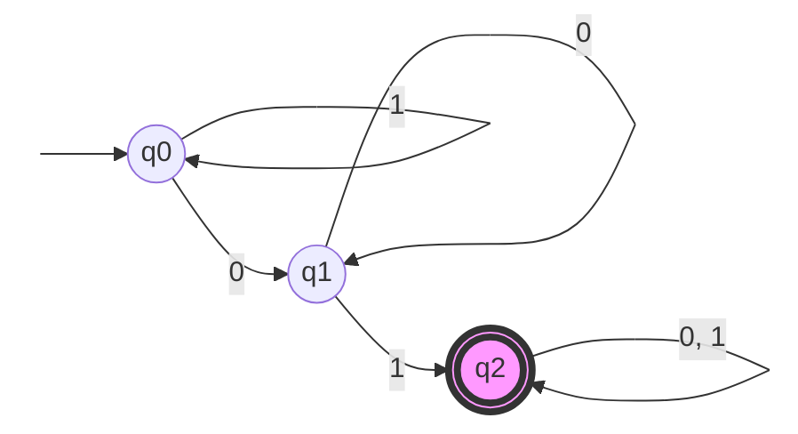

## 确定的有穷自动机

定义：一个确定的有穷自动机（DFA）是一个五元组$A$ ,$(Q, \Sigma, \delta, q_0, F)$，其中：

- $Q$ 是一个有限的状态集合。
- $\Sigma$ 是一个有限的输入符号集合，称为字母表。
- $\delta$ 是一个状态转移函数，定义为 $\delta: Q \times \Sigma \to Q$，它描述了在给定状态和输入符号的情况下自动机如何转移到下一个状态。
- $q_0$ 是初始状态，$q_0 \in Q$。
- $F$ 是一个接受状态集合，$F \subseteq Q$，它包含了所有的接受状态。

DFA 的工作原理如下：

一条纸带 + 一个读头 + 一张控制表

例如：给出一个 DFA，它接受所有 至少包含一次子串 "01" 的二进制串（即 0 后面紧跟一个 1）。

我们可以定义这个 DFA 的五元组如下：

- $Q = \{q_0, q_1, q_2\}$，其中 $q_0$ 是初始状态，$q_1$ 是状态“已看到 0”，$q_2$ 是接受状态。
- $\Sigma = \{0, 1\}$。
- $\delta$ 定义如下：
    $$
    \delta(q_0, 0) = q_1\\
    \delta(q_0, 1) = q_0\\
    \delta(q_1, 0) = q_1\\
    \delta(q_1, 1) = q_2\\
    \delta(q_2, 0) = q_2\\
    \delta(q_2, 1) = q_2
    $$
- $q_0$ 是初始状态。
- $F = \{q_2\}$ 是接受状态集合。

### 状态转移图

状态转移图是DFA的等价定义

定义：

- 状态转移图是一个有向图，其中每个节点代表一个状态 $q$，

- 每条有向边代表一个输入符号引起的状态转移。边上的标签表示输入符号。$\delta(q, a) = p$ 表示从状态 $q$ 出发，输入符号 $a$ 后转移到状态 $p$。
- 开始状态q0用一个start+箭头指向它，接受状态用双圈表示。

对于上面的例子，状态转移图如下：

### 状态转移表

定义：

- 每个状态q对应一行，每个输入符号a对应一列
- 表格中的值表示$\delta(q, a)=p$的结果状态。

- 开始状态q0用一个箭头指向它，接受状态用星号\*表示。

对于上面的例子，状态转移表如下：

|             状态 | 输入0 | 输入1 |
| ---------------: | ----- | ----: |
| $\rightarrow$ q0 | q1    |    q0 |
|               q1 | q1    |   *q2 |
|              *q2 | q2    |    q2 |

## 拓展转移函数

定义：

拓展转移函数 $\hat{\delta}$ 是状态转移函数 $\delta$ 的扩展，用于处理输入字符串而不是单个符号。

$$
\begin{aligned}
\hat{\delta}(q, \epsilon) &= q \\[6pt]
\hat{\delta}(q, wa) &= \delta(\hat{\delta}(q, w), a)
\end{aligned}
$$

其中 $q$ 是一个状态，$w\in\Sigma^*$ 是一个字符串，$a\in\Sigma$ 是一个输入符号，$\epsilon$ 是空字符串.

我们可以通过数学归纳法来证明: $\forall q \in Q,\quad x, y \in \Sigma^*, \quad\hat{\delta}(q, xy) = \hat{\delta}(\hat{\delta}(q, x), y)$.

证明：

对字符串 $y$ 的长度进行归纳:

- 基础情况：当 $y = \epsilon$ 时，$\hat{\delta}(q, x\epsilon) = \hat{\delta}(q, x) = \hat{\delta}(\hat{\delta}(q, x), \epsilon)$，结论成立。
- 归纳假设：假设对于长度为 $n$ 的字符串 $w$，结论成立，即 $\hat{\delta}(q, xw) = \hat{\delta}(\hat{\delta}(q, x), w)$。
- 归纳步骤：对于长度为 $n+1$ 的字符串 $y = wa$，其中 $w$ 是长度为 $n$ 的字符串，$a$ 是一个输入符号。根据定义，我们有：

$$
\begin{aligned}
\hat{\delta}(q, xwa) &= \delta(\hat{\delta}(q, xw), a) \quad \text{（根据定义）} \\
&= \delta(\hat{\delta}(\hat{\delta}(q, x), w), a) \quad \text{（根据归纳假设）} \\
&= \hat{\delta}(\hat{\delta}(q, x), wa) \quad \text{（根据定义（从右往左））}
\end{aligned}
$$
