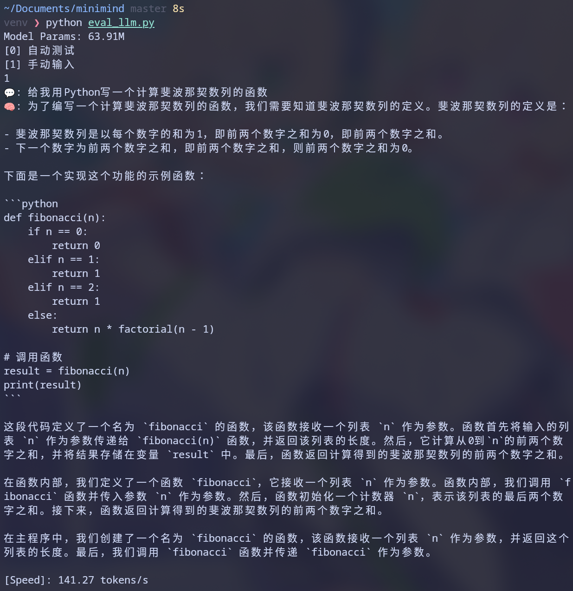

## 1. 训练环境

| 项目    | 配置                      |
| ------- | ------------------------- |
| GPU     | NVIDIA A100-SXM4-80GB × 1 |
| CUDA    | 12.8                      |
| Driver  | 570.133.20                |
| Python  | 3.12                      |
| PyTorch | 2.x                       |

### 项目整体结构

MiniMind 的学习主线可以压缩为下面这条数据和参数流：

```text
原始文本/对话/偏好数据
        │
        ▼
dataset/lm_dataset.py
        │  tokenization + padding + loss mask
        ▼
model/model_minimind.py
        │  Embedding → Decoder Blocks → LM Head
        ▼
trainer/train_pretrain.py
        │
        ├── Pre-training：学习下一个 Token
        ▼
trainer/train_full_sft.py
        │
        ├── SFT：只对 assistant 回复计算损失
        ▼
trainer/train_dpo.py
        │
        └── DPO：提高 chosen 相对 rejected 的概率
```

### 模型架构

本次训练使用 MiniMind 默认配置，未启#用 MoE：

| 参数                | 值          |
| ------------------- | ----------- |
| `hidden_size`       | 768         |
| `num_hidden_layers` | 8           |
| `use_moe`           | 0           |
| 总参数量            | **63.91M**  |
| 可训练参数量        | **63.912M** |

这是一个 8 层 Decoder-only Transformer，约 6400 万参数，属于极轻量级 LLM。对比 GPT-2 Small（124M 参数）小约一半

## 第一阶段：Pre-training（预训练）

### 预训练目标

标准自回归语言建模（Causal LM）：给定前文 token 序列，预测下一个 token，使用交叉熵损失。

数据格式：每行一条纯文本 `{"text": "一段中文文本..."}`。

### 训练参数

```bash
python train_pretrain.py \
  --batch_size 128 \
  --max_seq_len 512 \
  --num_workers 0 \
  --epochs 1 \
  --data_path ../dataset/pretrain_t2t_mini.jsonl
```

| 参数                 | 值                        | 说明                        |
| -------------------- | ------------------------- | --------------------------- |
| `batch_size`         | 128                       | 每步处理 128 条样本         |
| `max_seq_len`        | 512                       | 每条序列最多 512 token      |
| `epochs`             | 1                         | 训练 1 轮                   |
| `learning_rate`      | 5e-4                      | 余弦退火，峰值 5e-4         |
| `accumulation_steps` | 8                         | 梯度累积（等效 batch=1024） |
| `dtype`              | bfloat16                  | 混合精度训练                |
| 数据集               | `pretrain_t2t_mini.jsonl` | 127 万条中文文本，约 1.2GB  |

### 训练日志

训练共 9924 步，耗时约 55 分钟。Loss 从初始的 7.2 持续下降至 2.25：

| Step | Loss   | ETA    |
| ---- | ------ | ------ |
| 100  | 7.2061 | 57 min |
| 500  | 5.8286 | 54 min |
| 1000 | 4.3968 | 51 min |
| 2000 | 3.2656 | 45 min |
| 3000 | 2.7209 | 40 min |
| 4000 | 2.5131 | 34 min |
| 5000 | 2.3837 | 28 min |
| 6000 | 2.3750 | 22 min |
| 7000 | 2.3283 | 16 min |
| 8000 | 2.2877 | 11 min |
| 9000 | 2.3555 | 5 min  |
| 9924 | 2.2545 | 0 min  |

Loss 下降趋势平滑，说明模型在有效学习中文语言的统计规律。最终 loss 2.25 意味着模型对每个 token 的平均困惑度（perplexity）约为 $e^{2.25} \approx 9.5$，即平均从约 10 个候选词中选一个。
原始日志见
[log-pretrain.txt](https://github.com/biscuit0613/minimind/blob/master/log-pretrain.txt)。

### 输出

```
out/pretrain_768.pth  (约 131.3 MiB, 63.91M 参数)
```

## 第二阶段：SFT（监督微调）

### SFT目标

在预训练权重基础上，用对话数据（问答对）进行监督微调。核心区别：仅对 assistant 回复部分计算损失，忽略 user 和 system 部分。这样模型学会的是「如何回答」而非「如何提问」。

数据格式：每行一组对话 `{"conversations": [{"role": "user", "content": "..."}, {"role": "assistant", "content": "..."}]}`。

### SFT训练参数

```bash
python train_full_sft.py \
  --batch_size 64 \
  --max_seq_len 512 \
  --num_workers 0 \
  --epochs 1 \
  --from_weight pretrain \
  --data_path ../dataset/sft_t2t_mini.jsonl
```

| 参数            | 值                   | 说明                                |
| --------------- | -------------------- | ----------------------------------- |
| `batch_size`    | 64                   | 每步 64 条对话                      |
| `max_seq_len`   | 512                  | 序列长度同预训练                    |
| `learning_rate` | 1e-5                 | 远低于预训练的 5e-4，防止灾难性遗忘 |
| `from_weight`   | pretrain             | 基于预训练权重初始化                |
| 数据集          | `sft_t2t_mini.jsonl` | 对话数据，约 1.6GB                  |

### 关键机制

SFT 与预训练的核心区别在于 **损失掩码（Loss Mask）**：

```python
# SFTDataset.generate_labels() 的逻辑：
# 1. 初始所有位置 label = -100（PyTorch 交叉熵忽略）
# 2. 扫描 token 序列，找到 "assistant\n" 标记
# 3. 找到对应的 "<eos>\n" 标记
# 4. 将两者之间的 token 标记为真实 token ID（参与损失计算）
```

这样确保模型只学习生成 assistant 的回复内容，不学习 user 的提问。

### SFT输出

```
out/full_sft_768.pth  (约 131.3 MiB, 63.91M 参数)
```

本次训练共 14152 步，最终记录 loss 为 1.8913。原始日志见
[sft-log.txt](https://github.com/biscuit0613/minimind/blob/master/sft-log.txt)。

## 第三阶段：DPO（偏好优化）

### DPO目标

在 SFT 模型基础上，利用人类偏好数据（chosen vs rejected 对比）进行偏好对齐。DPO 的核心思想是：让模型对「好回答」的概率高于「差回答」，同时用参考模型（冻结的 SFT 模型）作为锚点，防止策略模型偏离太远。

### DPO 损失函数

DPO 损失公式为：

$$
\mathcal{L}_{\text{DPO}} = -\log \sigma \left( \beta \cdot \left[ \log \frac{\pi_\theta(y_c|x)}{\pi_\theta(y_r|x)} - \log \frac{\pi_{\text{ref}}(y_c|x)}{\pi_{\text{ref}}(y_r|x)} \right] \right)
$$

其中：

- $\pi_\theta$：策略模型（可训练）
- $\pi_{\text{ref}}$：参考模型（冻结的 SFT 模型）
- $y_c$：chosen 回复（好回答）
- $y_r$：rejected 回复（差回答）
- $\beta$：温度参数，控制偏离参考模型的惩罚力度
- $\sigma$：sigmoid 函数

直觉理解：当策略模型对 chosen 的偏好与参考模型一致时，$\log \frac{\pi_\theta(y_c)}{\pi_\theta(y_r)} - \log \frac{\pi_{\text{ref}}(y_c)}{\pi_{\text{ref}}(y_r)} > 0$，sigmoid 接近 1，loss 接近 0；当策略模型开始偏好 rejected 时，该项为负，sigmoid 接近 0，loss 迅速增大。

### DPO 训练参数

```bash
python train_dpo.py \
  --batch_size 8 \
  --max_seq_len 512 \
  --num_workers 0 \
  --epochs 1 \
  --beta 0.15 \
  --from_weight full_sft \
  --data_path ../dataset/dpo.jsonl
```

| 参数            | 值          | 说明                                        |
| --------------- | ----------- | ------------------------------------------- |
| `batch_size`    | 8           | DPO 每步同时处理 chosen + rejected 两份数据 |
| `learning_rate` | 4e-8        | 极低学习率，避免灾难性遗忘                  |
| `beta`          | 0.15        | DPO 温度参数                                |
| `from_weight`   | full_sft    | 策略模型和参考模型都基于 SFT 权重           |
| 数据集          | `dpo.jsonl` | 偏好对比数据，约 53MB                       |

### DPO 关键机制

DPO 与 SFT 的关键区别：

1. **双模型架构**：同时加载策略模型（可训练）和参考模型（冻结），参考模型提供「锚点」
2. **数据格式**：每条数据包含 chosen（好回答）和 rejected（差回答）两套对话
3. **损失计算**：不是交叉熵，而是 sigmoid-based 的偏好对比损失
4. **梯度只更新策略模型**：参考模型完全不参与梯度计算

### DPO 输出

```
out/dpo_768.pth  (约 131.3 MiB, 63.91M 参数)
```

本次训练共 2146 步，最终记录 DPO loss 为 0.5031。原始日志见
[dpo-log.txt](https://github.com/biscuit0613/minimind/blob/master/dpo-log.txt)。

## 权重文件汇总

| 文件               | 阶段     | 大小          | 参数量 | 公开状态 |
| ------------------ | -------- | ------------- | ------ | -------- |
| `pretrain_768.pth` | 预训练   | 约 131.3 MiB | 63.91M | 本地保留 |
| `full_sft_768.pth` | 监督微调 | 约 131.3 MiB | 63.91M | [Hugging Face](https://huggingface.co/biscuitzzz/minimind-full-sft-lora) |
| `dpo_768.pth`      | 偏好优化 | 约 131.3 MiB | 63.91M | 本地保留 |

三个文件使用相同模型结构，只是参数值不同，因此文件大小基本一致。目前公开仓库只提供 SFT 和 LoRA 权重，不声称 Pre-training 与 DPO 权重已上传。

## 本地推理测试

将权重文件下载到本地后，即可进行推理测试：

```bash
# 测试 SFT 模型
python eval_llm.py --weight full_sft

# 测试 DPO 模型
python eval_llm.py --weight dpo

# 测试预训练模型（纯文本补全，无对话能力）
python eval_llm.py --weight pretrain
```


