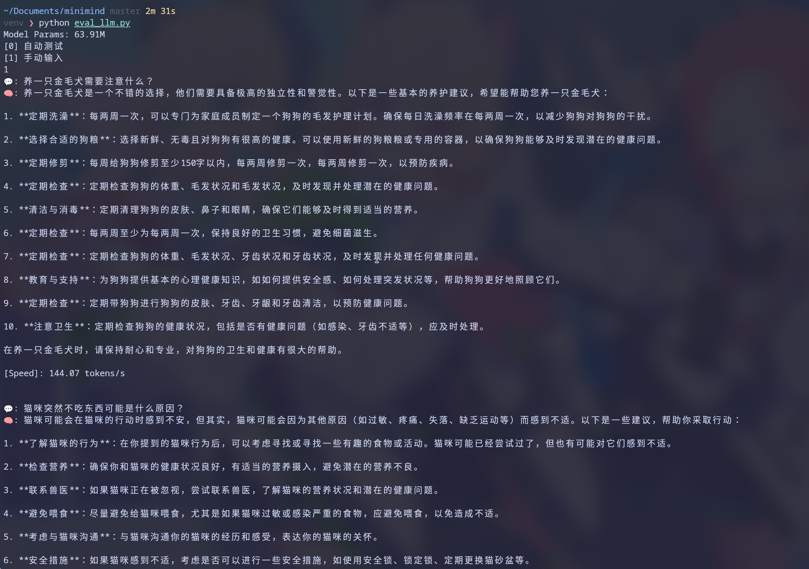
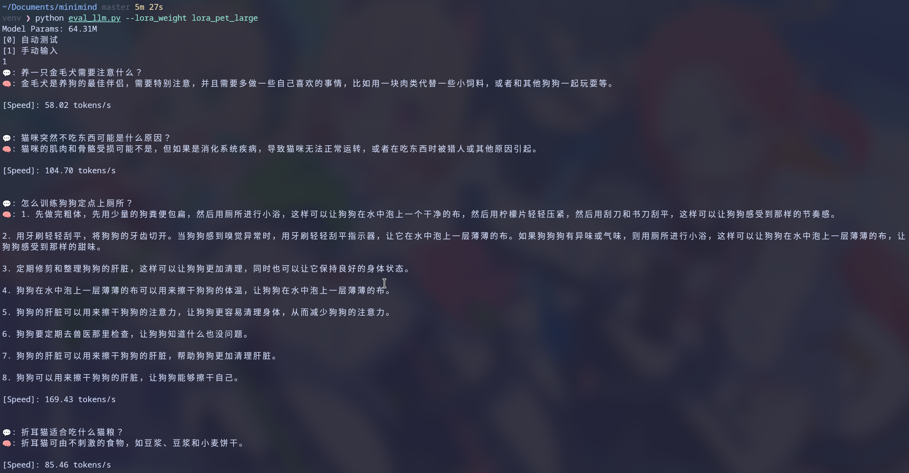

## 数据

[Chinese-QA-Agriculture_Forestry_Animal_Husbandry_Fishery](https://huggingface.co/datasets/Mxode/Chinese-QA-Agriculture_Forestry_Animal_Husbandry_Fishery)

dataset/lora_pet_large.jsonl

16,688 条问答约 5.1MB

该数据来自中文农林牧渔问答集，经过宠物关键词筛选和去重。

## 配置

```python
  python train_lora.py \
    --lora_name lora_pet_large \
    --data_path ../dataset/lora_pet_large.jsonl \
    --from_weight full_sft \
    --epochs 5 \
    --batch_size 32 \
    --max_seq_len 340 \
    --num_workers 0 \
    --save_interval 500 \
    --device cuda:0 \
    --dtype bfloat16
```

 |                  |                          |
 | ---------------- | ------------------------ |
 | 模型             | MiniMind hidden_size=768 |
 | 基座             | full_sft_768.pth         |
 | 设备             | NVIDIA A100              |
 | LoRA rank        | 16                       |
 | 可训练 LoRA 参数 | 约 0.393M                |
 | 每个 epoch       | 522 steps                |
 | 总训练步数       | 2610                     |

训练结果：

最终 loss：约 2.4389LoRA 权重：out/lora_pet_large_768.pth
  
推理命令：

```python
python eval_llm.py \
    --weight full_sft \
    --lora_weight lora_pet_large
```

LoRA 虽然只训练约 0.393M 参数，但增量仍然可能显著改变小模型的行为分布。

可以参考lora前后的输出对比，同样的prompt：





现象更像是 LoRA 训练后的能力退化：宠物问题有些关键词命中，但回答出现明显幻觉和重复

baseline 虽然代码也错，但至少尝试写循环；LoRA 直接返回 [0,1] 固定值，结合lora训练数据里没有代码，应该是覆盖了原始能力

比较有意思的是平均输出从 384 tokens 降到 100 tokens，模型变 **干脆** 了。可能是lora训练集中对话数据的长度分布偏短，导致模型在生成时更倾向于输出短文本。
