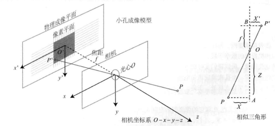
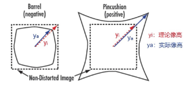

## 1 针孔相机模型

相机的成像相机的成像可以近似为小孔成像模型，如上图所示。空间一点$P$发出光线，光线经过光心$o$，照在成像平面上形成像点$P’$，设光心所在平面与像素平面平行，距离为焦距$f$，点$P$到光心所在平面的距离为$Z$，则根据相似三角形可得
$$
\frac{Z}{f} = -\frac{X}{X'} = -\frac{Y}{Y'}
$$

其中$X,Y$代表$P$点在光心平面坐标系$xoy$下的坐标，$X', Y'$代表$P'$点在成像平面的坐标，表达式中负号代表反像，但是相机中会自动翻转图像，可以去掉负号，可得
$$
X' = f \frac{X}{Z} \\
Y' = f \frac{Y}{Z}
$$

## 2 相机内参

在实际相机中，可将镜头（群）视为一个等效凸透镜，光心则为该透镜的中心。大多数情况下，光心所在平面为镜头的前切面，然而具体还得翻阅相机和镜头的参数手册和使用手册。

成像平面为镜头的焦平面，也是相机中CCD/CMOS 传感器（统称图像传感器）所在的平面。从光学成像角度来说，当相机和镜头搭配使用时，应尽量满足观察目标的成像面与图像传感器平面重合，这样才能获得最佳成像结果。

图像传感器上是由一个个像素单元组成，因此在图像传感器上适用的是像素坐标系和图像坐标系。

**像素坐标系**的定义：以像素为单位的坐标系。以图像左上角为原点，向右为$x$轴正方向，向下为$y$轴正方向，每个像素可以用一个有序二元组$(u,v)$来表示，这个坐标系就叫做像素坐标系。像素坐标系是一个二维坐标系，标识了在每个像素在图像传感器中的位置，每次增量是1个像素。

**图像坐标系**的定义：以真实物理尺寸为单位的坐标系。像素坐标系中的标号为$(u,v)$，其中$u$轴每个像素对应实际物理尺寸$dx$，$v$轴每个像素对应实际物理尺寸$dy$，因此图像坐标系是一个对应真实世界的尺寸二维坐标系，可以记为$(X’,Y’)$ 。图像坐标系的原点在光轴上，因此图像坐标系与像素坐标系间存在平移。
像素坐标系和图像坐标系有如下关系
$$
\begin{cases}
    u = \alpha X' + c_x \\
    v = \beta Y' + c_y
\end{cases}
$$
$\alpha$、$\beta$分别为$x$、$y$方向缩放因子，$c_x$、$c_y$分别为$x$、$y$方向平移
代入针孔相机模型表达式，并取$f_x = \alpha f, f_y = \beta f$，可得
$$
\begin{cases}
    u = f_x \frac{X}{Z} + c_x \\
    u = f_y \frac{Y}{Z} + c_y
\end{cases}
$$
写成矩阵
$$
\begin{bmatrix}
    u \\ v \\ 1
\end{bmatrix} = \frac{1}{Z}
\begin{bmatrix}
    f_x & 0 & c_x \\
    0 & f_y & c_y \\
    0 & 0 & 1
\end{bmatrix}
\begin{bmatrix}
    X \\ Y \\ Z
\end{bmatrix} = \frac{1}{Z} K P
$$
可以看出，矩阵$K$仅与相机和镜头本身有关，称$K$为相机的内参矩阵。

## 3 相机外参

在计算相机内参的过程中，适用的是$P$在相机坐标系下的坐标，而$P$在世界坐标系下也存在着一个坐标，称为世界坐标。设相机坐标系下的坐标为 $P$, 世界坐标系下的坐标为 $P_w$。根据坐标变换，存在旋转矩阵 $R$ 和平移矩阵 $t$，满足
$$
P = RP_W+t = TP_w
$$
这时可以发现相机的位姿可以用 $R,t$ 完全描述，称 $R,t$ 为相机外参。
因此可以得到像素坐标和世界坐标的关系
$$
ZP_{uv} = Z \begin{bmatrix}
    u \\ v \\ 1
\end{bmatrix} = K(RP_w+t)=KTP_w
$$

## 4 相机畸变

相机畸变是在图像边缘处使得成像目标的几何形状和几何关系发生变化的现象，主要有以下两种：

1. **径向畸变**：与光轴夹角较大的入射光线在成像时放大率变化较大产生的畸变。主要分为**桶形畸变**和**枕形畸变**

   

2. **切向畸变**：透镜与成像平面不完全平行所产生的畸变。

畸变参数主要有**径向参数**和**切向参数**。

径向参数随着离中心距离增加而增加，我们通常假设这种畸变满足多项式关系，即
$$
\begin{aligned}
    x_{corrected}=x(1+k_1r^2+k_2r^4+k_3r^6) \\
    y_{corrected}=y(1+k_1r^2+k_2r^4+k_3r^6)
\end{aligned}
$$
切向参数可以使用$p_1,p_2$进行纠正
$$
\begin{aligned}
    x_{corrected} = x+2p_1xy+p_2(r^2+2x^2) \\
    y_{corrected} = y+2p_2xy+p_1(r^2+2y^2)
\end{aligned}
$$
合并可得
$$
\begin{aligned}
    x_{corrected}=x(1+k_1r^2+k_2r^4+k_3r^6)+2p_1xy+p_2(r^2+2x^2) \\
    y_{corrected}=y(1+k_1r^2+k_2r^4+k_3r^6)+2p_2xy+p_1(r^2+2y^2)
\end{aligned}
$$
得到畸变参数矩阵：$[k_1,k_2,p_1,p_2,k_3]$

再投影到像素平面，可得
$$
\begin{cases}
    u=f_xx_{corrected}+c_x\\
    v=f_yy_{corrected}+c_y
\end{cases}
$$
这里我们注意畸变参数不一定用5个，使用的数量取决于使用的相机成像情况。在实际标定的时候如果有些参数没有显示出来就是0。

## 5 相机标定

相机标定的方法很多，比较常用的是[张正友标定法](https://blog.csdn.net/qq_64079631/article/details/127984760)，这里不做过多描述。

对上述内容如果还有疑问，可以参考阅读[这里](https://blog.csdn.net/weixin_43206570/article/details/84797361)
