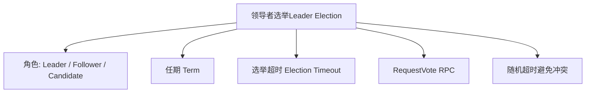
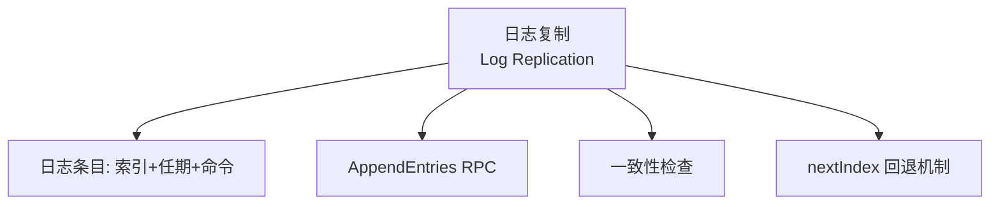
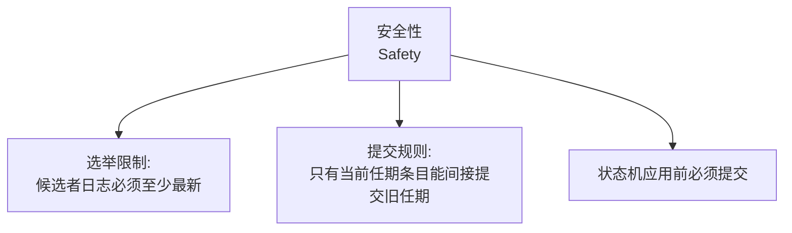
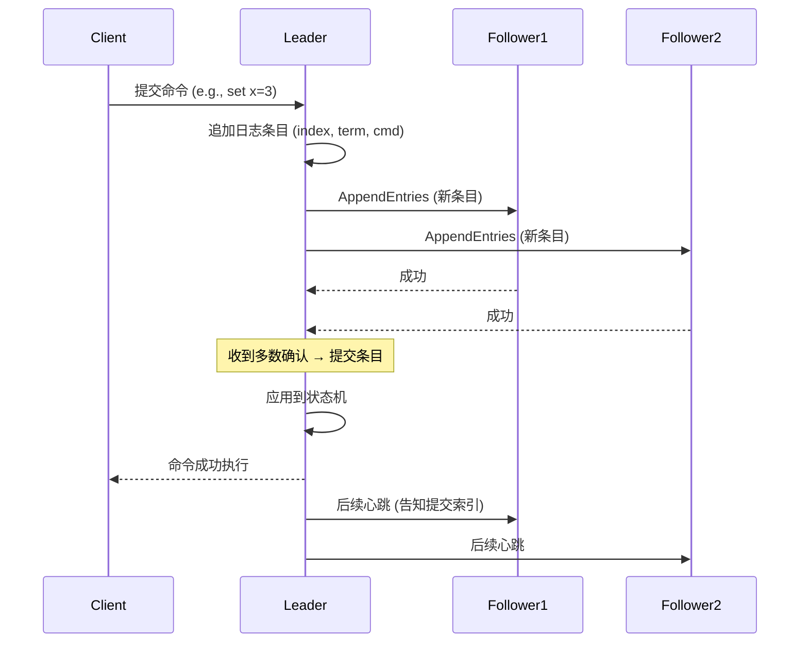
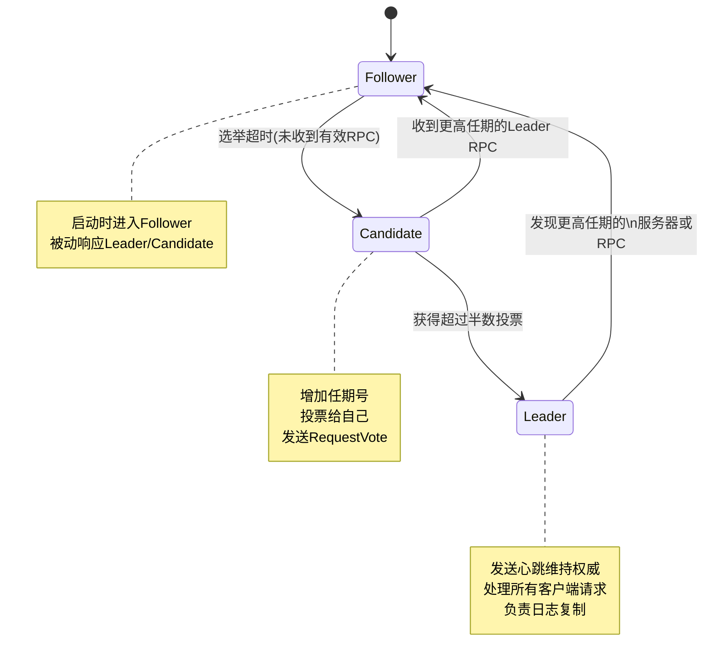
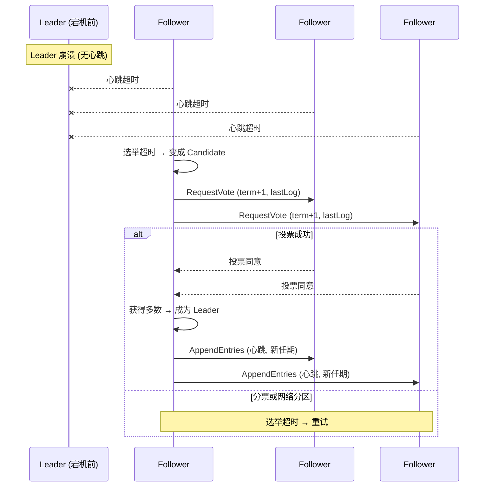
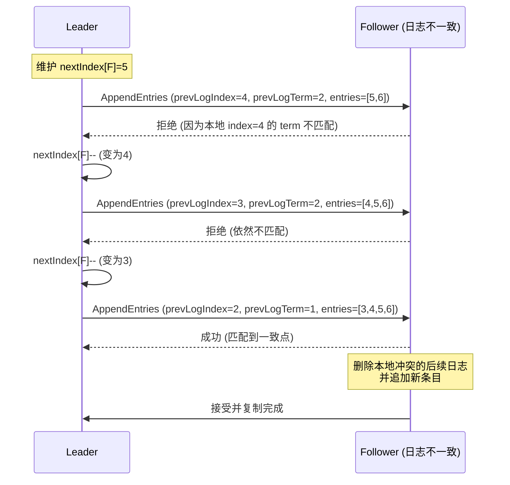

RAFT 是一种分布式一致性算法，旨在在分布式系统中实现可靠的状态复制和一致性。RAFT 通过选举一个领导者节点来协调集群中的操作，确保所有节点都保持一致的状态。

概念全景图：

## 服务器角色

- 领导者（Leader）：处理所有客户端请求，负责日志复制，发送心跳，同一时刻最多一个
- 追随者（Follower）：被动接受领导者的日志复制和心跳，只响应 Leader 和 Candidate 的 RPC，不主动发起操作
- 候选者（Candidate）：当追随者没有收到领导者的心跳时，会变成候选者并发起选举，试图成为新的领导者。

## 任期（Term）

- 时间被划分为连续的整数任期。

- 每个任期开始于一次选举，如果选举成功，则一个 Leader 管理整个任期。

- 有些任期可能因选举失败（分票）而没有 Leader。

- 任期是一个逻辑时钟，用于检测过期的信息（如旧的 Leader）。

## 领导者选举流程

触发条件：Follower 在选举超时（一般 100~500ms）内未收到 Leader 的心跳。变成 Candidate：

- 增加当前任期号。

- 给自己投票。
- 向所有其他服务器并发发送 RequestVote RPC。

结果三种可能：

1. 获得超过半数投票 → 成为 Leader，立即发送心跳维持权威。
2. 收到合法 Leader 的 RPC → 退回 Follower。
3. 选举超时无人胜出 → 增加任期，重开新一轮选举。

避免平局：选举超时时间随机（例如 100~200ms 之间），使一个服务器大概率先发起选举并获胜。

## 日志复制（正常操作）

客户端命令只发给 Leader。

Leader 将命令作为日志条目追加到本地日志（包含：索引、任期、命令）。

Leader 通过 AppendEntries RPC 并行复制到所有 Follower。

当条目被超过半数节点复制后，Leader 提交该条目，应用到状态机，并通知客户端。

### 日志结构

每个日志条目由 (索引, 任期, 命令) 标识。

索引从 1 开始连续递增。

日志存储在持久化介质（磁盘），崩溃恢复后保留。

### 日志特性

两个不同服务器上的相同索引和任期的日志条目，它们存储的命令一定相同。

并且在该条目之前的所有日志也完全一致（通过一致性检查保证）。

### 日志不一致

Leader 为每个 Follower 维护 nextIndex：下一个要发送的日志索引。

当 AppendEntries 的一致性检查失败（Follower 在 prevLogIndex 处没有匹配的条目），Leader 会递减 nextIndex 并重试。

最终 Follower 会删除冲突的日志（及之后所有条目），以 Leader 的日志为准。

leader 宕机，触发选举操作

日志不一致，触发日志回退机制

