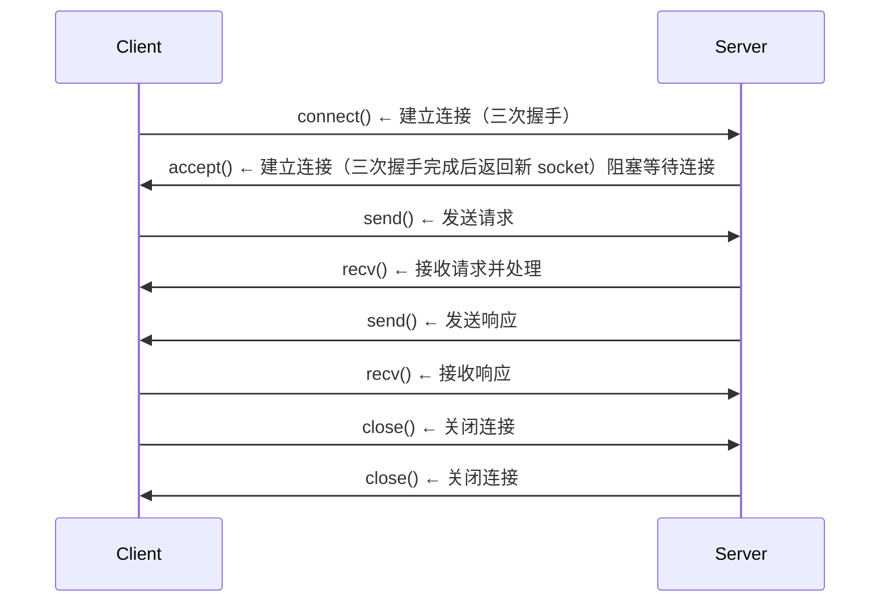

| 维度           | TCP                             | UDP                       |
| -------------- | ------------------------------- | ------------------------- |
| **基本机制**   | 面向连接（connection-oriented） | 无连接（connectionless）  |
| **通信前提**   | 必须三次握手建立连接            | 不需要连接，直接发送      |
| **通信模型**   | 一对一连接（点对点）            | 一对多 / 多对多（无状态） |
| **数据单位**   | 字节流（stream）                | 报文（datagram）          |
| **边界**       | ❌ 无边界（可能拆包/粘包）       | ✅ 保持消息边界            |
| **可靠性**     | ✅ 可靠（确认+重传）             | ❌ 不可靠                  |
| **顺序保证**   | ✅ 有序                          | ❌ 可能乱序                |
| **丢包处理**   | 自动重传                        | 不处理                    |
| **重复数据**   | 自动去重                        | 可能重复                  |
| **流量控制**   | ✅ 有（滑动窗口）                | ❌ 无                      |
| **拥塞控制**   | ✅ 有（慢启动等）                | ❌ 无                      |
| **传输开销**   | 大（头部+控制）                 | 小                        |
| **延迟**       | 较高                            | 较低                      |
| **吞吐稳定性** | 稳定                            | 不稳定                    |
| **适用场景**   | 文件传输、HTTP、RPC             | 视频、语音、DNS           |

| 角色               | TCP 行为                        | UDP 行为                                |
| ------------------ | ------------------------------- | --------------------------------------- |
| **Server 初始化**  | socket → bind → listen → accept | socket → bind                           |
| **是否监听连接**   | ✅ listen + accept               | ❌ 不需要                                |
| **是否区分客户端** | ✅ 每个 client 一个 socket       | ❌ 通过地址区分                          |
| **接收数据**       | recv()（已建立连接）            | recvfrom()（带来源地址,让目标知道来源） |
| **发送数据**       | send()                          | sendto()（必须指定地址）                |

## Socket 套接字

Socket（套接字）是应用层与传输层之间的编程接口，用于实现**进程之间**的网络通信。他封装了传输协议层(TCP/UDP)的细节。

Socket 被归类为 IPC 基元（进程间通信原语），位于传输层（TCP/UDP）之上、远程调用之下的中间件层中

Socket = IP地址 + 端口号 + 协议（TCP/UDP）

### UDP-socket

特点：

- 无连接：发送数据前不需要建立连接，适合广播和多播。
- 不可靠：数据包可能丢失、重复或乱序。没有确认或重传
- 适用于实时应用，如视频会议、在线游戏等。
- 发送者必须显示将消息碎片化（548bytes）
- 接收者应有一个缓冲区来存储接收的数据包

通信流程

服务端：

```plaintext
socket()
bind()
recvfrom()
sendto()
close()
```

客户端：

```plaintext
socket()
sendto()
recvfrom()
close()
```

1. Server在已知端口sp处打开UDP套接字SS
2. SS等待客户端请求
3. Client在任意端口cp处打开UDP套接字CS
4. CS向serverIP+端口sp发送请求
5. Server接收请求并处理
6. Server通过SS向clientIP+端口cp发送响应

:::tip

sendto()和recvfrom()函数中需要指定目标的IP地址和端口号。

服务端通过recvfrom()函数获取客户端的IP地址和端口号，以便发送响应。

:::

### TCP-socket

特点：

- 面向连接：通信前需要建立连接，适合可靠的数据传输。
- 可靠：数据包按顺序传输，丢失时会重传。
- 适用于文件传输、电子邮件等需要可靠通信的应用。
- 可以发送任意大小的数据，TCP会负责分段和重组。
- 有拥塞控制调节发送者的速率防止网络过载

通信流程

服务端：

:::tip
accept()函数会阻塞等待客户端连接请求，三次握手完成后**返回一个新的socket**用于通信。后续通信用的是 accept 返回的 socket，而不是最初创建的监听 socket。
:::

```plaintext
socket()
bind()
listen()
accept()   ← 建立连接（三次握手完成后返回新 socket）阻塞等待连接
recv/send
close()
```

客户端：

```plaintext
socket()
connect()  ← 建立连接（三次握手）
recv/send
close()
```

时序：



通信机制：

1. Server在已知端口sp处打开TCP套接字SS
2. SS监听端口sp等待客户端连接请求
3. Client在任意端口cp处打开TCP套接字CS
4. CS向serverIP+端口sp发送连接请求（三次握手）
5. Server接受连接请求，SS在一个新端口nsp上创建一个新的套接字SS2与客户端通信
6. Client和Server通过CS和SS2进行通信
