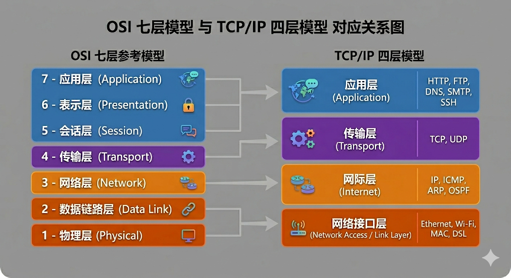

## 构成模块

节点：网络中的计算机或设备，能够发送、接收和处理数据。

主机：网络中的计算机或设备，能够发送、接收和处理数据。

交换机

路由器

链接

点对点

多址

### 网络的递归定义

网络是由节点和链接组成的系统，其中节点可以是主机、交换机或路由器，链接可以是点对点或多址的连接。网络可以递归地定义为一个由节点和链接组成的系统，其中每个节点都可以是一个网络。

### 地址和路由

地址：网络中每个节点的唯一标识符，用于定位和通信。

路由：根据地址，网络中数据包从源节点到目的节点的路径选择过程。

## 相关技术

### 多路复用

允许多个信号或者多个通信绘画在同一条物理线路上同时传输而互不干扰。分为

- 时分复用TDM：将时间划分为多个等长时隙，让多个信号轮流占用这些时隙
- 频分复用FDM：将物理信道的总带宽频率划分为多个频段，让多个信号同时占用不同的频段
- 按需分时
- 按数据包调度链接，不同来源的数据包在链路上交错，争夺链路的缓冲数据包，缓冲区（队列）溢出称为拥塞

## 进程间通信（IPC）抽象

分为两种，一种是request/reply，一种是Stream-based

- request/reply：客户端发送请求，服务器处理请求并返回响应。这种模式适用于需要明确请求和响应的场景，如HTTP协议。例如分布式文件系统，数字图书馆，分布式数据库等。
- Stream-based：数据以连续的流形式传输，适用于需要持续数据传输的场景，如视频流、音频流等。例如视频帧的顺序，网站点播视频，视频会议等

## 网络的分层架构

网络的分层架构是一种设计原则，将网络功能划分为不同的层次，每一层负责特定的功能，并通过接口与其他层进行通信。

分层的规矩理论上来说有三种，一种是OSI七层模型，另一种是TCP/IP四层模型，还有一种是教学时候常用的五层模型。虽然 OSI 模型在学术研究和理论分析中非常重要，但 TCP/IP 模型才是目前互联网运行的实际工业标准。（感谢gemini的配图）

## 来点形式化的定义

### 通用的形式化框架

一个协议层 $L_i$ 是一个计算实体，$i$ 越大层数越高，提供两个接口：

- **服务接口** $S_i$ ：在此协议(层)上为上层 $L_{i+1}$ 层提供的操作
- **对等接口** $P_i$ ：在此协议(层)上与对端相同层 $L_i$ 交换消息的语法和语义。

第 $L_i$ 层接受来自 $L_{i+1}$ 层的**服务数据单元 (SDU)**，将其封装成 **协议数据单元 (PDU)** 后交给 $L_{i-1}$ 层。$L_i$ 层还接受来自 $L_{i-1}$ 层的 PDU，**解封装**后将 SDU 交给 $L_{i+1}$ 层。

形式化目标：$L_i$ 屏蔽 $L_{i-1}$ 层的实现细节，向 $L_{i+1}$ 层提供一个抽象接口 $S_i$，使得 $L_{i+1}$ 层不需要关心 $L_{i-1}$ 层的实现细节。

下面的分层按照 TCP/IP 模型来讲解（）里面表示OSI模型的对应层：

### 物理层 $L_1$

- 输入：比特流 $B={b_1, b_2, ..., b_n},b_k \in {0,1}$

- 输出：物理信号如电压、电流、光信号等

- 功能：将离散比特编码为适合在物理介质上传播的连续信号，并在接收端解码回比特，同时处理时序、同步和基本调制。

用Media 表示物理介质，如电缆、光纤、无线信道等，$S$ 表示物理信号的集合，如电压、电流、光信号等。物理层 $L_1$ 的功能可以形式化定义为一个**映射** $\Phi_{L_1}$，将输入的比特流 $B$ 和物理介质 $Media$ 映射到输出的物理信号 $S$：

$$
\Phi_{L_1}: B \times Media \rightarrow S
$$

要求存在 **逆映射** 在给定信噪比下以概率 $P_{success}>1-\epsilon$ 成功地从物理信号 $S$ 恢复出原始比特流 $B$：

### 数据链路层 $L_2$

- 输入：来自网络层的帧 $F$（比特序列）

- 输出：封装后的帧 $F'$（比特序列）加上定界符，差错检验码等
- 功能：相邻节点之间提供可靠（或尽力而为）的帧传输；同时提供介质访问控制：在多节点共享介质上，定义调度策略 $\sigma$ 使得冲突概率最小化。

对应的映射如下

$$
\Phi_{L_2}: F \rightarrow (F,CRC(F),Delimiter)
$$

### 网络层 $L_3$

- 输入：来自传输层的数据报文 $D$ 加上目标地址 $Addr_{dest}$

- 输出：封装后的数据包 $D'$ 并选择路由 $\rho$
- 功能：
  - 寻址：全局唯一地址
  - 路由：根据拓扑和策略计算路径
  - 分组转发：逐跳将数据包推向目的地
  - （可选）分片与重组

对于一个网络图 $G=(V,E)$，其中 $V$ 是节点集合，$E$ 是边集合，有**路由**表示可行的边

$$
\rho: V \times V \rightarrow 2^E
$$
