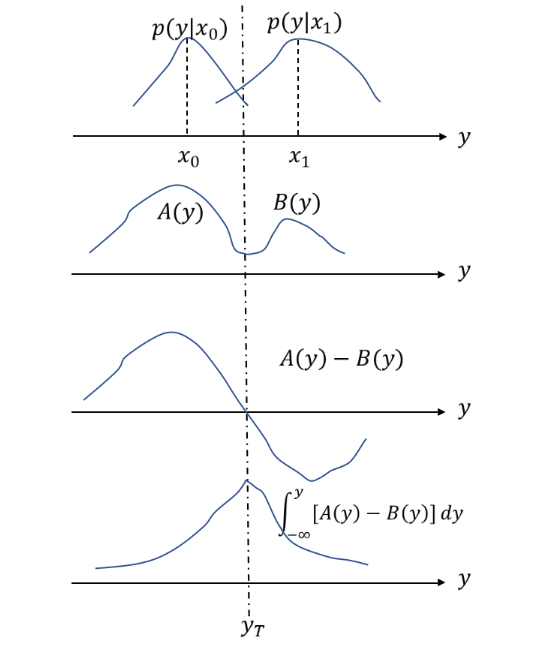

将分类问题转化成一个通信问题

接收到的信号可以看作一个时间t的函数

$$
x(t) = \underbrace{s(t)}_{\text{信号}} + \underbrace{n(t)}_{\text{噪声}}
$$

对于信号 $s(t)$，我们有两种假设：

- $H_0$: $s(t) = 0$（没有信号，只有噪声）
- $H_1$: $s(t) \neq 0$（有信号）

如果有多个信号参数，那么就是多分类问题

对于分类错误的代价，这里以二元假设检验为例，用 $C_{ji}$ 表示在假设 $H_i$ 为真(真实类别为 $i$)时，将信号判断为 $H_j$ （判断成 $j$）的代价。$i,j \in \{0, 1\},0 \rightarrow H_0, 1 \rightarrow H_1$

| 代价符号 | 真实情况 | 判断结果 | 名称         | 取值            |
| -------- | -------- | -------- | ------------ | --------------- |
| $C_{00}$ | $H_0$    | $H_0$    | 正确拒绝     | 0               |
| $C_{10}$ | $H_0$    | $H_1$    | 误报(假阳性) | 1(正数作为惩罚) |
| $C_{01}$ | $H_1$    | $H_0$    | 漏报(假阴性) | 1(正数作为惩罚) |
| $C_{11}$ | $H_1$    | $H_1$    | 正确接受     | 0               |

## 检验准则的推导

假设发送的信号为 $x_0,x_1$,接收信号 $y$ ，接收空间为 $S_y$ 。那么状态转移概率为 $P(y|x_0),P(y|x_1)$ 分别表明接收方把每个发送信号转移到 $S_y$ 中任意一点的概率

用 **阈值 $y$** 把接收空间 $S_y$ 划分成两部分：$S_{y_0}$ 和 $S_{y_1}$ 。如果 $y \in S_{y_0}$ 就判定为 $x_0$，如果 $y \in S_{y_1}$ 就判定为 $x_1$。

关注出现错误error的概率：

$$
\alpha =\int_{S_{y_0}} P(y|x_1) dy ,\quad \text{漏报率}x_1\rightarrow x_0\\
\beta =\int_{S_{y_1}} P(y|x_0) dy ,\quad \text{误报率}x_0\rightarrow x_1\\
$$

于是可以定义发送一个$x_0$或$x_1$的平均代价$C_0$和$C_1$：

$$
\begin{aligned}
C_0 &= (1-\beta)C_{00} + \beta C_{10}  \\
C_1 &= (1-\alpha)C_{11} + \alpha C_{01}
\end{aligned}
$$

更进一步，如果知道了发送$x_0$和$x_1$的先验概率 $P(x_0),P(x_1)$，就可以计算**发送一个信号**的平均代价：

$$
C_M = P(x_0)C_0 + P(x_1)C_1
$$

展开后得到：

$$
\begin{aligned}
C_M &= P(x_0)C_0 + P(x_1)C_1 \\
&= P(x_0)[(1-\beta)C_{00} + \beta C_{10}] + P(x_1)[(1-\alpha)C_{11} + \alpha C_{01}] \\
&=\underbrace{P(x_0)C_{00} + P(x_1)C_{11}}_{\text{基础代价(全部正确)}} + \underbrace{\beta[P(x_0)(C_{10} - C_{00})]}_{\text{误报代价}} + \underbrace{\alpha[P(x_1)(C_{01} - C_{11})]}_{\text{漏报代价}}
\end{aligned}
$$

这里的 $\alpha$ 和 $\beta$ 分别表示漏报率和误报率。还可以继续展开

先利用

$$
\int_{S_{y_0}} P(y|x_1) dy + \int_{S_{y_1}} P(y|x_1) dy = 1\\[1ex]
\alpha = 1 - \beta
$$

$C_M$继续展开为：

$$
C_M = P(x_0)C_{00} + P(x_1)C_{11} + \int _{S_{y_1}} [P(x_0)(C_{10} - C_{00})P(y|x_0)]dy +\int _{S_{y_0}} [P(x_1)(C_{01} - C_{11})P(y|x_1)] dy
$$

随便找个空间，统一积分号的下标：

$$
C_M = P(x_0)C_{00} + P(x_1)C_{11} + \int _{S_{y_1}} [P(x_0)(C_{10} - C_{00})P(y|x_0) - P(x_1)(C_{01} - C_{11})P(y|x_1)] dy
$$

为了方便，定义

$$
A(y)=P(x_0)(C_{10} - C_{00})P(y|x_0) \\
B(y)=P(x_1)(C_{01} - C_{11})P(y|x_1)
$$

$A(y)$ : 观测到y且真实类别为 $x_0$ ，如果错判为 $x_1$ 会产生的风险增量，度量了在点 $y$ 误报的代价。

$B(y)$ : 观测到y且真实类别为 $x_1$ ，如果错判为 $x_0$ 会产生的风险增量，度量了在点 $y$ 漏报的代价。

所以

$$
C_M = P(x_0)C_{00} + P(x_1)C_{11} + \int _{S_{y_1}} [A(y) - B(y)] dy
$$

由于 $C_{00},C_{11}$ 是正确分类的代价，通常取值为0，所以基础代价为0。剩下的误报代价和漏报代价都是正数。**找一个判决阈值 $y$ 就是最小化代价**，也就是最小化积分号的部分：

图解如下

$$
\boxed{
\begin{aligned}
&\argmin_{S_{y_1}} \int _{S_{y_1}} [A(y) - B(y)] dy\\
&\text{或}\\
&\argmin_{S_{y_0}} \int _{S_{y_0}} [B(y) - A(y)] dy
\end{aligned}
}
$$

显然，A=B满足最小化条件，所以判决准则为：

$$
\boxed{
\frac{P(y|x_1)}{P(y|x_0)} \gtrless \frac{P(x_0)(C_{10} - C_{00})}{P(x_1)(C_{01} - C_{11})}
}
$$

对应的y

$$
y=\begin{cases}
    1,\quad \text{上式取大于号}\\
    0,\quad \text{上式取小于等于号}
\end{cases}
$$

太长了不好记，定义

- $L(y) = \dfrac{P(y|x_1)}{P(y|x_0)}$ 为似然比

- $\lambda = \dfrac{P(x_0)(C_{10} - C_{00})}{P(x_1)(C_{01} - C_{11})}$ 为检测阈值

基于这个式子，有如下三种判别准则

### 贝叶斯准则

则贝叶斯准则：

$$
L(y) \gtrless \lambda
$$

解 $y$ 就是判决阈值

- 贝叶斯准则需要知道损失函数 $C_{ij}$ 和先验概率 $P(x_i)$，以及状态转移概率 $P(y|x_i)$，在实际应用中可能很难获得这些信息。

### 最大后验概率准则

如果损失函数不知道，可以简单假设错误判决的代价为1，正确判决的代价为0，即 $C_{10} = C_{01} = 1$ 和 $C_{00} = C_{11} = 0$，则检测阈值 $\lambda$ 简化为：

$$
\lambda = \frac{P(x_0)}{P(x_1)}
$$

最大后验概率准则：

$$
\frac{p(y|x_1)}{p(y|x_0)} \gtrless \frac{P(x_0)}{P(x_1)}\\
$$

又

$$
\frac{p(y|x_1)}{p(y|x_0)} = \frac{P(x_1|y)P(y)}{P(x_1)}\cdot\frac{P(x_0)}{P(y)P(x_0|y)}
$$

所以最大后验概率准则等价于：

$$
\frac{p(x_1|y)}{p(x_0|y)} \gtrless 1
$$

### 最大似然准则

损失函数和先验概率都不知道，假设错误判决的代价为1，正确判决的代价为0，即 $C_{10} = C_{01} = 1$ 和 $C_{00} = C_{11} = 0$，以及先验概率相等 $P(x_0) = P(x_1)$，则检测阈值 $\lambda$ 简化为：

$$
\frac{P(y|x_1)}{P(y|x_0)} \gtrless 1
$$
