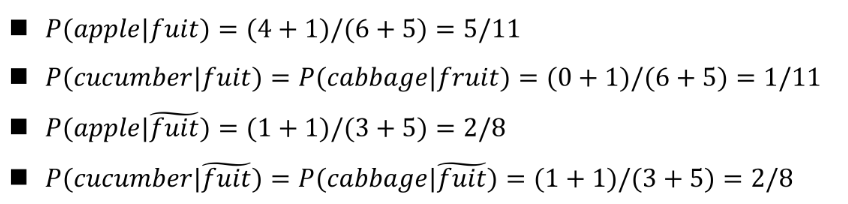
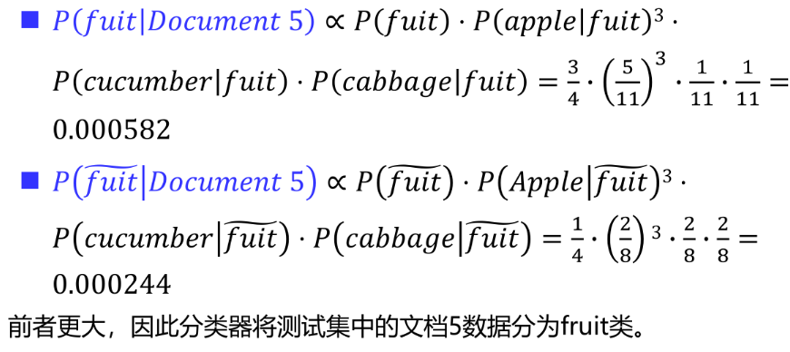

## 贝叶斯定理 (Bayes' Theorem)

设事件 $B$ 已经发生，需要评估哪个 事件 $A_i$ 最有可能导致 $B$ 的发生。贝叶斯定理提供了一个计算后验概率的公式:

$$
P(A_i | B) =\frac{P(AB)}{P(B)} = \frac{P(B | A_i) P(A_i)}{P(B)}=\frac{P(B | A_i) P(A_i)}{\sum_j P(B | A_j) P(A_j)}
$$

- 先验概率：$P(A_i)$，表示在观察到事件 $B$ 之前对事件 $A_i$ 的信念。
- 似然函数：$P(B | A_i)$，表示在事件 $A_i$ 发生的条件下事件 $B$ 发生的概率。
- 后验概率：$P(A_i | B)$，表示在观察到事件 $B$ 之后对事件 $A_i$ 的信念。

后验 $\propto$ 似然 $\times$ 先验。后验概率与先验概率成正比，比例系数由似然函数决定。

有两种优化函数：

- 最大后验概率 (MAP)：$\hat{A} = \arg\max_{A_i} P(A_i | B)=\arg\max_{A_i}{P(B | A_i) P(A_i)}$
- 最大似然估计 (MLE)：$\hat{A} = \arg\max_{A_i} P(B | A_i)$

后验概率考虑了先验知识，而最大似然估计只关注数据本身的似然性。选择哪种方法取决于具体问题和可用的信息。

## 生成式模型和判别式模型

生成式模型：建模 **联合概率分布** $P(\mathbf{x}, \mathbf{\omega})$，可以通过 $P(\mathbf{\omega} | \mathbf{x}) = \frac{P(\mathbf{x} | \mathbf{\omega}) P(\mathbf{\omega})}{P(\mathbf{x})}$ 来进行分类。

判别式模型：直接建模 **条件概率分布** $P(\mathbf{\omega} | \mathbf{x})$，不关心特征的分布。

:::note
生成式模型可以导出判别式模型，但判别式模型不能导出生成式模型。
:::

判别式模型通常转化为：

- 最大似然
- 交叉熵最小化
- 本质是一个优化问题

从邮件分类的实际例子来看：

### 用生成式模型（朴素贝叶斯）来分类邮件

统计：

- 先验：$P(\text{垃圾邮件})$ 和 $P(\text{正常邮件})$，可以通过历史数据中垃圾邮件和正常邮件的比例来估计。
- 似然：$P(\text{邮件内容} | \text{垃圾邮件})$ 和 $P(\text{邮件内容} | \text{正常邮件})$，可以通过分析邮件内容中出现的词汇来估计。

计算：

- 后验：$P(\text{垃圾邮件} | \text{邮件内容})$ 和 $P(\text{正常邮件} | \text{邮件内容})$，通过贝叶斯定理计算，选择概率较大的类别作为分类结果。

能解释这个被分类成垃圾邮件的邮件为什么被分类成垃圾邮件

### 用判别式模型（逻辑回归）来分类邮件

直接假设：存在一个函数，可以把特征 x （邮件内容）映射到类别概率。一个比较常见的模型是逻辑回归。后文会讲到

## 生成式模型-贝叶斯分类器

数据 → 概率建模 → 后验推断 → 判别函数 → 决策规则 → 决策边界

特征向量 $\mathbf{x} = (x_1, x_2, ..., x_n)$，类别 $\mathbf{\omega}={\mathbf{\omega}_1, \mathbf{\omega}_2, ..., \mathbf{\omega}_c}$，我们想要计算 $P(\mathbf{\omega} | \mathbf{x})$，即在给定特征 $\mathbf{x}$ 的条件下类别 $\mathbf{\omega}$ 的概率。

对 $P(\mathbf{\omega} | \mathbf{x})$ 应用贝叶斯定理：

$$
P(\mathbf{\omega} | \mathbf{x}) = \frac{P(\mathbf{x} | \mathbf{\omega}) P(\mathbf{\omega})}{P(\mathbf{x})}
$$

这里面符号的语义

- $P(\mathbf{\omega})$：类别 $\mathbf{\omega}$ 的**先验概率**。在没有看到任何数据之前，种类 $\mathbf{\omega}$ 的概率。

    在数据中体现为：测试集中类别 $\mathbf{\omega}$ 的频率。

- $P(\mathbf{x} | \mathbf{\omega})$：**似然/类条件概率**。如果种类是 $\mathbf{\omega}$, 那么特征向量呈现为 $\mathbf{x}$ 的概率。 用条件概率形式表示，以强调是**同一类别**事物的内部特征的概率分布。

    贝叶斯分类器的变体往往基于对 $P(\mathbf{x} | \mathbf{\omega})$ 的不同假设来构建。

- $P(\mathbf{\omega} | \mathbf{x})$：在给定特征 $\mathbf{x}$ 的条件下类别 $\mathbf{\omega}$ 的**后验概率**。

    用贝叶斯定理计算，常常对数化。
- $P(\mathbf{x})$：特征 $\mathbf{x}$ 的**边缘概率**。对所有类别的特征 $\mathbf{x}$ 的概率进行求和。

    在分类时是常数，可以忽略。

## 整体流程

### 问题建模与数据准备

- **定义类别**：确定分类任务有 $c$ 个类别 $\omega_1, \omega_2, \dots, \omega_c$。

- **特征提取**：确定描述样本的特征向量 $\mathbf{x}$。
- **划分数据集**：获取有标签的训练集 $D = (\mathbf{x}_1, y_1), \dots, (\mathbf{x}_n, y_n)$。

### 概率密度估计方法

如何获得 $p(\mathbf{x}|\omega_i)$ 和 $P(\omega_i)$ ，重点关注 $p(\mathbf{x}|\omega_i)$。

- **方法A（参数法）**：假设已知 $p(\mathbf{x}|\omega_i)$ 的参数形式（如高斯分布、伯努利分布）。唯一未知的是参数 $\theta_i$（如 $\mu, \Sigma$）。
- **方法B（非参数法）**：不假设任何分布形式，直接从数据中“拼凑”出密度函数。

### 估计类条件概率密度 $p(\mathbf{x}|\omega_i)$（训练）

**参数估计（如高斯分布）** 的假设前提

1. 假设类条件概率的分布长这样：$P(\mathbf{x}|\omega_i) = P(\mathbf{x}|\omega_i;\theta_i)$。
2. 独立同分布：同一类别的样本是独立同分布的随机变量。

#### **最大似然估计 (ML)**

对于某一类 $\omega_i$ 的数据集：$D_i = \{\mathbf{x}_j | y_j = \omega_i\}$

似然$L(\theta_i) = P(D_i | \theta_i) = \prod_{j=1}^{N_i} P(\mathbf{x}_j | \omega_i; \theta_i)$。

- 对数化 $l(\theta_i) = \ln P(D_i | \theta_i)= \sum_{j=1}^{N_i} \ln P(\mathbf{x}_j | \omega_i; \theta_i)$。

- 目标函数 $\hat{\theta_i} = \arg\max_{\theta_i} l(\theta_i)=\argmax_{\theta_i} \ln P(D_i | \theta_i)$。
- 计算：解方程 $\frac{\partial}{\partial \theta}l(\theta) = 0$

对于服从高斯分布的类条件概率，参数 $\theta_i$ 包括均值 $\mu_i$ 和协方差矩阵 $\Sigma_i$，MLE 的解为：

$$
\hat{\mu}_{\text{ML}} = \frac{1}{N_i} \sum_{j=1}^{N_i} \mathbf{x}_j, \quad \hat{\Sigma}_{\text{ML}} = \frac{1}{N_i} \sum_{j=1}^{N_i} (\mathbf{x}_j - \hat{\mu}_{\text{ML}})(\mathbf{x}_j - \hat{\mu}_{\text{ML}})^T
$$

#### **最大后验估计 (MAP)**

已知参数的先验 $p(\theta_i)$。MAP只是比ML多了这一个先验项

似然 $L(\theta_i) = P(\theta_i | D_i)= P(D_i | \theta_i) P(\theta_i) / P(D_i)$。其中 $P(D_i)$ 是常数，可以忽略。

- 对数化 $l(\theta_i) = \ln P(\theta_i | D_i)= \ln P(D_i | \theta_i) + \ln P(\theta_i)$。
- 目标函数 $\hat{\theta_i} = \arg\max_{\theta_i} l(\theta_i)=\argmax_{\theta_i} [ \ln P(D_i | \theta_i) + \ln P(\theta_i) ]$。

例如，假设 $\theta_i$ 的先验是一个高斯分布 $\mathcal{N}(\mu_0, \sigma_0^2)$，类条件概率也是高斯分布 $\mathcal{N}(\mu_i, \sigma^2)$，则MAP的解为：

$$
\hat{\mu}_{\text{MAP}} = \frac{\sigma^2 \mu_0 + N_i \sigma_0^2 \hat{\mu}_{\text{ML}}}{\sigma^2 + N_i \sigma_0^2}, \quad \hat{\Sigma}_{\text{MAP}} = \hat{\Sigma}_{\text{ML}}
$$

#### **完全贝叶斯估计**

已知参数的先验 $p(\theta_i)$，求在已有训练样本集D的条件下，类条件概率密度函数 $p(\mathbf{x}|D) = \int p(\mathbf{x}|\theta_i) p(\theta_i|D) d\theta_i$。

不求单一 $\theta_i$，而是对 $\theta_i$ 积分得到预测分布 $p(\mathbf{x}|D) = \int p(\mathbf{x}|\theta_i) p(\theta_i|D) d\theta_i$。这会得到**高斯过程**或**贝叶斯线性回归**。

**走非参数路径（真实分布未知）**：

- **Parzen窗/核密度估计**：选择一个窗宽 $h$，构造概率密度 $p_n(\mathbf{x}) = \frac{1}{n} \sum_{i=1}^n \frac{1}{V_n} \phi(\frac{\mathbf{x}-\mathbf{x}_i}{h})$。这个模型直接由训练样本“记住”了分布。
- **k-近邻法**：根据样本数 $n$ 动态调整搜索半径，直到包含 $k$ 个最近邻。

### 估计先验概率 $P(\omega_i)$

这一步最简单。在没有特殊知识的情况下：

- **频率计数法**：$P(\omega_i) \approx \frac{N_i}{N}$，即训练集中第 $i$ 类样本占比。
- **均匀先验**：假设所有类发生概率相等，$P(\omega_i) = \frac{1}{c}$

### 确定决策准则，设定阈值$\theta$

这一步决定了**怎么利用**估计出的概率来决策。

- **最小错误率准则**：$\hat{\omega} = \arg\max_i P(\omega_i | \mathbf{x})$
- **最小风险准则**：引入损失函数 $\lambda_{ij}$，$\hat{\omega} = \arg\min_j \sum_i \lambda_{ij} P(\omega_i | \mathbf{x})$（例如，将癌症误判为健康的风险要远大于反过来）。
- **聂曼-皮尔逊准则**：固定一类错误率，最小化另一类错误率

### 构建判别函数g(x)，决策边界x

判别函数： $g(\mathbf{x})$，例如 $\ln \frac{P(\mathbf{x}|\mathbf{\omega}_1)}{P(\mathbf{x}|\mathbf{\omega}_2)}$

应用决策准则(应用阈值 $\theta$ )：$g(x)\gtrless\theta, x\quad \text{assign to}\quad  {\omega_1 \atop \omega_2}$

决策边界：$g(\mathbf{\hat{x}}) = \theta$ 产生一个边界 $\mathbf{\hat{x}}$，将特征空间划分为不同的决策区域。

- 对于最小错误率准则，等价于比较 $\frac{p(\mathbf{x}|\omega_1)}{p(\mathbf{x}|\omega_2)} > \frac{P(\omega_2)}{P(\omega_1)}$。
- 化简后，边界是一个**超平面**（LDA）或者**二次曲面**（QDA），或者是一个**由样本点刻画的复杂非线性区域**（k-NN / Parzen）。

### 模型评估（计算总错误率）

在测试集上评估。

- **错误率公式**：正如我们之前详细讨论的，真实总体错误率必须是**联合概率**的积分：
    $$
    P(\text{error}) = \int_{R_2} p(\mathbf{x}|\omega_1)P(\omega_1) d\mathbf{x} + \int_{R_1} p(\mathbf{x}|\omega_2)P(\omega_2) d\mathbf{x}
    $$

### 输出部署

对一个新的无标签样本 $\mathbf{x}_{\text{new}}$，调用构建的判别函数，直接输出 $\hat{\omega}$。

---

- **LDA** = (参数法 ML) + (协方差相等假设) + (最小错误率准则)。
- **朴素贝叶斯** = (参数法 ML) + (特征独立性假设) + (最小错误率准则)。
- **高斯过程** = (完全贝叶斯估计) + (最小错误率准则)。
- **k-NN** = (非参数估计 k近邻) + (最小错误率准则)（无需显式建模密度函数）。
- **Parzen窗分类器** = (非参数估计 Parzen窗) + (最小错误率准则)。
- **图像复原** = (参数法 MAP) + (拉普拉斯先验) + (最小化均方误差/风险)。

### 朴素贝叶斯：多项式MNB

- MNB的特征向量：$\mathbf{x} = (x_1, x_2, ..., x_n)$，如文本分类中，$x_i$ 是一个文档样本里，词表 V 中第 $i$ 个词的词频。

$$
P(v_i | \mathbf{\omega}) = \frac{N_{i\omega} + \alpha}{N_\omega + \alpha D}
$$

其中 $N_{i\omega}$ 是在类别 $\mathbf{\omega}$ 下特征 $x_i$ 出现的次数，$N_\omega$ 是在类别 $\mathbf{\omega}$ 下所有特征出现的总次数，$\alpha=1$ 是拉普拉斯平滑参数，$D$ 是特征空间的维度(特征数量或词表大小)。

决策时，$x_i$ 在右上角作为幂指数。

| 文档ID | 文档中的词                         | 类别   |
| ------ | ---------------------------------- | ------ |
| 1      | apple banana                       | 水果   |
| 2      | apple apple                        | 水果   |
| 3      | apple orange                       | 水果   |
| 4      | cucumber cabbage Apple             | 非水果 |
| 5      | apple apple apple cucumber cabbage | ？     |

定义词表：$apple, banana, orange, cucumber, cabbage$，特征空间维度 $D=5$。

特征向量（id作为下标）

$$
x_1 = (1, 1, 0, 0, 0), x_2 = (2, 0, 0, 0, 0), x_3 = (1, 0, 1, 0, 0), \\
x_4 = (1, 0, 0, 1, 1), x_5 = (3, 0, 0, 1, 1)
$$

取前四个文档作为训练集，计算先验概率和类条件概率：

先验概率：$P(\text{水果}) = \frac{3}{4}, P(\text{非水果}) = \frac{1}{4}$

类条件概率：

### 朴素贝叶斯：伯努利BNB

条件概率 $P(x_i | \mathbf{\omega})$ 是一个伯努利分布：

$$
P(x_i | \mathbf{\omega}) = \begin{cases}
P(x_i = 1 | \mathbf{\omega}) & \text{if } x_i = 1 \\
1 - P(x_i = 1 | \mathbf{\omega}) & \text{if } x_i = 0
\end{cases}
$$

$$
P(x_i = 1 | \mathbf{\omega}) = \frac{N_{i\omega} + \alpha}{N_\omega + 2\alpha}
$$

这里 $N_{i\omega}$ 是在类别 $\mathbf{\omega}$ 下特征 $x_i$ 出现的 **文档数量**，$N_\omega$ 是在类别 $\mathbf{\omega}$ 下的 **文档总数**，$\alpha=1$ 是拉普拉斯平滑参数。

- 在伯努利贝叶斯分类器中， 只关注是否出现，不关注频率

### 朴素贝叶斯：高斯GNB

假设每个单独的特征 $x_i\in \mathbf{x}$ 的条件概率 $P(x_i | \mathbf{\omega})$ 是一个高斯分布 $\mathcal{N}(\mu_{i\omega}, \sigma^2_{i\omega})$：

$$
P(x_i | \mathbf{\omega}) = \frac{1}{\sqrt{2\pi}\sigma_{i\omega}} \exp\left(-\frac{(x_i - \mu_{i\omega})^2}{2\sigma_{i\omega}^2}\right)
$$

其中 $\mu_{i\omega}$ 和 $\sigma_{i\omega}$ 是在类别 $\mathbf{\omega}$ 下特征 $x_i$ 的均值和方差。需要估计。

### 补充：图模型

朴素贝叶斯分类器本质上就是一个非常简单的概率图模型（贝叶斯网络）

结构如下：

node: 特征 $x_i$ 和类别 $\mathbf{\omega}$ 都是节点。

edge: $\mathbf{\omega} \rightarrow x_i$，表示类别 $\mathbf{\omega}$ 影响特征 $x_i$ 的生成。特征之间没有边，表示条件独立。

```plaintext
        w 
    /   |    \
  x1   x2 ... xn
```

此时，联合概率分布可以表示为:

$$
P(\mathbf{\omega}, x_1, x_2, ..., x_n) = P(\mathbf{\omega}) \prod_{i=1}^n P(x_i | \mathbf{\omega})=P(\mathbf{\omega}) P(X | \mathbf{\omega})
$$

## 判别式模型-二项逻辑回归-MLE

判别式模型直接建模条件概率 $P(Y | X)$，不关心特征的分布。对于二分类问题，常用的模型是逻辑回归。

例如，$X\in \mathbb{R}^n$ 作为输入，$Y \in 0, 1$ 作为输出，我们可以使用逻辑函数（sigmoid函数）将线性组合映射到概率空间：

$$
\begin{aligned}
P(Y=1 | X) &= \sigma(w^T X + b) \\
&= \frac{1}{1 + e^{-(w^T X + b)}}\\
P(Y=0 | X) &= 1 - P(Y=1 | X) \\
&= 1 - \sigma(w^T X + b)
\end{aligned}
$$

:::tip

这里sigmoid的指数显示的指出了 $w,b$，但是也可以用增广的输入 $X' = [X; 1]$ 和权重 $\theta = [w; b]$ 来表示，这样就不需要单独处理偏置项了。

这种表示下的 $\theta^T X'$ 和后文的 $w^T X + b$ 是等价的。

:::

对于输入数据，格式为 $\{X^{(n)},Y^{(n)}\}_{n=1}^N$ ,右上角的 $(n)$ 表示第 $n$ 个样本。其中的 $X\in \mathbb{R}^n$ 是特征组成的向量，$Y = \{0, 1\}$ 是标签。我们可以通过最大化似然函数来训练模型：

$$
\begin{aligned}
\mathcal{L}(w, b) &= \prod_{n=1}^N P(Y^{(n)} | X^{(n)}) \\
&= \prod_{n=1}^N \sigma(w^T X^{(n)} + b)^{Y^{(n)}} (1 - \sigma(w^T X^{(n)} + b))^{1 - Y^{(n)}}
\end{aligned}
$$

这里 $Y^{(n)}$ 在幂指数的位置， $P(Y^{(n)} | X^{(n)})$ 是根据 $Y^{(n)}$ 的取值来选择 $\sigma(w^T X^{(n)} + b),(Y^{(n)}=1)$ 或 $1 - \sigma(w^T X^{(n)} + b),(Y^{(n)}=0)$，这样可以统一表示两种情况。

但是这依托是乘积不好优化，不妨转化为对数似然：

$$
\begin{aligned}
\log \mathcal{L}(w, b) &= \sum_{n=1}^N \left[ Y^{(n)} \log \sigma(w^T X^{(n)} + b) + (1 - Y^{(n)}) \log (1 - \sigma(w^T X^{(n)} + b)) \right]
\end{aligned}
$$

乘以 $(-\frac{1}{N})$ ，转化为最小化问题（这其实就是交叉熵损失函数）

$$
\begin{aligned}
\min_{w, b} \mathcal{l}(w, b) &= \min_{w, b} -\frac{1}{N} \sum_{n=1}^N \left[ Y^{(n)} \log \sigma(w^T X^{(n)} + b) + (1 - Y^{(n)}) \log (1 - \sigma(w^T X^{(n)} + b)) \right]
\end{aligned}
$$

问题来了，怎么解？

梯度下降：

关于梯度的计算：

:::tip

sigmoid函数的导数 $\sigma'(z) = \sigma(z)(1 - \sigma(z))$，这是一个重要的性质，在计算梯度时会用到。

外面套一个log,求导 $(\log \sigma(z))' = \frac{\sigma'(z)}{\sigma(z)} = 1 - \sigma(z)$

:::

$$
\begin{aligned}\frac{\partial \mathcal{l}}{\partial w} &= \frac{1}{N}\sum_{n=1}^N ( \sigma(w^T X^{(n)} + b)- Y^{(n)}) X^{(n)} \\[1em]
\frac{\partial \mathcal{l}}{\partial b} &= \frac{1}{N} \sum_{n=1}^N ( \sigma(w^T X^{(n)} + b)- Y^{(n)})
\end{aligned}
$$
