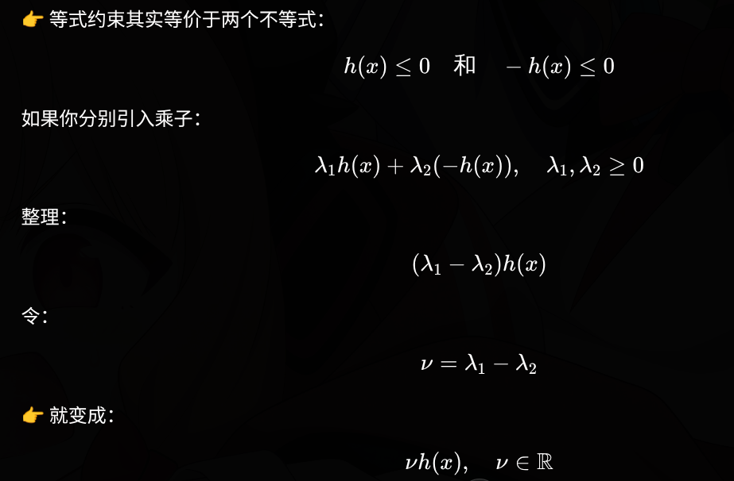

拉格朗日函数并没有“消灭约束”，而是把“是否违反约束”转化成了 **“代价惩罚”** 。

对于**原问题**，其约束可以看作一种“硬性约束”，如果不满足就直接不可行

$$
\begin{aligned}
\min \quad & f_0(x) \\
\text{s.t.} \quad & g_i(x) \le 0, \quad i = 1, \dots, m \\
\quad & h_j(x) = 0, \quad j = 1, \dots, p\\
\end{aligned}
$$

引入拉格朗日乘子 $\lambda_i \geq 0$ (这个大于等于零很关键) 和 $\mu_j$ ，构造**拉格朗日函数**，约束不再显式限制 $x$，$x$ 可以是任意的（无约束）

但：如果违反约束 → 代价 $L$ 会变大

$$
L(x, \lambda, \mu) = f_0(x) + \sum_{i=1}^m \lambda_i g_i(x) + \sum_{j=1}^p \mu_j h_j(x)
$$

约束被吸收为惩罚，关键在于 $\lambda_i \geq 0$ 和 $\mu_j$ , $\mu_j$ 没有符号限制

对于不等式约束 $g_i(x) \le 0$ ，分情况如下：

1. 满足约束
    - $g_i(x) \le 0$ → $\lambda_i g_i(x) \le 0$ → $L(x, \lambda, \mu) \le f_0(x)$
    - 约束满足时，拉格朗日函数的值不会超过原问题的目标函数值。
2. 不满足约束
    - $g_i(x) > 0$ → $\lambda_i g_i(x) > 0$ → $L(x, \lambda, \mu) > f_0(x)$
    - 约束违反时，拉格朗日函数的值会超过原问题的目标函数值。

对于等式约束 $h_j(x) = 0$，分情况如下：

1. 满足约束
    - $h_j(x) = 0$ → $\mu_j h_j(x) = 0$ → $L(x, \lambda, \mu) = f_0(x)$
    - 约束满足时，拉格朗日函数的值等于原问题的目标函数值。
2. 不满足约束
    - $h_j(x) > 0$ 令 $\mu_j > 0$ → $\mu_j h_j(x) > 0$ → $L(x, \lambda, \mu) > f_0(x)$
    - $h_j(x) < 0$ 令 $\mu_j < 0$ → $\mu_j h_j(x) > 0$ → $L(x, \lambda, \mu) > f_0(x)$
    - 约束违反时，无论 $h_j(x)$ 是正还是负，只要 $\mu_j$ 的符号与 $h_j(x)$ 的符号相同，拉格朗日函数的值都会超过原问题的目标函数值。

这里还有一种理解思路：

## “原问题最优解 + 对偶结构成立”的必要条件：KKT 条件

KKT 条件是优化问题为 **强对偶问题** 的必要条件。KKT条件不是“拉格朗日函数最优的条件”，而是“原问题最优解**必须满足的一组( $x^*, \lambda^*, \mu^*$ )条件**

是一个必要条件（在一定条件下也是充分条件）”。

对于如下形式的优化问题：

原问题：

$$
\begin{aligned}
\min \quad & f(x) \\
\text{s.t.} \quad & g_i(x) \le 0, \quad i = 1, \dots, m \\
& h_j(x) = 0, \quad j = 1, \dots, p
\end{aligned}
$$

对偶问题：

$$
\begin{aligned}
\max_{\lambda, \mu} \quad & \min_x L(x, \lambda, \mu) \\
\text{s.t.} \quad & \lambda_i \ge 0, \quad i = 1, \dots, m
\end{aligned}
$$

以及拉格朗日函数：

$$
L(x, \lambda, \mu) = f(x) + \sum_{i=1}^m \lambda_i g_i(x) + \sum_{j=1}^p \mu_j h_j(x)
$$

KKT 条件包括五个子条件，分成三个部分：

$$
\text{原问题可行条件}\begin{cases}
    g_i(x^*) \le 0, \quad i = 1, \dots, m \\
    h_j(x^*) = 0, \quad j = 1, \dots, p
\end{cases}
$$

$$
\text{对偶问题可行条件}\begin{cases}
    \nabla_x L(x^*, \lambda^*, \mu^*) = 0 \\
    \lambda_i^* \ge 0, \quad i = 1, \dots, m
\end{cases}
$$

$$
\text{互补松弛条件}\begin{cases}
    \lambda_i^* g_i(x^*) = 0, \quad i = 1, \dots, m
\end{cases}
$$

互补松弛条件的直观理解：对于每个不等式约束 $g_i(x) \le 0$，要么约束是紧的（$g_i(x^*) = 0$），此时对应的拉格朗日乘子 $\lambda_i^*$ 可以是正的；要么约束是松的（$g_i(x^*) < 0$），此时对应的拉格朗日乘子 $\lambda_i^*$ 必须为零。

### 什么时候KKT是“充要条件”

在原问题是凸优化且满足Slater条件时，它是充要条件。

凸优化要求

- 目标函数 $f(x)$ 是凸函数。
- 不等式约束函数 $g_i(x)$ 是凸函数。
- 等式约束函数 $h_j(x)$ 是仿射函数（即线性函数）。

Slater条件要求存在一个 $x$ 使得 $g_i(x) < 0$ 对所有 $i$ 都成立（注意是严格小于），并且 $h_j(x) = 0$ 对所有 $j$ 都成立。
