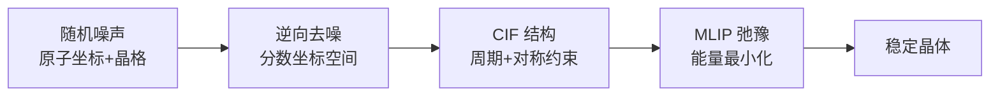

## 晶体生成的特殊挑战

晶体和图像/分子最大的不同：**三维周期性**。一个晶胞平移复制就构成整个晶体，生成时必须在分数坐标空间（$[0,1)^3$）操作，且生成的晶格参数（$a,b,c,\alpha,\beta,\gamma$）需对应真实空间群。

## 前向扩散：逐步加噪

给定晶体 $C_0 = (\mathbf{X}_0, \mathbf{L}_0)$，$\mathbf{X}_0 \in \mathbb{R}^{N\times 3}$ 为分数坐标，$\mathbf{L}_0 \in \mathbb{R}^{3\times 3}$ 为晶格矩阵。

前向过程逐步加高斯噪声：

$$
q(C_t | C_{t-1}) = \mathcal{N}(C_t; \sqrt{1-\beta_t}\, C_{t-1}, \beta_t I)
$$

$t=T$ 时 $\mathbf{X}_T \sim \mathcal{N}(0, I)$，$\mathbf{L}_T \sim \mathcal{N}(0, I)$，完全随机。

## 反向去噪：分数坐标空间的约束

反向过程学一个去噪网络 $\epsilon_\theta(C_t, t)$，预测加上的噪声。DDPM 简化损失：

$$
\mathcal{L}_{\text{simple}} = \mathbb{E}_{t, C_0, \epsilon} \left[ \|\epsilon - \epsilon_\theta(C_t, t)\|^2 \right]
$$

晶体生成的两个关键约束：

1. **分数坐标周期性**：$\mathbf{X}$ 在 $[0,1)^3$，噪声叠加后需 wrap 回单位立方体。DiffCSP 的做法：在分数空间定义 wrapped 正态分布，用 $\mathrm{mod}$ 操作保证周期性。

2. **晶格对称性**：生成 $\mathbf{L}$ 时需保证晶格能构成合理空间群。MatterGen 的解决方案：直接生成 $6$ 个晶格参数 $(a,b,c,\alpha,\beta,\gamma)$，再加上 $N$ 个原子的分数坐标和元素类型。

## DiffCSP：分数坐标 + 晶格联合扩散

DiffCSP 是晶体扩散的经典框架，损失函数：

$$
\mathcal{L}_{\text{DiffCSP}} = \mathbb{E}_t \Big[ \lambda_{\mathbf{X}} \|\epsilon_{\mathbf{X}} - \epsilon_\theta^{\mathbf{X}}(C_t, t)\|^2 + \lambda_{\mathbf{L}} \|\epsilon_{\mathbf{L}} - \epsilon_\theta^{\mathbf{L}}(C_t, t)\|^2 + \lambda_{\mathbf{A}} \mathcal{L}_{\mathbf{A}} \Big]
$$

三部分分别对应分数坐标去噪、晶格去噪、原子类型预测。$\lambda$ 是权重系数。

## MatterGen：属性条件生成

MatterGen 在 DiffCSP 基础上加了**属性条件**：在去噪过程中注入目标属性（如带隙 >5eV）的嵌入，实现条件生成。

$$
\epsilon_\theta(C_t, t, \mathbf{c}) \quad \text{where } \mathbf{c} = \text{condition embedding}
$$

训练时以一定概率随机丢弃条件 $\mathbf{c}$（classifier-free guidance），推理时通过 guidance scale 控制条件强度。

## 和 MatMind 生成方案对比

| 维度 | 扩散模型 | MatMind（LLM + RL） |
|------|---------|-------------------|
| 生成空间 | 分数坐标 + 晶格参数连续空间 | Wyckoff 序列离散 token 空间 |
| 训练方式 | 去噪分数匹配（无监督） | SFT + GRPO 强化学习 |
| 物理约束 | 主要通过数据隐式学习 | RL 奖励函数显式约束 |
| 速度 | 迭代去噪（慢，需 ~1000 步） | 自回归一步生成（快） |
| 条件生成 | classifier-free guidance | 条件指令 + 属性奖励 |

## 关键局限

- 扩散需要多步迭代采样，生成速度慢
- 很难同时保证三周期边界、空间群对称性和热力学稳定性
- 无法输出结构化推理（只能给结构，不能解释"为什么这样生成"）
- 和 GNN 一样是"窄架构"，一个模型只能做生成，不能做预测 == 这就是 MatMind 要解决的问题
