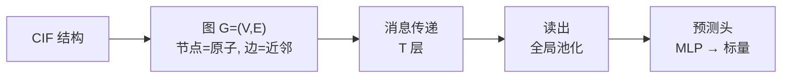

GNN 做晶体性质预测的标准流程是一个四步流水线：**构造图 → 消息传递 → 读出 → 预测**。

## Step 1: CIF → 图

晶体是三维周期结构，不能直接喂给 GNN。先把 CIF 转成图：

- 节点（$V$）= 原子，特征 $h_v^{(0)} =$ 原子序数 embedding（one-hot 或预训练）
- 边（$E$）= 截断半径 $r_{\text{cut}}$（~5Å）内的原子对，特征 $e_{uv} =$ 距离 / 键角 / 高斯径向基展开
- 周期性边界：需判断跨晶胞的邻接关系

$$
\mathcal{G} = (V, E), \quad h_v^{(0)} \in \mathbb{R}^d, \quad e_{uv} \in \mathbb{R}^{d_e}
$$

## Step 2: 消息传递

每个节点反复聚合邻居信息，更新自身表示。T 层后每个节点包含 T 跳邻域信息。

通用消息传递范式：

$$
m_v^{(t)} = \sum_{u \in N(v)} M_t(h_v^{(t)}, h_u^{(t)}, e_{uv}), \quad
h_v^{(t+1)} = U_t(h_v^{(t)}, m_v^{(t)})
$$

以 CGCNN 为例：

$$
h_v^{(t+1)} = h_v^{(t)} + \sum_{u \in N(v)} \sigma(z_{uv}^{(t)} W_f^{(t)} + b_f^{(t)}) \odot g(z_{uv}^{(t)} W_s^{(t)} + b_s^{(t)})
$$

其中 $z_{uv}^{(t)} = h_v^{(t)} \oplus h_u^{(t)} \oplus e_{uv}$，$\oplus$ 为拼接，$\sigma$ 为 sigmoid 门控，$\odot$ 为逐元素乘。

M3GNet 的改进：额外编码三体角信息 $e_{uvw}$，在消息中引入键角。

## Step 3: 读出（全局池化）

T 层消息传递后，所有节点特征聚合成一个图级向量：

$$
h_{\mathcal{G}} = \frac{1}{|V|} \sum_{v \in V} h_v^{(T)} \quad (\text{mean pooling})
$$

也可用 sum pooling 或注意力池化（set2set / attention）。

## Step 4: 预测头

图级向量经过 1-2 层 MLP 映射到标量：

$$
\hat{y} = W_2 \cdot \sigma(W_1 h_{\mathcal{G}} + b_1) + b_2
$$

回归用 MSE 损失：

$$
\mathcal{L} = \frac{1}{N} \sum_{n=1}^{N} (\hat{y}_n - y_n)^2
$$

## 和 MatMind 回归头的对比

| 维度 | GNN | MatMind 回归头 |
|------|-----|---------------|
| 特征编码 | 消息传递聚合邻域信息 | LLM self-attention 全局上下文 |
| 输入 | 显式图拓扑 + 距离/角 | 序列化 CIF token |
| 参数规模 | ~0.1M–2M（轻量） | 8B backbone（大，但通用） |
| 领域先验 | 依赖图构造和特征工程 | 预训练时通过随机交错注入 |
| 泛化性 | 同分布强，跨分布弱 | 三阶段训练后跨分布更鲁棒 |

GNN 的优势在于**轻量高效**，在数据充足且分布稳定时表现优秀；MatMind 的优势在于**统一框架**（预测 + 生成 + 推理）和对稀疏/跨分布任务的更强泛化。

## 经典模型一览

| 模型 | 消息机制 | 三体交互 | 参数 | 发表 |
|------|---------|---------|------|------|
| CGCNN | 门控消息 + 拼接 | 无 | ~0.5M | 2018 |
| M3GNet | 三体消息 + 更新 | 有 | ~1.5M | 2023 |
| SchNet | 连续滤波卷积 | 无 | ~0.5M | 2017 |
| DimeNet | 距离-角消息 | 有（二面角） | ~3M | 2020 |
