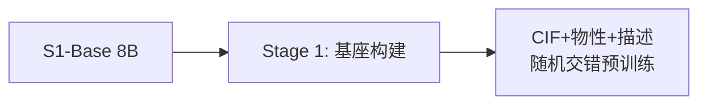
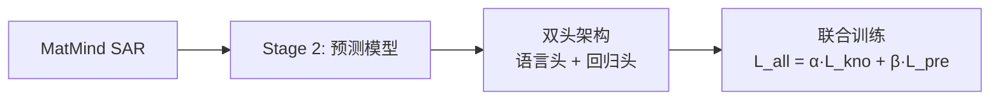
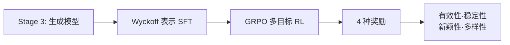

## 论文信息

**标题**: MatMind: A Structure-Activity Knowledge-Driven Generative Foundation Model for Materials Science  
**作者**: 姚战奥、张博轩、舒靖源、吴晓宇、王荣燕、李琳婧、曾大军、姚宇东、陈廷伟、王有伟、赵晓林、施嘉辉、刘建军（中科院上海硅酸盐所、自动化所等）  
**发表**: arXiv:2606.07712（Springer Nature 审稿中）  
**代码**: 未开源，基于 S1-Base 8B + Alexandria/MP-20 数据库

## 核心思想

材料科学中的 AI 长期被"窄架构"主导——GNN 做性质预测、扩散模型做晶体生成，各守一摊无法统一。MatMind 证明：**LLM 可以同时承载结构表示、定量预测和构效推理**，前提是通过**渐进式训练框架**协同激活领域知识与物理反馈。三个关键设计：构效知识注入（让模型理解材料科学）、双头架构（语言推理与数值回归互增强）、多目标物理强化学习（稳定性/新颖性/多样性协调优化）。

## 三阶段渐进式+互补训练流程

三个阶段的定位不同：

| Stage | 输入          | 输出           | 能力             |
| ----- | ------------- | -------------- | ---------------- |
| 1     | CIF+数值+文本 | 更好的 LLM     | 建立材料科学先验 |
| 2     | CIF + 问题    | CoT推理 + 数值 | 正向：结构→性质  |
| 3     | 指令          | Wyckoff 序列   | 反向：性质→结构  |

### stage1: pretrain



Stage 1 以 S1-Base 8B 为起点，用 Alexandria 数据库稳定子集（E_hull ≤ 0.1 eV/atom）做晶体科学数据对齐预训练。

细节参考：[输入数据格式](#输入数据格式)

### stage2: SAR+双头架构



预训练后做构效关系（SAR）增强微调，在材料学里就是"结构决定性质"：知道原子怎么排列，就能推断出物理性质。MatMind 的 SAR 微调就是专门训练模型建立这种推理能力。

细节参考：[SAR微调(语言头)与L_kno损失](#SAR微调(语言头)与L_kno损失)

Stage 2 在 MatMind SAR 上插入双头架构。回归头做连续数值预测——取最后一层所有 token 的 hidden state 做 mean pooling，再经线性变换输出标量。

细节参考：[回归头和L_pre](#回归头与l_pre损失)

联合损失：

$$\mathcal{L}_{\text{all}} = \alpha \cdot \mathcal{L}_{\text{kno}} + \beta \cdot \mathcal{L}_{\text{pre}}$$

- $\mathcal{L}_{\text{kno}}$ 约束模型说人话解释推理过程（语言头）（CoT 正确）
- $\mathcal{L}_{\text{pre}}$ 约束回归头输出正确的数值（回归头）（预测准确）

- $\alpha, \beta$ 在验证集上通过 Pareto 前沿确定。

**联合训练要分两步**： 回归头参数是随机初始化的，而 backbone 的 36 层 Transformer 已经过充分训练。如果一上来就联合训练，回归头的随机梯度噪声会破坏 backbone 已有的表征结构，导致微调初期模型"忘记"已经学会的科学知识。论文的做法是：**第一步冻结 backbone，只训练回归头**，直到它的预测信号稳定；**第二步才解冻所有参数联合优化**。

```text
Step 1 (warm-up):     Step 2 (联合):

输入 CIF               输入 CIF
  ↓                      ↓
backbone (36层)         backbone (36层)
  ↓ freeze, ❌梯度       ↓ unfreeze, ✅梯度
mean_pooling            mean_pooling
  ↓                      ↓
Linear(4096→1) ✅梯度   Linear(4096→1) ✅梯度
  ↓                      ↓
预测值                  预测值
```

前向传播两次一模一样——都是 CIF → backbone 36层 → mean_pooling → Linear → 预测值。

反向传播：

- Step 1 — loss.backward()：梯度从预测值流到 Linear 的 $W,b$ 就停了，因为 backbone.parameters() 的 requires_grad=False。backbone 权重不变。
- Step 2 — loss.backward()：梯度从预测值一路穿过 Linear → mean_pooling → backbone 36 层，所有参数都更新。
PyTorch 里 loss.backward() 不管参数冻不冻都会算梯度，但 optimizer.step() 只更新 requires_grad=True 的参数。

step2 反向传播时，$\mathcal{L}_{\text{pre}}$ 的梯度会穿过回归头一直传到 36 层 backbone，促使 hidden state 朝"更有利于数值预测"的方向调整。同时 $\mathcal{L}_{\text{kno}}$ 的梯度也在拉 hidden state 朝"更有利于语言推理"的方向调整。两者互相牵制。

Stage 1 + Stage 2 做完后，MatMind 能做：

- 给它一个 CIF → 能输出 CoT 推理链 + 预测带隙/E_hull/体模量
- 但反过来：说"给我一个带隙 >5eV 的晶体" → 不会，它没有反向生成的能力

### Stage3: 多目标物理强化学习



Stage 3 分两步。

1. 先做生成语法合格 Wyckoff 表示的有监督微调（SFT），
2. 后做 GRPO 强化学习。

- SFT 让模型学会"从文字指令生成 Wyckoff 序列"
- GRPO 让模型学会"在物理奖励下生成 Wyckoff 序列"。

第一步细节参考：[SFT生成合格的Wyckoff表示](#sft生成合格-wyckoff-表示)

做完 SFT，模型已经能从指令生成语法正确的 Wyckoff 序列了——但生成出来的晶体不一定稳定。

SFT 后做 GRPO 强化学习。GRPO 的核心是**组内相对优势**：

SFT 模型作为初始策略 $\pi_{\text{ref}}$，GRPO 每次迭代：

1. 策略 $\pi_\theta$ 生成 G 个 Wyckoff 序列（比如 G=12）
2. 每个序列转成 CIF → [MLIP](#mlip) 弛豫 → 算 E_hull、新颖性、多样性
3. 给**每个**结构算**总奖励**，(需要先过一次**门控**) $R(C_{i\in G}) = V(C_i) × (R_S + R_N + R_U + R_P)$ [奖励函数的门控机制](#奖励函数的门控机制) [R_S](#稳定性奖励) [R_N](#新颖性奖励) [R_U](#多样性奖励)
4. **组内**归一化：
    $$A_i = \frac{R(C_i) - \mu_R}{\sigma_R + \epsilon}$$
    （均值为0，标准差为1，$\epsilon$ 是数值稳定常数）
5. 用 $A_i$ 做优势函数更新策略参数 $\theta$。 $A_i > 0$ 意味着该结构优于组内平均，策略会被鼓励去生成类似结构
6. 回到 1

$$\mathcal{L}_{\text{GRPO}} = -\mathbb{E} \left[ \frac{1}{G} \sum_{i=1}^{G} \min \left( \frac{\pi_\theta(C_i)}{\pi_{\text{old}}(C_i)} A_i, \; \text{clip} \left( \frac{\pi_\theta(C_i)}{\pi_{\text{old}}(C_i)}, 1-\epsilon, 1+\epsilon \right) A_i \right) \right] + \beta \cdot D_{\text{KL}}[\pi_\theta \| \pi_{\text{ref}}]$$

重要性采样比 $\frac{\pi_\theta}{\pi_{\text{old}}}$ 衡量新旧策略偏离程度，clip 限制在 $[1-\epsilon, 1+\epsilon]$ 防止更新过激，KL 散度惩罚约束策略不要离初始 SFT 模型太远。

奖励的闭环流程

```text
模型生成 Wyckoff → 转 CIF
→ V(C) 有效性门控（间距≥0.5Å？电中性？弛豫收敛？）
    → 不通过 → R=0，直接跳过
    → 通过 
        → [MLIP](#mlip) 弛豫 → 算 E_hull → R_S
        → StructureMatcher 对比训练集 → R_N（新颖性）
        → 组内两两指纹距离 → R_U（多样性）
        → 条件匹配（有条件时）→ R_P
    → 总奖励 = R_S + R_N + R_U + R_P → 组内归一化 → GRPO 更新
```

## 训练时的细节参考

### 输入数据格式

[跳转回去](#stage1-pretrain)

输入数据格式上，每个晶体有三个表示：

CIF 结构 + DFT 物性数值（带隙/体模量/E_hull）+ RoboCrystallographer 自动生成的文本描述。

>CIF是晶体结构的标准化表示，包含晶胞参数、空间群、原子坐标等信息。RoboCrystallographer 是一个规则引擎，可以根据晶体的 CIF 自动生成自然语言描述，比如"TiO₂ 金红石相，空间群 Fm-3m，带隙约 3.0 eV"。

这三者不是各自分块训练，而是**一一对应地随机交错**成一个序列：同一结构的 CIF 片段、物性数值、文本描述轮流出现。比如 TiO₂ 的训练序列可能长这样：

```text
"TiO2 F m -3 m a=4.25 ... band_gap: 3.05 ... TiO2 crystallizes in the cubic ... 
 bulk_modulus: 186.0 ... F m -3 m ... e_hull: 0.0 ... is a wide-band-gap ..."
```

然后换下一个晶体 Fe₂O₃，同样三个模态反复穿插。如果按常规做法把同类数据分块堆在一起（先看所有 CIF → 再看所有数值 → 再看所有描述），模型可以分块独立记忆，**跨模态关联**很弱。随机交错迫使模型在同一个 context window 内同时处理结构、性质、文本三者，自然建立双向映射。

### SAR微调(语言头)与L_kno损失

[跳转回去](#stage2-sar双头架构)

本质上依然是有监督微调（SFT）

总共晶体性能排序、区间预测、目标筛选三类任务，每条数据带材料专家的 CoT 链式推理标注。

具体实现：

1. 数据构造

    从 Alexandria 数据库选 30K 个晶体（与预训练子集无结构重合），给每个晶体生成三种任务：
    - 任务 A（排序）：给 3-5 个晶体，按某性质排序
    >输入："对以下晶体的带隙从大到小排序：\
    >A) TiO2 金红石, … B) TiO2 锐钛矿, … C) ZnO 纤锌矿, …" \
    >输出（CoT）："金红石 Ti-O 八面体共边，带隙 ~3.0eV；锐钛矿八面体连接不同，带隙 ~3.2eV；ZnO 纤锌矿带隙 ~3.4eV。因此 C > B > A。"

    - 任务 B（区间判断）：给一个晶体和一个范围，判断该性质是否在范围内
    - 任务 C（目标筛选）：给一组候选晶体和目标性质要求，挑出满足条件的
2. 训练方式
    纯标准的 next-token prediction：
    >输入:  [任务指令 + CIF 信息 + 问题]\
    >输出:  [CoT 推理链 + 最终答案]

    损失就是常规的自回归交叉熵
    $$
    \mathcal{L}_{\text{kno}} = -\frac{1}{T}\sum \log p_\theta(x_t|x_{<t})
    $$

    模型在看到前面所有 token（$x_{<t}$）之后，预测当前这个位置应该是哪个 token，得到一个概率分布。$p_\theta(x_t | x_{<t})$ 就是这个分布里正确答案 $x_t$ 对应的概率。取 $\log$ 后，概率越接近 1，$\log$ 越接近 0，loss 越小。
3. 人工标注的必要性

    强调这 30K 条全是材料学专家手工标注 + 质量审核的，不是用 GPT 或其他 LLM 蒸馏生成的。CoT 推理链如果物理上错了，模型学到了也是错的。

### 回归头与L_pre损失

[跳转回去](#stage2-sar双头架构)

$$\hat{y} = W_{\text{reg}} \cdot \frac{1}{L} \sum_{i=1}^{L} h_i + b_{\text{reg}}$$

其中 $h_i \in \mathbb{R}^d$ 是第 $i$ 个 token 在最终层的 hidden state向量，$L$ 是序列长度，$W_{\text{reg}} \in \mathbb{R}^{1 \times d}$ 是线性投影矩阵。

mean pooling : $\frac{1}{L} \sum_{i=1}^{L} h_i$ — 对所有 token 的 hidden state 向量按位置取平均。

>假设输入是 "TiO2 F m-3m 带隙是多少？"，模型把它切成了比如 10 个 token，每层 Transformer 会给每个 token 算出一个 hidden state（比如 4096 维向量）。mean pooling 就是把这 10 个向量逐位置平均，得到一个 4096 维的"句子向量"——代表模型对这个晶体整体结构+问题的理解。

$W_{\text{reg}} \cdot \text{mean\_pool} + b_{\text{reg}}$ — 一个线性层，把 4096 维的句子向量压缩成 1 个标量。就是模型预测的物理性质数值。

参与MSE损失：$\hat{y}_n$ 就是回归头输出的这个标量，$y_n$ 是 DFT 算出的真实值。

$$
\mathcal{L}_{\text{pre}} = \frac{1}{N} \sum_{n=1}^{N} (\hat{y}_n - y_n)^2
$$

### SFT:生成合格 Wyckoff 表示

[跳转回去](#stage3-多目标物理强化学习)

$$W(C) = (g, \{(w_k, a_k, x_k)\}_{k=1}^{K})$$

[空间群号] [空间群符号] [(Wyckoff 字母) (元素) (x) (y) (z)] ...

$g \in \{1,...,230\}$ 是空间群编号，$w_k$ 是第 $k$ 个不等价位的 Wyckoff 字母，$a_k$ 是原子种类，$x_k \in [0,1)^3$ 是分数坐标，$K$ 是不等价位数。Wyckoff 表示利用空间群对称性将等价位折叠，极大缩短序列长度。

损失函数是 条件 next-token prediction：和普通 LLM 训练一模一样，只是输出的 token 不是自然语言而是 Wyckoff 编码。$\mathbf{c}$ 是条件（无条件时为 $\emptyset$，条件时为"带隙 >5eV"这样的文字指令）。

$$
\mathcal{L}_{\text{SFT}} = - \frac{1}{T}\sum_{t=1}^{T} \log p_\theta(x_t | x_{<t}, \mathbf{c})
$$

### 奖励函数的门控机制

[跳转回去](#stage3-多目标物理强化学习)

所有奖励分量在通过**有效性门控**后才参与计算。门控 $V(C)$ 是三条件的**逻辑与**：

$$V(C) = V_{\text{dist}}(C) \cdot V_{\text{charge}}(C) \cdot V_{\text{relax}}(C)$$

- $V_{\text{dist}}$：任意原子间距 ≥ 0.5 Å（排除原子重叠的非物理结构）
- $V_{\text{charge}}$：所有氧化态之和为零（电中性守恒）
- $V_{\text{relax}}$：NequIP-OAM-XL [MLIP](#mlip) 弛豫成功收敛，无数值异常

任一条件不满足则 $V(C)=0$，后续所有奖励归零。

### 稳定性奖励

总奖励公式：

$$R(C_i) = \mathbf{1}[V(C_i)=1] \cdot m_i^{\text{ratio}} \cdot m_i^{\text{elem}} \cdot (R_S + R_N + R_U + R_P)$$

$m_i^{\text{ratio}}$ 是组分比例重平衡因子（惩罚模板坍塌，奖励稀有配比），$m_i^{\text{elem}}$ 是元素条件因子（可控条件生成），$R_P$ 是条件生成时的属性匹配奖励（无条件时为零）。

**稳定性奖励** $R_S(C_i)$ 基于 [MLIP](#mlip) 弛豫后的 $E_{\text{hull}}$，经凸衰减映射：

$$
R_S(C_i) = \begin{cases}
1 & E_{\text{hull}}(C_i') \leq 0.1 \\
\left( \dfrac{0.2 - E_{\text{hull}}(C_i')}{0.1} \right)^2 & 0.1 < E_{\text{hull}}(C_i') < 0.2 \\
0 & E_{\text{hull}}(C_i') \geq 0.2
\end{cases}
$$

凸指数 $\gamma = 2$ 让奖励在接近稳定边界时陡峭上升，而高能区域提升很小——优化压力集中在近稳定结构。

### 新颖性奖励

[跳转回去](#stage3-多目标物理强化学习)

**新颖性奖励** $R_N(C_i)$ 分两层：先用 StructureMatcher 精确匹配做硬门控（匹配到已知结构则零分），再通过结构指纹和组分指纹分别算到训练集最近邻距离，综合打分。

### 多样性奖励

[跳转回去](#stage3-多目标物理强化学习)

**多样性奖励** $R_U(C_i)$ 基于组内最大熵原理：将组内 $G$ 个结构两两算指纹距离，转为 softmax 相似度，再算 Shannon 熵后归一化。熵越高意味着结构散布越开，奖励越高。并用 Hume-Rothery 替换规则做去重门控（元素替换后等价者视为重复，不奖励）。

### MLIP

MLIP = Machine Learning Interatomic Potential（机器学习原子间势函数）

用神经网络替代 DFT 做快速能量预测的工具。先用 DFT 算大量结构（比如 OMat 团队算了几百万个），让神经网络学习"原子怎么排布 → 能量是多少"的映射。

DFT 算一个结构需要几小时，MLIP 只需毫秒级，精度接近。MatMind 全程依赖 MLIP——RL 奖励的信号靠它算，评价的 E_hull 靠它算。论文使用了两个不同的 MLIP（NequIP-OAM-XL 和 eSEN-30M-OAM），训练和评价各用一个，防止过拟合。

MatMind 用的两个 MLIP

| MLIP          | 架构                                  | 用途                                  |
| ------------- | ------------------------------------- | ------------------------------------- |
| NequIP-OAM-XL | E(3)-等变 GNN（Tensor Field Network） | RL 训练时的奖励信号 + 结构有效性验证  |
| eSEN-30M-OAM  | OMat 家族，具体架构未公开             | 评价阶段做弛豫（和训练用不同的 MLIP） |

如果训练和评价用同一个 MLIP，模型可能学会利用那个特定势函数的偏好和漏洞——比如找到一些"在这个 MLIP 眼里 E_hull=0，但换个势函数就不稳定了"的伪稳定结构。换一个评价用的 MLIP，意味着得出的S.U.N.率不是针对某个势函数的拟合分数，而是跨模型的泛化稳定性。所有基线（MatterGen、DiffCSP）也都在同一套评价pipeline里跑，确保公平。

## 模型架构总览

这篇论文其实涉及三组架构：**MatMind 自身的组件**、**被用作基线的模型**、**支撑管线的基础设施**。

### MatMind 自身组件

MatMind **没有加深或改动 Transformer 骨干结构**——全程只做了两件事：更新权重（继续训练/SFT/RL）和额外挂一个 tiny 线性层。

| 组件           | 架构                                                           | 说明                          |
| -------------- | -------------------------------------------------------------- | ----------------------------- |
| **骨干 LLM**   | Qwen3-8B（36 层, decoder-only, GQA + SwiGLU + RoPE + QK-Norm） | 结构不变，仅权重更新          |
| **回归头**     | `MeanPool(hidden_states) → Linear(1)`                          | 36 层输出后挂一层线性映射     |
| **RL 算法**    | GRPO（组内相对优势，无需 critic 模型）                         | 训练算法，非架构改动          |
| **结构序列化** | Wyckoff 表示：`(空间群号, {(字母, 元素, 坐标)})`               | 数据格式，非模型结构          |
| **指纹工具**   | CrystalNNFingerprint + ElementProperty                         | PyMatGen 工具，仅用于奖励计算 |

回归头是唯一的新增参数——单层 `Linear(hidden_size, 1)`，不涉及任何注意力头修改或层数增减。GRPO 和 Wyckoff 编码则完全不属于架构层面。

### 基线对比模型

**性质预测：**

| 模型             | 架构                         | 说明                           |
| ---------------- | ---------------------------- | ------------------------------ |
| **CGCNN**        | 图神经网络（消息传递）       | 经典晶体 GNN，2018             |
| **M3GNet**       | 图神经网络（含三体相互作用） | 比 CGCNN 多键角信息，2023      |
| **LLM-Prop**     | LLM（T5 式 encoder-decoder） | 用 LLM token 输出预测数值      |
| **MatBERT-109M** | BERT（纯 encoder）           | 材料领域预训练 BERT，109M 参数 |

**晶体生成：**

| 模型          | 架构                    | 说明                   |
| ------------- | ----------------------- | ---------------------- |
| **MatterGen** | 连续扩散模型            | Microsoft，Nature 2024 |
| **DiffCSP**   | 分数坐标扩散 + 晶格预测 | 2023                   |

**通用 LLM 对比（消融实验中被注释，未正式出图）：** GPT-4o（闭源）、Claude-3.5（闭源）、LLaMA-3.1-70B、Qwen-2.5-72B。

注意 MatMind（8B）参数远小于通用 LLM 但分数更高——论文的核心论点：材料专业知识必须通过特定注入，纯靠规模扩展无效。

### 支撑管线的基础设施

| 模型/工具                | 架构                                       | 在 MatMind 中的角色                                    |
| ------------------------ | ------------------------------------------ | ------------------------------------------------------ |
| **NequIP-OAM-XL**        | 等变 GNN [MLIP](#mlip)（E(3)-equivariant） | RL 奖励信号 + 有效性门控的弛豫引擎                     |
| **eSEN-30M-OAM**         | [MLIP](#mlip)（OMat 家族）                 | 评价阶段做弛豫（与训练用不同 [MLIP](#mlip)，防过拟合） |
| **OMat 能量校正**        | 线性校正（非神经网络）                     | 将 MLIP 总能量对齐到 MP-20 凸包参考面                  |
| **RoboCrystallographer** | 规则引擎 + 模板生成                        | 自动为晶体写自然语言描述                               |
| **StructureMatcher**     | 贪心算法（PyMatGen）                       | 去重 / 新颖性检查                                      |
| **Alexandria 数据库**    | 纯数据（百万级 DFT 结果）                  | Stage 1 预训练数据源                                   |

## 评价指标

### 性质预测评价

用 MAE（训练L_pre 用的MSE）评价三个物理维度各异的属性：

- $E_{\text{hull}}$（eV/atom）：能量在凸包以上多高——热力学稳定性的直接度量。MatMind 零点差背后意味着它能区分稳定/亚稳态晶体，这对 RL 阶段奖励信号的响应至关重要
- 体模量（GPa）：抵抗体积压缩的能力——力学功能属性
- 带隙（eV）：价带顶到导带底的能量差——电子功能属性

### 晶体生成评价：S.U.N. 率

$$
\text{S.U.N.} =
\frac{\| \{C : E_{\text{hull}}(C') \leq 0 \}
\wedge \{C \notin \mathcal{D}_{\text{ref}}\}
\wedge \{C \in \mathcal{U}\}\|}
{N_{\text{total}}}
$$

三重筛选的复合指标，三者缺一不可：

| 条件       | 符号                                | 含义                                          | 算                                                      |
| ---------- | ----------------------------------- | --------------------------------------------- | ------------------------------------------------------- |
| **S**table | $E_{\text{hull}}(C') \leq 0$        | 经充分弛豫后能量在凸包上或以下——热力学可合成  | 需 [MLIP](#mlip) 弛豫 + OMat 能量校正 + 对比 MP-20 凸包 |
| **U**nique | $C \in \mathcal{U}$                 | 生成的 $N$ 个结构内部两两不等价               | StructureMatcher 对比（排除同一轮产出的重复）           |
| **N**ovel  | $C \notin \mathcal{D}_{\text{ref}}$ | 不匹配已有数据库（MP-20 + Alexandria 训练集） | 同样是 StructureMatcher 对比                            |

### 评价管线全流程

```
生成 Wyckoff 序列
  → 转为 CIF 结构
  → V(C) 有效性验证（间距/电中性）
  → NequIP-OAM-XL 弛豫 → 算 E_hull
  → 若通过稳定性+新颖性+独特性 → S.U.N. 计数 +1
```

## 实验结果

### 性质预测（MAE）

| 任务                        | MatMind    | CGCNN  | M3GNet | LLM-Prop |
| --------------------------- | ---------- | ------ | ------ | -------- |
| $E_{\text{hull}}$ (eV/atom) | **0.0109** | 0.0123 | 0.0130 | 0.0138   |
| 体模量 (GPa)                | **5.36**   | 5.55   | 5.57   | 6.14     |
| 带隙 (eV)                   | **0.197**  | 0.244  | 0.209  | 0.346    |

MatMind 在三项任务上均列最优或并列最优，首次以 LLM 范式超越专用 GNN。

### 无条件晶体生成（S.U.N. 率）

| 方法                 | S.U.N. 率 |
| -------------------- | --------- |
| **MatMind CIF RL**   | **65.3%** |
| MatterGen            | 44.3%     |
| DiffCSP              | 40.2%     |
| MatMind SFT（无 RL） | 42.1%     |

RL 贡献了 +23.2pp，SFT 仅与扩散基线持平，证明物理奖励信号是核心驱动。

### 条件生成与小样本迁移（S.U.N. 率提升）

| 条件任务            | 正样本数      | 占比          | Pre-RL      | Post-RL | 倍数 |
| ------------------- | ------------- | ------------- | ----------- | ------- | ---- |
| 带隙 >5eV           | ~6,000 / 45k  | 18.0% → 34.8% | 1.9×        |
| 体模量 ~300GPa      | ~600 / 45k    | 12.8% → 26.8% | 2.1×        |
| 磁化密度 ≥0.2 μB/ų | **21** / 600k | 3×10⁻⁵        | 1.2% → 5.2% | 4.3×    |

磁化密度任务尤其关键：正样本仅 21 个（60 万中），但 RL 提升幅度（~4×）与其他任务同量级，说明物理 RL 可以解耦优化效果与小样本标注数量。生成的 Gd₂FeIr 和 Gd₂MnCo₃ 在化学上合理（稀土+3d 过渡金属，与 SmCo₅、Nd₂Fe₁₄B 一致），说明模型学到了真正的构效关系而非插值。

## 代码短评

**未开源。** 论文使用 S1-Base 8B + Alexandria/MP-20 数据集 + OMat [MLIP](#mlip) 家族，工程依赖链长（NequIP-OAM-XL 弛豫 + eSEN-30M-OAM 评估 + MP 凸包），复现门槛较高。期待后续开源。

## 思考

**优势：** 首次在多个材料子任务上以单一 LLM 方案匹敌甚至超越专用模型，验证了"LLM 作为材料基座模型"的范式可行性。三阶段训练 pipeline 和双头架构设计精巧，可作为后续材料 LLM 的标准模版。物理 RL 在 extreme data scarcity（21/600k）下的有效性极具实用价值。

**不足：** 参考文献大量使用 `TODO_xxx` 占位符，消融实验和注意力分析部分尚未完成。8B 模型三阶段训练的计算成本未披露。完全依赖 DFT/[MLIP](#mlip) 计算，未验证与真实实验的一致性。代码未开源。

## 博客 ⇄ 论文快速索引

| 博客环节                                      | 论文位置                 |
| --------------------------------------------- | ------------------------ |
| 核心思想 / 三阶段总览                         | §2 Result, Fig. 1        |
| Stage 1 pretrain                              | §3.2.1 / §3.1.1          |
| 随机交错数据格式                              | §3.1.1                   |
| SAR SFT + $\mathcal{L}_{\text{kno}}$          | §3.1.2 / §3.2.2, Eq. (6) |
| 回归头 + $\mathcal{L}_{\text{pre}}$ + warm‑up | §3.2.2, Eq. (3)–(5)      |
| Wyckoff 表示                                  | §3.1.4, Eq. (1)          |
| GRPO 公式                                     | §3.2.3, Eq. (8)–(9)      |
| 门控 $V(C)$                                   | §3.3.1, Eq. (10)         |
| 稳定性奖励 $R_S$                              | §3.3.3, Eq. (13)–(14)    |
| 新颖性奖励 $R_N$                              | §3.3.4, Eq. (15)         |
| 多样性奖励 $R_U$                              | §3.3.5, Eq. (16)         |
| 总奖励 $R(C_i)$                               | §3.3.8, Eq. (17)         |
| 评价 MAE                                      | §3.4.1, Eq. (18)         |
| 评价 S.U.N.率                                 | §3.4.2, Eq. (19)         |
| 性质预测结果                                  | §2.2, Fig. 2             |
| 无条件晶体生成                                | §2.3.1, Fig. 3           |
| 条件晶体生成                                  | §2.3.2, Fig. 4           |
| 小样本磁化密度迁移                            | §2.4, Fig. 5             |
| MLIP 使用设计                                 | §3.4.2 / §3.3.1          |
