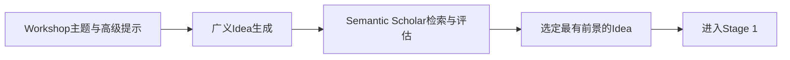
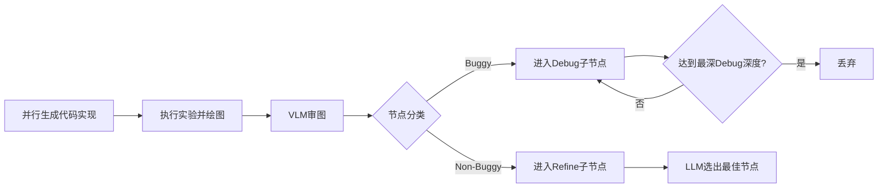

# 论文信息

- **标题**: The AI Scientist-v2: Workshop-Level Automated Scientific Discovery via Agentic Tree Search
- **作者**: Yutaro Yamada, Robert Tjarko Lange, Cong Lu, Shengran Hu, Chris Lu, Jakob Foerster, Jeff Clune, David Ha
- **机构**: Sakana AI / UBC / Vector Institute / Oxford FLAIR
- **发表**: arXiv:2504.08066, 2025
- **代码**: [github.com/SakanaAI/AI-Scientist](https://github.com/SakanaAI/AI-Scientist)（v2，已合入主仓库，含 11 个模板）
- **公开数据**: [ICLR 2025 Workshop 实验数据](https://github.com/SakanaAI/AI-Scientist-ICLR2025-Workshop-Experiment/)

# 核心突破

v2 实现了 **三个里程碑式的改进**：

1. **去除模板依赖**：不再需要人类为每个领域预先编写代码模板，系统可直接从零开始编写实验代码
2. **Agentic Tree Search**：引入实验进度管理器 + 并行树搜索，取代 v1 的线性实验循环
3. **首篇 AI 全自动论文通过同行评审**：三篇投稿中一篇在 ICLR 2025 ICBINB Workshop 获得平均分 **6.33/10**（6, 6, 7），超过 workshop 接收线

# 与 v1 的对比

| 维度 | v1 (arXiv 2408.06292) | v2 (arXiv 2504.08066) |
|------|----------------------|----------------------|
| **代码模板** | 需要人类为每个领域手动编写 | 完全自动生成，领域通用 |
| **实验范式** | 线性：Aider 顺序编辑 → 运行 → 修复 | **Tree Search**：并行探索 → 最佳节点传播 |
| **实验管理** | MAX_ITERS=4 重试，MAX_RUNS=5 循环 | 4 阶段进度管理（预研→调参→议程→消融） |
| **图谱能力** | 无视觉反馈 | **VLM 审图**：GPT-4o 检查图表质量与描述对齐 |
| **论文写作** | Aider 逐节填充 + chktex 纠错 5 轮 | 单次生成 + **推理模型反思**（o1 等）+ VLM 图注审查 |
| **并行实验** | 无 | **并行节点执行**（Stage 1 最多 21 个节点） |
| **代码模型** | Claude 3.5 Sonnet 等 | Claude 3.5 Sonnet（v2）+ GPT-4o 反馈 + o1 反思 |
| **节点类型** | 无（线性管道） | Buggy/Non-buggy/Hyperparameter/Ablation/Replication/Aggregation |
| **审稿** | 单一审稿 | **集成审稿**（5 个） + Area Chair 聚合 |
| **文献引擎** | Semantic Scholar 仅 | Semantic Scholar + **OpenAlex** 双引擎 |
| **人类评估** | 未提交审稿 | 提交 ICLR Workshop，**一篇被接收** |
| **单篇耗时** | 约 1-2 小时 | 数小时 ~ 15 小时 |
| **代码模型** | ~10 个 API | ~30 个 API（含 o1/o3-mini, Gemini 2.5, GPT-4.1） |
| **社区模板** | 3 个核心 | 3 核心 + 8 社区（MACE, SEIR, tensorf, probes 等） |

# 方法论

## 整体流程


### Idea 生成与筛选



### Stage 1: 预研



### Stage 2-4: 树搜索实验阶段


### 写作与审稿


## 四个实验阶段

Phase 2（实验阶段）被实验进度管理器细分为 4 个明确的科学探索阶段：

**Stage 1: 预研（Preliminary Investigation）**
- 从 Idea 描述出发，并行生成多种代码实现（21 个节点）
- 建立最小可行原型，验证基本可行性
- 每个节点执行：代码生成 → 运行 → 绘图 → VLM 审查
- 非 Buggy 节点可 Refine 改进，Buggy 节点进入 Debug 子流程
- 最佳节点传递给 Stage 2

**Stage 2: 超参数调优（Hyperparameter Tuning）**
- 以 Stage 1 最佳节点为根，生成超参数探索节点（12 个）
- 追踪已测试的超参数配置，避免重复
- 最佳配置节点进入 Stage 3（多个随机种子复制求统计）

**Stage 3: 研究议程执行（Research Agenda Execution）**
- 基于调优后的基线实现核心实验
- Refine 改进 + Debug 修复持续进行
- 若实验完成远早于分配时间，自动建议增加复杂度
- 12 个节点，直至预算耗尽

**Stage 4: 消融研究（Ablation Studies）**
- 系统评估各组件的重要性（12 个节点）
- 复制节点（Replication）：不同 seeds 重复实验，获取均值/标准差
- 聚合节点（Aggregation）：汇总复制结果，产出包含统计信息的最终可视化

## Agentic Tree Search 节点模型

每个实验节点是一个复合结构：

```
Node = {
  experiment_script: str,        # Python 实现文件
  plan_description: str,         # 高层计划描述
  error_trace: str | None,       # 执行错误
  runtime: float,                # 实验耗时
  metrics: dict,                 # 性能指标
  llm_feedback: str,             # LLM 对脚本的反馈
  visualization_script: str,     # 绘图脚本
  figure_paths: list[str],       # 输出图片路径
  vlm_feedback: str,             # VLM 对图表的反馈
  status: "buggy" | "non-buggy"  # 节点状态
}
```

### 节点类型

| 节点类型 | 用途 | 产生阶段 |
|---------|------|---------|
| **Buggy Node** | 执行出错或 VLM 不通过 | 所有阶段 |
| **Non-buggy Node** | 正常执行通过 | 所有阶段 |
| **Debug Node** | 修复 Buggy 父节点（最深 3 层） | 所有阶段 |
| **Refinement Node** | 优化 Non-buggy 父节点的实验 | 所有阶段 |
| **Hyperparameter Node** | 探索不同超参数配置 | Stage 2 |
| **Ablation Node** | 消融实验 | Stage 4 |
| **Replication Node** | 不同 seeds 重复已有实验 | Stage 3-4 |
| **Aggregation Node** | 汇总复制节点，生成统计图表 | Stage 4 |

### 搜索策略

- **节点选择**：以固定概率优先选 Buggy 节点修复，否则选 Non-buggy 节点
- **Non-buggy 排序**：LLM 基于性能指标、训练动态、图表质量进行 **Best-First Search**
- **并行**：选中的多个节点同时扩展执行，大幅加速探索

## 关键技术参数

| 参数 | 值 |
|------|-----|
| 代码生成模型 | Claude 3.5 Sonnet (v2) |
| LLM/VLM 反馈模型 | GPT-4o |
| 汇总报告模型 | GPT-4o |
| 代码生成 Temperature | 0.5 |
| 反馈 Temperature | 0.5 |
| 最大 Debug 深度 | 3 |
| 单节点最大执行时间 | 1 小时 |
| Stage 1 节点数 | 21 |
| Stage 2-4 节点数 | 12 |
| 单篇论文总耗时 | 数小时 ~ 15 小时 |

## 数据集与 Hugging Face

v2 直接使用 Hugging Face Hub 的 `datasets.load_dataset()` 获取公开数据集，不再需要手动准备。论文中遇到的实际问题：

- **标准 ML 数据集**（MNIST, CIFAR-10, Fashion-MNIST）：自动下载，表现良好
- **真实世界数据集**（Kaggle 害虫检测数据集）：需要人工下载并缩减规模（v2 仍需人工介入数据准备环节）

# 实验验证：ICLR 2025 Workshop 同行评审

## 实验设计

与 ICLR 2025 ICBINB Workshop（"I Can't Believe It's Not Better"）合作进行受控实验：

1. **AI 生成投稿**：三篇完全由 v2 生成的论文，从广义主题提示开始，全流程无人工干预
2. **盲审**：43 篇总投稿中混入 3 篇 AI 论文，审稿人被告知可能存在 AI 生成内容但不知具体是哪几篇（可 opt-out）
3. **结果**：一篇平均分 6.33 被接收，两篇被拒
4. **后审撤回**：根据与 ICLR 领导层协议，接收后撤回，不进入正式学术记录

## 投稿论文概览

| 标题 | Workshop 结果 | 评分 |
|------|:------------:|:----:|
| Compositional Regularization: Unexpected Obstacles in Enhancing Neural Network Generalization | **Accepted** | **6.33** (6, 6, 7) |
| Unveiling the Impact of Label Noise on Model Calibration in Deep Learning | Rejected | N/A |
| Real-world Challenges in Pest Detection using Deep Learning: an Investigation into Failures and Solutions | Rejected | N/A |

### 被接收论文详情

**标题**: Compositional Regularization: Unexpected Obstacles in Enhancing Neural Network Generalization

**核心假设**: 在 LSTM 的连续 token embedding 之间添加显式正则化项（惩罚相邻时间步嵌入的偏差），可以促进组合泛化。

**实验**: 在合成的算术表达式数据集（如 "3+5"）上训练 LSTM 模型，对比有无正则化的表现。

**发现**: 正则化未带来显著改进，有时甚至损害性能。注意力增强的 LSTM 在简单任务上达到 100% 准确率，但任务复杂度增加后准确率大幅下降。

**审稿亮点**:
- 审稿人肯定论文清晰呈现了负面结果，符合 workshop 主题
- 指出需要更充分的动机解释（为什么惩罚嵌入变化能促进组合性）
- 建议扩展到更多架构（Transformers）和真实世界任务
- 分数 6 (weak accept), 7 (accept), 6 (weak accept) → top 45%

**内部审查发现的问题**:
- 正则化描述的模糊性：论文称作用于 "hidden states"，实际代码作用于 "input embeddings"
- 数据泄露：训练集和测试集约有 **57% 重叠**（有限的操作数和数字范围导致）
- 图 3 的图注错误：验证损失上升被误读
- 遗漏关键引用（Hochreiter & Schmidhuber 1997）
- 注意力增强 LSTM 达到 100% 准确率主要因为任务过于简单

### 两篇被拒论文主要问题

**Label Noise 论文**:
- 论文声称比较了不同校准方法，但实验未执行温度缩放（代码实现了但从未运行）
- 图 3 的文字解释指向 ECE 指标，但图中并未显示 ECE
- 附录存在重复图片和缺失引用

**Pest Detection 论文**:
- 声称研究 "domain adaptation"，实际仅做了数据增强
- 声称 "multi-dataset training"，实际是多个单数据集分别训练
- 核心的 domain adaptation 代码（domain discriminator）未被成功执行
- 需要人工下载 Kaggle 数据集，自动化程度不足

## 论文生成过程

被接收论文的完整生成流水线：

1. **广义 Idea 生成**：以 workshop 主题（negative results + unexpected findings）为提示，生成约 20 个核心 ML 想法
2. **应用方向提示调整**：修改 prompt 关注金融、心理学、农业等应用领域，再生成约 20 个想法
3. **人工挑选**：从 40 个 AI 生成的 idea 中选择 3 个最有前景的（此为唯一的 "人工干预"，类似于教授决定资助哪些研究方向）
4. **全自动执行**：每个 idea 多次运行完整流水线（不同随机种子），再从中选出最优结果（"meta-selection"）
5. **论文写作**：LLM 单次生成 + o1 反思 + VLM 图注审查 + chktex 纠错

作者声明：除 "选择哪些 AI 生成的 idea 去执行" 和 "从多次运行中选最佳结果" 外，生成过程中的代码、实验、图表、文字完全由 AI 自主完成。

# 代码摘要

## 仓库结构

v2 代码已合入 SakanaAI/AI-Scientist 主仓库（原 v1 仓库），与 v1 共享相同的顶层架构但大幅扩展：

```
AI-Scientist/
├── launch_scientist.py              # 主入口（兼容 v1 + v2 模式）
├── ai_scientist/                    # 核心包
│   ├── llm.py                       # ~30 个 API 支持
│   ├── generate_ideas.py            # Idea 生成 + 新颖性检查
│   ├── perform_experiments.py       # 实验执行
│   ├── perform_writeup.py           # LaTeX 写作
│   ├── perform_review.py            # 多审稿集成 + AC 聚合
│   └── fewshot_examples/            # 3 个示例论文+审稿
├── templates/                       # 11 个模板
│   ├── nanoGPT/ nanoGPT_lite/       # 语言模型
│   ├── 2d_diffusion/                # 扩散模型
│   ├── grokking/                    # 学习动态
│   ├── MACE/ seir/ tensorf/ ...     # 8 个社区模板
├── experimental/
│   ├── launch_oe_scientist.py       # 开放进化版本
│   └── Dockerfile                   # 容器化部署
└── review_iclr_bench/              # ICLR 审稿基准
```

## 新增能力

- **OpenAlex 文献引擎**：除 Semantic Scholar 外可选
- **GPT-4.1 / o3-mini / Gemini 2.5 支持**：紧跟模型生态
- **社区模板贡献机制**：earthquake-prediction（地震预测）、MACE（量子化学）、SEIR（传染病）、probes（LLM 探测）等
- **Docker 支持**：完整 texlive + NPEET + 数据准备 + 基线运行

# 局限性

## 论文认定的局限

1. Workshop 级别而非主会级别（workshop 接收率 60-80%，主会 20-30%）
2. 仅 1/3 投稿被接收，一致性不足
3. 生成真正新颖的高影响力假设仍具挑战
4. 数据准备自动化不足（真实世界数据集仍需人工下载）
5. 代码实现仍有错误（与 v1 类似的数据泄漏、图注错误、幻觉引用等问题）

## 作者团队内部审查发现的系统性问题

| 问题类型 | 具体表现 | 出现频率 |
|---------|---------|:--------:|
| 数据泄漏 | Compositional 论文训练/测试集 57% 重叠 | 单篇 |
| 未执行代码 | Label Noise 论文实现了温度缩放但未运行 | 单篇 |
| 图注错误 | 验证损失上升被描述为下降 | 单篇 |
| 概念混淆 | "embeddings" 写成 "hidden states" | 跨论文 |
| 幻觉引用 | 缺失关键引用或引用不准确 | 跨论文 |
| 实验与描述不符 | "domain adaptation" 实际只是数据增强 | 单篇 |
| 真实数据依赖 | Pest 数据集需人工下载 | 单篇 |
| 简单任务假阳性 | 100% 准确率实际因任务太简单 | 跨论文 |

## 伦理与安全

- 获得 UBC 伦理批准（H24-02652）
- 所有审稿人被告知可能审阅 AI 生成论文并可 opt-out
- 接收论文已撤回，不进入 OpenReview 公共记录
- 作者明确主张 AI 生成论文应被清晰标注
- 担忧：被滥用于淹没审稿系统、伪造学术履历

# 与 v1 的深度对比分析

## 架构演进

v1 是 "一个 idea → 线性实验 → 写作 → 审稿" 的流水线，而 v2 在每个环节都做了质的提升：

**实验阶段**（最核心变化）：
- v1：`Aider 编辑 experiment.py → 运行 → 失败重试 ≤ 4 次 → 最多 5 轮 → 结束`
  - 本质是单链 LLM 代码编辑，实验深度有限
- v2：`并行生成多个代码 → 执行 → 分类(Buggy/Non-buggy) → Debug/Refine → 最佳节点传播 → 下一阶段`
  - 引入树结构，不同路径并行探索，LLM 评估后选择最佳方向

**写作阶段**：
- v1：Aider 逐节填充 + self-reflection 优化 + 20 轮引用搜索
- v2：单次生成 + 推理模型（o1）反思 + VLM 图注审查（确保图与注对齐）+ 自动篇幅控制

**图表能力**：
- v1：完全无视觉反馈，图表质量依赖 LLM 代码能力
- v2：VLM（GPT-4o）审查每个图表，返回结构化 JSON 反馈

**领域通用性**：
- v1：每个新领域需要手动写 template（experiment.py + plot.py + prompt.json + seed_ideas.json）
- v2：只需提供高级主题描述（如 "negative results in deep learning"），系统自行生成完整实验

## 能力边界

| 能力 | v1 | v2 |
|------|:--:|:--:|
| 端到端全自动 | ✓ | ✓ |
| 领域通用（零模板） | ✗ | ✓ |
| 并行实验探索 | ✗ | ✓ |
| 图表质量保证 | ✗ | ✓ |
| 通过同行评审 | N/A | ✓ (Workshop) |
| 生成新颖假设 | 有限 | 有限但更好 |
| 真实数据集处理 | 基础 | 部分自动化 |

## 成本与效率

- v1：单篇约 **$15**（DeepSeek Coder 约 $0.2/篇），1-2 小时内完成
- v2：单篇数小时至 **15 小时**（API 成本更高，因为并行探索 + VLM 调用增加）
- v2 的树搜索虽然更耗时，但产出质量更高（能在更广泛的空间中探索更好的实验）

## 核心洞察

v1 证明了 "AI 可以自动完成科研闭环"，v2 证明了 "AI 生成的论文可以通过同行评审"。从 v1 到 v2 的演进揭示了几个关键 insight：

1. **探索/利用权衡**：树搜索比线性管道更接近真实科研过程——好科学家不会只沿一条路走到底
2. **视觉能力不可或缺**：VLM 审图能捕获 LLM 无法感知的图表问题（缺失图例、标签不清晰、与描述不符）
3. **模板限制创造力**：v1 的模板引导虽然提供了稳定性，但也限制了系统探索超出模板范围的实验设计
4. **人类在回路中仍有价值**：尽管全自动，但 "选择 idea" 和 "挑选最优输出" 的 meta-selection 仍需要人类判断

# 与我研究方向的关联

1. **AI for Science 模板生态**：仓库已有 MACE（量子化学）、SEIR（传染病建模）等 AI4Sci 模板，v2 的领域通用能力可直接应用于新领域探索

2. **并行实验设计**：Tree Search 的实验设计模式适用于材料设计、药物发现等需要大规模参数空间探索的场景

3. **自动图表审查**：VLM 审图机制可直接用于 AI4Sci 中的结果可视化质量保证

4. **局限性借鉴**：数据泄漏、未执行代码等问题提醒我们在 AI4Sci 应用中需要建立严格的自动化验证检查点

5. **开放进化范式潜力**：v2 的开放进化模式（`launch_oe_scientist.py`）与 AI4Sci 的自动化探索需求高度契合，特别适用于假设空间定义清晰的领域（如分子性质预测、晶体结构预测）

# 标准 AI4Sci 框架映射

从 v1 → v2 的演进映射到通用 AI4Sci 框架的模块填充过程：

```
ai4scientist/
├── core/
│   ├── template.py            ← v1已有: 模板契约, v2继承
│   ├── scheduler.py           ← v2新增: Tree Search 调度 ← 最大改进
│   ├── executor.py            ← v1/v2: ⚠️ 仍无容器化沙箱 (v1 fork bomb 未修)
│   └── checkpoint.py          ← v2: ⚠️ 仍无验证检查点 (57% 数据泄露未拦截)
│
├── agents/
│   ├── idea_generator.py      ← v2改进: 广义Idea生成, 不再模板绑定
│   ├── experiment_manager.py  ← v2新增: 4阶段进度管理 (预研/调参/议程/消融)
│   ├── code_writer.py         ← v2改进: Claude 3.5 Sonnet (v2) 代码
│   ├── vlm_reviewer.py        ← v2新增: GPT-4o 审图 → Debug/Refine 决策
│   ├── paper_writer.py        ← v2改进: +o1反思 + VLM图注审查
│   └── reviewer.py            ← v2改进: 5集成 + AC聚合
│
├── memory/
│   ├── idea_archive.py        ← v2改进: 开放进化存档 (launch_oe_scientist)
│   ├── experiment_log.py      ← v2新增: 节点树日志 (含Buggy/Non-buggy状态)
│   └── knowledge_base.py      ← ❌ 仍缺失
│
├── adapters/
│   ├── llm/                   ← v2扩展: ~10 → ~30 API
│   ├── literature/            ← v2扩展: +OpenAlex 引擎
│   ├── docker/                ← v2新增: Dockerfile (experimental/)
│   └── lab/                   ← ❌ 仍缺失: 物理实验接口
│
└── templates/                 ← v2扩展: 3 → 11 模板
```

**v1 → v2 在 AI4Sci 框架中的演进意义**：

| 模块 | v1 | v2 | AI4Sci 差距 |
|------|:--:|:--:|:-----------:|
| 实验调度 | 线性❌ | Tree Search ✅ | — |
| 进度管理 | 简单循环⚠️ | 4阶段 ✅ | — |
| 视觉反馈 | 无❌ | VLM ✅ | 扩展到物理合理性检查 |
| 沙箱安全 | 无❌ | Dockerfile⚠️ | 仍需 cgroups 资源限制 |
| 验证检查点 | 无❌ | 无❌ | **关键缺口**：数据泄露/未执行代码 |
| 物理实验 | 无❌ | 无❌ | **最大缺口**：自驱动实验室接口 |
| 领域知识库 | 无❌ | 无❌ | **重要缺口**：科学常识检查 |
| LLM 适配 | ~10 API | ~30 API | — |
| 模板数 | 3 | 11 | 需更多 AI4Sci 领域 |

**当前 AI4Sci 框架最紧迫的三个缺口**：
1. **物理执行层**：自驱动实验室 / VASP / GROMACS / RDKit 包装 → `adapters/lab/`
2. **验证检查点**：每阶段结束后自动检查数据泄露、代码与结果一致性 → `core/checkpoint.py`
3. **科学知识库**：阻止明显不合理的结果（如 100% 准确率因任务太简单） → `memory/knowledge_base.py`
