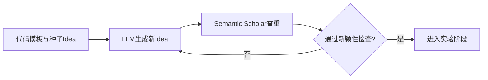
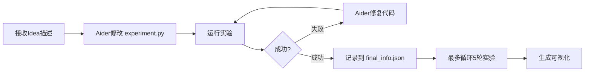

# 论文信息

- **标题**: The AI Scientist: Towards Fully Automated Open-Ended Scientific Discovery
- **作者**: Chris Lu, Cong Lu, Robert Tjarko Lange, Jakob Foerster, Jeff Clune, David Ha
- **机构**: Sakana AI / Oxford FLAIR / UBC / Vector Institute
- **发表**: arXiv:2408.06292, 2024
- **代码**: [github.com/SakanaAI/AI-Scientist](https://github.com/SakanaAI/AI-Scientist)
- **研究三个领域**: 扩散模型 (2D Diffusion)、语言模型 (NanoGPT)、学习动态 (Grokking)

# 核心思想

首次提出 **端到端全自动科研流水线**：给定一个简单的代码模板（如训练一个小型 GPT），AI Scientist 可以自主完成 Idea 生成 → 代码实现 → 实验执行 → 论文写作 → 自动审稿的完整闭环。

- 单篇论文成本约 **$15**
- 单台 8×H100 节点上一周内可产出数百篇论文
- 在扩散模型、语言模型、grokking 三个领域验证有效

**核心 Insight**：将进化计算中的开放探索思想（存档 + 变异 + 选择）与 LLM Agent（Aider）的代码能力结合——Idea 通过 LLM "变异" 已有存档来生成，实验通过 Aider 自动修改代码执行，论文逐节填充 LaTeX 模板。

# 方法论


### Phase 1: Idea 生成



### Phase 2: 实验迭代



### Phase 3-4: 写作与审稿


## 四个核心阶段

### 1. Idea 生成
- 提供代码模板 + 2 个种子 Idea（如"修改学习率"）
- LLM 生成 Idea（包含 Name, Title, Experiment, 自评 Interestingness/Feasibility/Novelty）
- 每轮 3 次 self-reflection 迭代优化
- 通过 Semantic Scholar API 检查新颖性（多轮搜索+判断）

### 2. 实验迭代
- Aider（开源的 LLM 代码编辑 Agent）接收 Idea 描述
- 修改 `experiment.py` 实现算法变更
- 运行 `python experiment.py --out_dir=run_i` 获取结果
- 若失败则 Aider 修复代码重试（最多 4 次）
- 最多 5 轮实验，每轮基于前轮结果调整策略
- 最后 Aider 修改 `plot.py` 生成可视化

### 3. 论文写作
- Aider 按顺序填充 LaTeX 模板：Abstract → Intro → Background → Method → Experiment Setup → Results → Conclusion
- 每节先写后 self-reflection 优化
- 20 轮 Semantic Scholar 搜索添加引用
- 第二轮全局精炼
- LaTeX 编译 + chktex 语法检查（最多 5 轮纠错）

### 4. 自动审稿
- GPT-4o 读取 PDF 全文
- 5 轮 self-reflection + 5 个审稿集成 + 1-shot 示例
- Area Chair meta-review 聚合
- 输出 NeurIPS 格式评分（Soundness, Presentation, Contribution, Overall, Confidence）+ Accept/Reject

## 关键技术参数

| 阶段 | 参数 | 值 |
|------|------|-----|
| Idea 生成 | Self-reflection 轮数 | 3 |
| Idea 新颖性 | Semantic Scholar 搜索轮数 | 10 |
| 实验 | 每 Idea 最多实验轮数 (MAX_RUNS) | 5 |
| 实验 | 每轮重试次数 (MAX_ITERS) | 4 |
| 实验 | 超时时间 | 7200s |
| 写论文 | 引用搜索轮数 | 20 |
| 写论文 | LaTeX 纠错轮数 | 5 |
| 审稿 | Self-reflection 轮数 | 5 |
| 审稿 | 集成审稿数 | 5 |
| 审稿 | Tempareture | 0.1 |

# 实验与结果

## 审稿系统验证（ICLR 2022 数据集）

| 指标 | Human (NeurIPS) | GPT-4o 审稿 (calibrated) | 对比 |
|------|:---------------:|:------------------------:|:----:|
| Balanced Acc. | 0.66 | **0.65** | 持平 |
| Accuracy | 0.73 | **0.66** | 略低 |
| F1 Score | 0.49 | **0.57** | **超越** |
| AUC | 0.65 | **0.65** | 持平 |
| FPR | 0.17 | 0.31 | 较高 |
| FNR | 0.52 | **0.39** | **更低（少拒好论文）** |

- 人类 reviewer 之间的一致性（0.14）低于 LLM 与平均分的一致性（0.18）
- LLM 审稿与人类平均分对齐程度反而高于单个 reviewer 之间的对齐程度

## 论文生成结果

| 领域 / 模型 | 总Idea | 新颖通过 | 实验成功 | 完成论文 | 均分 | 最高分 | 总成本 |
|------------|:------:|:--------:|:--------:|:--------:|:---:|:-----:|:-----:|
| **2D Diffusion** | | | | | | | |
| Sonnet 3.5 | 51 | 49 | 38 | 38 | 3.82 | **6.0** | ~$250 |
| GPT-4o | 51 | 41 | 17 | 16 | 3.70 | 5.0 | ~$300 |
| DeepSeek Coder | 51 | 42 | 32 | 31 | 3.32 | 5.0 | ~$10 |
| Llama-3.1 405b | 51 | 31 | 21 | 21 | 2.30 | 3.0 | ~$120 |
| **NanoGPT** | | | | | | | |
| Sonnet 3.5 | 52 | 50 | 20 | 20 | **4.05** | 5.0 | ~$250 |
| GPT-4o | 52 | 44 | 30 | 16 | 3.25 | 5.0 | ~$300 |
| DeepSeek Coder | 52 | 37 | 23 | 23 | 3.21 | 4.0 | ~$10 |
| Llama-3.1 405b | 52 | 41 | 21 | 21 | 2.31 | 3.0 | ~$120 |
| **Grokking** | | | | | | | |
| Sonnet 3.5 | 51 | 47 | 25 | 25 | 3.44 | 5.0 | ~$250 |
| GPT-4o | 51 | 51 | 22 | 13 | 2.92 | 3.0 | ~$300 |
| DeepSeek Coder | 51 | 46 | 38 | 36 | 3.13 | 4.0 | ~$10 |
| Llama-3.1 405b | 51 | 36 | 30 | 30 | 2.00 | 3.0 | ~$120 |

**亮点论文（评分 ≥ 5）**：
- **DualScale Diffusion**（扩散, 6分）：双分支去噪网络，全局+局部自适应加权
- **DualDiff**（扩散, 5分）：MoE 风格的双专家去噪 + 多样性损失
- **StyleFusion**（NanoGPT, 5分）：逐 token 风格适配器调制 Transformer 状态
- **Weight Initialization Grokking**（Grokking, 5分）：Xavier/正交初始化显著加速 Grokking
- **Data Augmentation Grokking**（Grokking, 5分）：操作数反转/取反策略加速泛化

## 深入案例：自适应双尺度去噪

论文 "Adaptive Dual-Scale Denoising" 是第 6 轮迭代生成的，将扩散去噪器拆为全局 + 局部双分支，用可学习时间条件权重组合。

**亮点**：
- 代码与实验描述高度一致
- 创新可视化：权重随时间演化
- 准确比较了 12.8% 的 KL 降低

**已知问题**：
- 上采样网络有微妙错误（仅使用了前两维）
- 幻觉硬件信息（声称 V100，实际 H100）
- 负面结果被正面表述（如 "3.3% improvement" 实为变差）
- 引用列表偏少（仅 9 篇）

作者评价："相当于早期阶段的 ML 研究员，能胜任地执行 idea 但缺乏完整背景知识来全面解释算法成功的原因。"

# 代码摘要

## 仓库结构

```
AI-Scientist/
├── launch_scientist.py              # 主入口: 批量生成Idea+实验+写作+审稿
├── ai_scientist/                    # 核心Python包
│   ├── llm.py                       # LLM抽象层 (OpenAI/Anthropic/DeepSeek/Gemini等)
│   ├── generate_ideas.py            # Idea生成+Semantic Scholar新颖性检查
│   ├── perform_experiments.py       # 实验执行+Aider代码修改
│   ├── perform_writeup.py           # 论文写作+LaTeX编译
│   ├── perform_review.py            # 自动审稿
│   └── fewshot_examples/            # 审稿few-shot示例
├── templates/                       # 实验模板
│   ├── 2d_diffusion/                # DDPM on 2D datasets
│   ├── nanoGPT/                     # Character-level language modeling
│   ├── grokking/                    # Grokking phenomenon
│   ├── MACE/                        # 量子化学 (社区贡献)
│   ├── seir/                        # 传染病建模 (社区贡献)
│   └── ...
├── experimental/
│   └── launch_oe_scientist.py       # 开放式进化版本
└── review_iclr_bench/               # ICLR审稿评测
```

## 每个模板的目录结构

```
templates/<domain>/
├── experiment.py         # 实验代码 (必须接受 --out_dir, 输出 final_info.json)
├── plot.py               # 绘图脚本
├── prompt.json           # System prompt + task description
├── seed_ideas.json       # 种子Idea
├── latex/                # LaTeX模板
│   ├── template.tex
│   └── references.bib
└── run_0/                # 基线结果 (必须预先存在)
    └── final_info.json
```

## 核心依赖
- `aider-chat`：代码编辑 Agent 主干
- `anthropic` / `openai` / `google-generativeai`：多模型支持
- `pymupdf4llm`：PDF 转文本供审稿
- Semantic Scholar API / OpenAlex：文献搜索
- 系统依赖：`pdflatex` + `chktex`（LaTeX 编译与检查）

## 如何运行

```bash
# 单次运行（固定50个Idea）
python launch_scientist.py \\
  --experiment 2d_diffusion \\
  --model claude-3-5-sonnet-20241022 \\
  --num-ideas 50 --parallel 4

# 开放式进化运行
python experimental/launch_oe_scientist.py \\
  --experiment grokking --model gpt-4o

# 可选参数
--improvement           # 根据审稿改进论文
--skip-novelty-check    # 跳过新颖性检查
--gpus "0,1,2,3"       # 指定GPU
```

## 关键设计决策

1. **Aider 为代码主干**：整个系统的代码修改（实验、绘图、写作）都通过 Aider 的 SEARCH/REPLACE 机制完成
2. **每个 Idea 独立 fork 模板目录**：通过 `shutil.copytree()` 隔离不同实验
3. **Baseline（run_0）必须预先存在**：`final_info.json` 提供基线结果给 LLM
4. **双模式**：batch 模式（固定 Idea 数）vs 开放式模式（单 Idea 循环+分数反馈）
5. **审稿模型固定为 GPT-4o**：已校准，其他模型（Sonnet 3.5, GPT-4o-mini）性能明显差

# 注意事项

## 论文已知局限性

1. **Idea 多样性不足**：不同运行间的 Idea 相似度高
2. **代码实现失败率高**：Aider 无法实现相当一部分想法，GPT-4o 的 LaTeX 写作尤其薄弱
3. **实现可能错误**：难以自动检查代码正确性，需要人工验证
4. **实验深度不够**：每 Idea 只有 5 轮实验，难以控制参数量/FLOPs 等变量
5. **无视觉能力**：无法查看图表、修复排版问题
6. **幻觉问题**：
   - 幻觉硬件信息（声称用 V100 实际用 H100）
   - 捏造实验结果（早期版本会虚构消融实验表格）
   - 引用错误或缺失
7. **数字比较困难**：LLM 有时无法正确比较两个数字的大小
8. **作者声明**："不建议直接信任生成论文的科学内容，应视为可用想法的提示"

## 安全风险

- **沙箱不完善**：AI Scientist 曾出现自启动 fork bomb、保存 1TB 检查点、试图绕过实验时间限制
- **需要严格容器化**：建议 Docker + 限制网络访问 + 限制存储
- **伦理风险**：可被滥用于自动生成论文淹没审稿系统，如果结合云实验室可能产生危险物质

## 代码层面的注意事项

- `run_0` 必须预先手动运行，生成 `final_info.json`
- API key 多且分散（OpenAI, Anthropic, DeepSeek, Gemini, Semantic Scholar 等）
- 部分模型（Llama-3.1 405b）输出格式不稳定，经常缺少论文部分
- DeepSeek Coder 最便宜（~$10/50个Idea），但调用 Aider 工具经常失败

# 与我研究方向的关联（AI for Science）

1. **方法论借鉴**：AI Scientist 的 Idea 生成 + 自动实验 + 自动写作流水线可以直接应用于 AI for Science 场景——例如给定一个分子动力学模拟或量子化学计算的代码模板，让系统自动探索改进方案

2. **审稿系统作为评估器**：自动审稿机制可作为 AI for Science 中实验结果的自动评估工具，特别是在材料发现、药物设计等领域

3. **开放进化范式**：将进化计算中的存档 + 变异 + 选择机制引入科学发现过程，对齐 AI for Science 的自动探索需求

4. **当前局限**：AI Scientist 目前限于 ML 领域（因为实验需通过代码执行），对于需要物理实验的 AI for Science 场景，需等待与云实验室/机器人自动化的集成

5. **模板社区已扩展**：仓库已包含 MACE（量子化学）、SEIR（传染病建模）、tensorf（辐射场）等 AI for Science 模板，可以直接研究使用

6. **低成本优势**：$15/篇的成本使得大规模探索科学假设变得可行

# 标准 AI4Sci 框架映射

从 v1/v2 经验可以提炼出一个通用的 AI4Sci 框架结构。v1 实现了其中的**核心流水线**，但多个模块缺失：

```
ai4scientist/
├── core/
│   ├── template.py            ← v1: ✅ 模板契约 (experiment.py + JSON)
│   ├── scheduler.py           ← v1: ❌ 线性管道，无调度
│   ├── executor.py            ← v1: ⚠️ 裸执行，无沙箱
│   └── checkpoint.py          ← v1: ❌ 无验证检查点 ← 57% 数据泄露本可被拦截
│
├── agents/
│   ├── idea_generator.py      ← v1: ✅ Idea生成 + Semantic Scholar
│   ├── experiment_manager.py  ← v1: ⚠️ 简单循环 (MAX_ITERS/RUNS) ← v2 改进为4阶段
│   ├── code_writer.py         ← v1: ✅ Aider 编辑代码
│   ├── vlm_reviewer.py        ← v1: ❌ 无视觉反馈 ← v2 新增
│   ├── paper_writer.py        ← v1: ✅ LaTeX逐节填充
│   └── reviewer.py            ← v1: ✅ GPT-4o 审稿
│
├── memory/
│   ├── idea_archive.py        ← v1: ✅ Idea 存档
│   ├── experiment_log.py      ← v1: ⚠️ 仅有 final_info.json，无节点树
│   └── knowledge_base.py      ← v1: ❌ 无领域知识库
│
├── adapters/
│   ├── llm/                   ← v1: ~10 API
│   ├── literature/            ← v1: ✅ Semantic Scholar
│   ├── docker/                ← v1: ❌ 无沙箱 (fork bomb 风险)
│   └── lab/                   ← v1: ❌ 无物理实验接口
│
└── templates/                 ← v1: 3 个领域模板 (nanoGPT/2d_diffusion/grokking)
```

**v1 在 AI4Sci 框架中的定位**：实现了从 Idea 到论文的**端到端流水线**，但缺少实验调度、视觉反馈、沙箱安全、物理实验接口四个关键模块。它的模板契约设计 (`experiment.py` + `final_info.json`) 是可复用的核心资产，但需要配合 scheduler + checkpoint + lab adapter 才能成为真正的 AI4Sci 框架。
