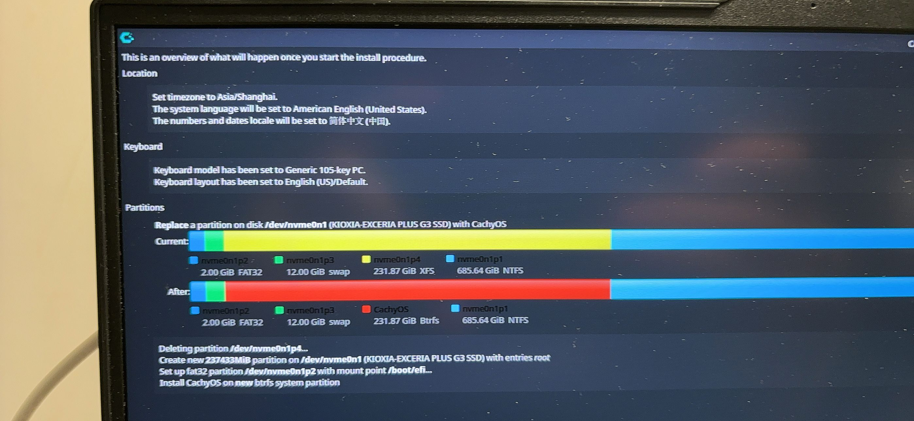

# Cachyos安装记录

## pre工作

在安装之前，先备份了重要数据，然后制作了Cachyos的启动U盘。我在官网[https://cachyos.org/download/](https://cachyos.org/download/)下载了最新的Cachyos ISO文件。

用wepe工具箱的硬盘管理删除了原来的ubuntu22分区，作为Cachyos的安装空间。

## 正式安装

从u盘启动，一路回车。进入启动页面，等一会就可以看见安装指导。

联网，然后结合[https://mirrors.ustc.edu.cn/help/cachyos.html](https://mirrors.ustc.edu.cn/help/cachyos.html)设置cachyos软件源。

```fish
# 在vim里打开
sudo  vim /etc/pacman.d/cachyos-mirrorlist
# 按i进入编辑模式，esc退出编辑模式，:进入命令模式，输入wq保存退出
# 顶部添加
Server = https://mirrors.ustc.edu.cn/cachyos/repo/$arch/$repo

sudo vim /etc/pacman.d/cachyos-v3-mirrorlist
# 顶部添加
Server = https://mirrors.ustc.edu.cn/cachyos/repo/$arch_v3/$repo

sudo vim /etc/pacman.d/cachyos-v4-mirrorlist
# 顶部添加
Server = https://mirrors.ustc.edu.cn/cachyos/repo/$arch_v4/$repo
```

改了之后新开一个终端

```fish
sudo pacman -Sy
```

这个相当于apt update，记住喵

## 准备分区

因为主包给cachyos留的空间目前是unallocated的状态，需要先分区。

cachyos有一个自带的分区工具Gparted

先分出1~2G作为EFI分区，格式化为FAT32

然后分出12G当swap，格式化成swap或者linux-swap

剩下的空间全部给/根分区，格式化成btrfs。（这个选啥无所谓，后面会覆盖掉）

检查一下：

```fish
sudo cfdisk /dev/nvme0n1
```

如果右边问题的话就delete然后重新设置就行。

## launch installation

然后就开始安装，bootloader选grub，比较通用。

键盘模式不改直接next

然后就到了最麻烦的分区，cachyos的分区比较友好，提供了四种分区方式，这里选择了replace partition那个，然后点击之前格式化成brtfs的分区作为/根分区，这里要把格式文件系统选成btrfs。

检查一下EFI system partition和swap分区有没有选错。

没选错就next。

然后选桌面，这里用比较简单的kde plasma。以后可以换桌面环境。

检查一下summary



然后就开始安装了，等一会就好了。

## 后续工作

### vscode

```fish
pacman -S visual-studio-code-bin
```

### QQ

用paru安装qq,paru是cachyos自带的一个AUR助手，不需要sudo,参数和pacman是完全通用的

```fish
sudo pacman -S paru

paru -S linuxqq
```

### clash 安装

一开始装的clash-verge,不能用，后来改成flclash，排查之后发现是防火墙的问题。

```fish
sudo vim /etc/pacman.conf
# 加入
https://mirrors.ustc.edu.cn/help/archlinuxcn.html

sudo pacman -Sy

sudo pacman -S archlinuxcn-keyring

sudo pacman -S  clash-verge-rev
```

-S就是apt install

```fish
sudo pacman -Rns clash-verge-rev
```

Rns删除的时候得注意一下有没有删多了

```fish
paru -S flclash-bin
```

然后防火墙放行

```fish
sudo ufw allow in on FLClash
sudo ufw allow out on FLClash
# 下面填监听端口
sudo ufw allow 7890
sudo ufw reload
```

### 保命快照

```fish
paru -S btrfs-assistant
sudo pacman -S grub-btrfs-support
```

下好之后进入btrfs assistant的设置，下面勾选snapper timeline enabled，取消勾选snapper cleanup enabled，保存并应用。

new一个快照，试试更新

```fish
sudo pacman -Syu
```

如果更新完有问题，重启进入grub菜单，选择btrfs snapshot，然后选择刚才new的快照就可以回滚了。

### libreoffice

```fish
pacman -S libreoffice-fresh libreoffice-fresh-zh-cn
```

### 输入法

选用了fcitx5

```fish
sudo pacman -S fcitx5-im fcitx5-chinese-addons
```

然后

```fish
sudo vim /etc/environment
# 添加

XMODIFIERS=@im=fcitx
GTK_IM_MODULE=fcitx
QT_IM_MODULE=fcitx
```

下好改好之后you need to go to "System Settings" -> "Virtual keyboard" and select "Fcitx 5" from it.

对于google chrome不能用输入法的问题：

```fish
vim ~/.config/chromium-flags.conf
# 添加
--enable-features=UseOzonePlatform 
--ozone-platform=wayland
--enable-wayland-ime
--wayland-text-input-version=3
```

对于libreoffice不能用输入法的问题：

```fish
sudo vim usr/bin/libreoffice

#加入
export GTK_IM_MODULE=fcitx
export QT_IM_MODULE=fcitx5
export XMODIFIERS=@im=fcitx
```

### nodejs

用fnm来管理nodejs版本

```fish
sudo paru -S fnm
fnm i 24
fnm use 24
```

如果报错：`We can't find the neccessary environment variables for fnm to replace the Node virsion`

```fish
sudo vim ~/.config/fish/conf.d/fnm.fish
# 添加
fnm env --use-on-cd --shell fish | source
```

就能用了。

```fish
getent passwd $(whoami) | cut -d: -f7
# 输出
/bin/fish
```
