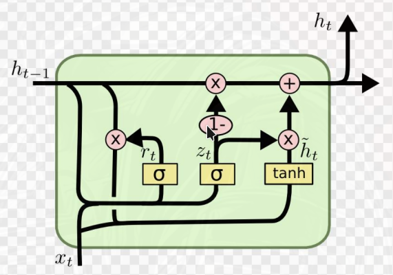
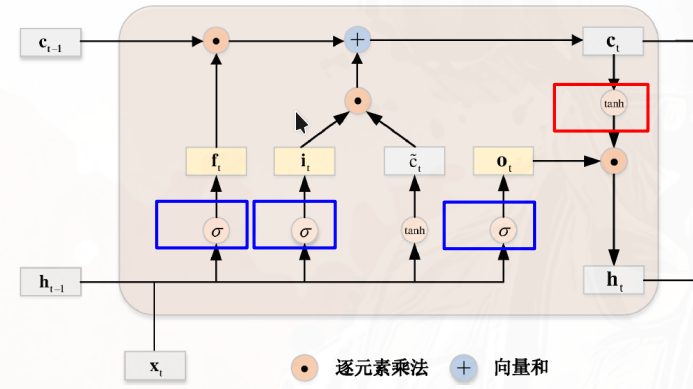

## 门

门：输出在 $[0,1]$ 之间的**向量**，用来对某种信息（某个向量）做逐元素缩放

如果把门的符号定义为 $g$，表示 sigmoid 函数

一般都是：

$$
g(\cdot) = \sigma(\cdot) = \frac{1}{1 + e^{-(\cdot)}}
$$

然后

输出=信息 $\odot g(\cdot)$

## GRU（Gated Recurrent Unit）门控循环单元

核心公式：在 **隐藏状态的更新** 中引入了两个门控机制：重置门 $r$（reset gate）和更新门 $z$（update gate）。

- 更新门 $z^{(t)} = \sigma(W_{xz} x^{(t)} + W_{hz} h^{(t-1)} + b_z)$ 决定了多少旧的隐藏状态需要保留

- 重置门 $r^{(t)} = \sigma(W_{xr} x^{(t)} + W_{hr} h^{(t-1)} + b_r)$ 决定了多少旧的隐藏状态需要被遗忘

- **候选**隐藏状态 $\tilde{h}^{(t)} = \tanh(W_{xh} x^{(t)} + W_{hh} (r^{(t)} \odot h^{(t-1)}) + b_h)$ 是 $t$ 时刻，重置门参与隐状态的更新，使用tanh非线性激活函数来确保候选隐状态中的值保持在区间 $[-1, 1]$ 之间

隐藏状态 $h^{(t)}$ 的更新公式为：

$$
h^{(t)} = z^{(t)} \odot h^{(t-1)} + (1 - z^{(t)}) \odot \tilde{h}^{(t)}
$$

这个公式决定了新的隐状态 $h^{(t)}$ 在多大程度上来自旧的状态 $h^{(t-1)}$ 和候选状态 $\tilde{h}^{(t)}$

语义：

- 当 $z^{(t)} \to 0$ 时，新的状态 $h^{(t)}$ 接近候选状态 $\tilde{h}^{(t)}$，意味着网络更倾向于使用新的信息 $x^{(t)}$，

- 完全等于0就表示和上一状态 $h^{(t-1)}$ 只存在非线性关系，完全接受新信息$x^{(t)}$，旧信息$h^{(t-1)}$ 的接受度由重置门 $r^{(t)}$ 决定
- 当 $z^{(t)} \to 1$ 时，新的状态 $h^{(t)}$ 接近旧的状态 $h^{(t-1)}$，意味着网络更倾向于保留旧的信息，来自 $x^{(t)}$ 的信息大部分被忽略，好像跳过了一部分时间步一样。
- 完全等于1就表示和上一状态 $h^{(t-1)}$ 只存在线性关系，完全忽略新信息$x^{(t)}$，旧信息$h^{(t-1)}$ 的接受度由重置门 $r^{(t)}$ 决定
- 当 $z^{(t)} = 0$，$r^{(t)} = 1$，GRU 网络则退化为简单循环
神经网络
- 当 $z^{(t)} = 0$，$r^{(t)} = 0$， GRU 网络退化为传统的前馈
神经网络

## LSTM（Long Short-Term Memory）长短期记忆网络

升级成三门机制：输入门（input gate）$i^{(t)}$、遗忘门（forget gate）$f^{(t)}$和输出门（output gate）$o^{(t)}$。

以及多了一个 **记忆单元**（cell state）$c^{(t)}$，用于存储 **长期记忆** 。（ps: $h$ 可以看作是短期记忆）

虽然引入了一个新的记忆单元，但只有隐状态会传递到输出层，而记忆单元完全属于内部信息。

- 输入门 $i^{(t)} = \sigma(W_{xi} x^{(t)} + W_{hi} h^{(t-1)} + b_i)$ 决定了多少新的信息需要被写入记忆单元
- 遗忘门 $f^{(t)} = \sigma(W_{xf} x^{(t)} + W_{hf} h^{(t-1)} + b_f)$ 决定了多少旧的信息需要被遗忘
- 输出门 $o^{(t)} = \sigma(W_{xo} x^{(t)} + W_{ho} h^{(t-1)} + b_o)$ 决定了多少记忆单元的信息需要被输出到隐藏状态
- 候选记忆单元 $\tilde{c}^{(t)} = \tanh(W_{xc} x^{(t)} + W_{hc} h^{(t-1)} + b_c)$ 是 $t$ 时刻，使用tanh非线性激活函数来确保候选记忆单元中的值保持在区间 $[-1, 1]$ 之间

**对于长期记忆**：记忆单元 $c^{(t)}$ 的更新公式为：

$$
c^{(t)} = f^{(t)} \odot c^{(t-1)} + i^{(t)} \odot \tilde{c}^{(t)}
$$

这个公式决定了新的记忆单元 $c^{(t)}$ 在多大程度上来自旧的记忆单元 $c^{(t-1)}$ 和候选记忆单元 $\tilde{c}^{(t)}$

语义：

- 当 $f^{(t)} \to 0$ 时，新的记忆单元 $c^{(t)}$ 接近候选记忆单元 $\tilde{c}^{(t)}$，意味着网络更倾向于使用新的信息 $x^{(t)}$，旧信息 $c^{(t-1)}$ 的接受度由遗忘门 $f^{(t)}$ 决定

- 当 $f^{(t)} \to 1$ 时，新的记忆单元 $c^{(t)}$ 接近旧的记忆单元 $c^{(t-1)}$，意味着网络更倾向于保留旧的信息，来自 $x^{(t)}$ 的信息大部分被忽略，好像跳过了一部分时间步
- 当 $i^{(t)} \to 0$ 时，新的记忆单元 $c^{(t)}$ 接近旧的记忆单元 $c^{(t-1)}$，意味着网络更倾向于保留旧的信息，来自 $x^{(t)}$ 的信息大部分被忽略，好像跳过了一部分时间步
- 当 $i^{(t)} \to 1$ 时，新的记忆单元 $c^{(t)}$ 接近候选记忆单元 $\tilde{c}^{(t)}$，意味着网络更倾向于使用新的信息 $x^{(t)}$，旧信息 $c^{(t-1)}$ 的接受度由遗忘门 $f^{(t)}$ 决定
- 当$f^{(t)} = 0$，$i^{(t)} = 1$ 时，记忆单元将历史信息清空，并将候选内部状态$\tilde{c}^{(t)}$写入
- 当$f^{(t)} = 1$，$i^{(t)} = 0$ 时，记忆单元将保留历史信息，并忽略候选内部状态$\tilde{c}^{(t)}$ 不写入新的信息

**对于短期记忆**：隐藏状态 $h^{(t)}$ 的更新公式为：

$$
h^{(t)} = o^{(t)} \odot \tanh(c^{(t)})
$$

这个公式决定了新的隐藏状态 $h^{(t)}$ 在多大程度上来自记忆单元 $c^{(t)}$，输出门 $o^{(t)}$ 控制着从记忆单元中输出多少信息到隐藏状态。

语义：

- 当 $o^{(t)} \to 1$ 时，新的隐藏状态 $h^{(t)}$ 接近 $\tanh(c^{(t)})$，意味着网络更倾向于将记忆单元$c^{(t)}$中的信息（长期记忆）传递给预测部分
- 当 $o^{(t)} \to 0$ 时，新的隐藏状态 $h^{(t)}$ 接近 0，只保留记忆单元$c^{(t)}$中的信息，而不将其传递给预测部分，相当于不更新隐状态。

### LSTM 变体1：peephole LSTM

peephole LSTM 是 LSTM 的一种变体，它在门控机制中引入了对 **上一时间步** 的**记忆单元** 状态的 **直接访问** 。

具体来说，peephole LSTM 在计算输入门、遗忘门和输出门时，会将记忆单元的状态 $c^{(t-1)}$ 作为额外的输入。

$$
i^{(t)} = \sigma(W_{xi} x^{(t)} + W_{hi} h^{(t-1)} + \boxed{W_{ci} c^{(t-1)}} + b_i)\\[1em]
f^{(t)} = \sigma(W_{xf} x^{(t)} + W_{hf} h^{(t-1)} + \boxed{W_{cf} c^{(t-1)}} + b_f)\\[1em]
o^{(t)} = \sigma(W_{xo} x^{(t)} + W_{ho} h^{(t-1)} + \boxed{W_{co} c^{(t-1)}} + b_o)
$$

这使得门控机制能够更好地利用长期记忆信息，从而提高模型的性能.

### LSTM 变体2：Coupled LSTM

耦合输入门和遗忘门的LSTM

在标准的LSTM中，输入门和遗忘门是独立的。然而，在Coupled LSTM中，这两个门被耦合在一起，使得它们共享相同的参数。这意味着，当输入门打开时，遗忘门会关闭，反之亦然。

$$
f^{(t)}=\sigma(W_{xf} x^{(t)} + W_{hf} h^{(t-1)} + b_f)\\[1em]
i^{(t)}=1-f^{(t)}
$$

记忆单元的更新公式变为：

$$
c^{(t)} = f^{(t)} \odot c^{(t-1)} + (1-f^{(t)}) \odot \tilde{c}^{(t)}
$$
