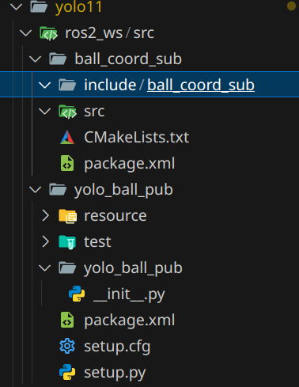

:::note
本文主要介绍ros2中的通讯机制，用于结营项目中python与C++的通讯
:::

## 安装

ROS2 Humble的安装参考这篇文章：[UbuntuCondaRos](../UbuntuCondaRos)

## 基本概念

1. 节点（Node）： 进程里的一个“角色”（比如“发布者”或“订阅者”）。

2. 话题（Topic）： 大喇叭频道，节点可以在上面发消息或收消息。

3. 消息（Message）： 话题里传的内容，有固定的字段结构。

4. 发布与订阅： Python 节点发布；C++ 节点订阅。

就这些，够用了。

## 创建工作空间

```bash
mkdir -p ~/ros2_ws/src
#-p参数表示如果上级目录（这里是ros2_ws）不存在就创建
cd ~/ros2_ws
```

## 新建包

```bash
cd ~/ros2_ws/src
#创建python发布包
ros2 pkg create yolo_ball_pub --build-type ament_python --dependencies rclpy geometry_msgs std_msgs
# yolo_ball_pub是包名，可以自己改
#创建C++订阅包
ros2 pkg create yolo_ball_sub --build-type ament_cmake --dependencies rclcpp geometry_msgs std_msgs
```

得到一个这样的目录结构：

```bash
ros2_ws/
└── src/
    ├── yolo_ball_pub/
    │   ├── package.xml
    │   ├── setup.cfg
    │   ├── setup.py
    │   └── yolo_ball_pub/
    │       └── __init__.py
    └── yolo_ball_sub/
        ├── CMakeLists.txt
        └── package.xml
```



## 编写发布节点

编辑`yolo_ball_pub/yolo_ball_pub/__init__.py`(init.py文件的名字可以随便改，节点代码主体在这里面)：

```python
import rclpy
from rclpy.node import Node
from geometry_msgs.msg import Point32
from std_msgs.msg import Float32
from ultralytics import YOLO
import cv2

class YoloBallPublisher(Node):
    def __init__(self):
        super().__init__('yolo_ball_publisher')
        self.declare_parameter('video_path', 'yolo_ball_pub/rgb.mp4')
        self.declare_parameter('model_path', 'v1.pt')
        self.declare_parameter('ball_class_id', 0)
        self.declare_parameter('conf_thresh', 0.7)

        self.pub_center = self.create_publisher(Point32, '/ball/center_px', 10)
        self.pub_width  = self.create_publisher(Float32, '/ball/width_px', 10)

        video_path = self.get_parameter('video_path').get_parameter_value().string_value
        model_path = self.get_parameter('model_path').get_parameter_value().string_value
        self.ball_cls = self.get_parameter('ball_class_id').get_parameter_value().integer_value
        self.conf = self.get_parameter('conf_thresh').get_parameter_value().double_value

        self.model = YOLO(model_path)
        self.cap = cv2.VideoCapture(video_path, cv2.CAP_FFMPEG)  # 使用 FFMPEG 后端打开视频

        fps = self.cap.get(cv2.CAP_PROP_FPS)
        period = 1.0 / fps if fps and fps > 0 else 0.03
        self.timer = self.create_timer(period, self.loop)
        
        if not self.cap.isOpened():
            self.get_logger().error(f"Failed to open video: {video_path}")
            self.destroy_node()
        return

    def loop(self):
        ok, frame = self.cap.read()
        if not ok:
            self.get_logger().info('Video ended.')
            self.destroy_node()  # 改为销毁节点，不直接 shutdown
            return

        results = self.model.track(frame, persist=True, conf=self.conf)
        if len(results) and results[0].boxes is not None:
            boxes = results[0].boxes
            xyxy = boxes.xyxy.cpu().numpy()
            clss = boxes.cls.cpu().numpy()
            confs = boxes.conf.cpu().numpy()

            # 取第一个篮球（简单起见）
            for i, box in enumerate(xyxy):
                if int(clss[i]) != self.ball_cls:
                    continue
                x1, y1, x2, y2 = map(float, box)
                cx = (x1 + x2) * 0.5
                cy = (y1 + y2) * 0.5
                w  = max(1.0, x2 - x1)

                msg_center = Point32(x=cx, y=cy, z=0.0)
                msg_width  = Float32(data=w)
                self.pub_center.publish(msg_center)
                self.pub_width.publish(msg_width)
                break  # 只发一个，保持简单
            # 可视化框
                cv2.rectangle(frame, (int(x1), int(y1)), (int(x2), int(y2)), (0,255,0), 2)
                cv2.circle(frame, (int(cx), int(cy)), 5, (0,0,255), -1)
                break

        # 显示图像窗口
        cv2.imshow("YOLO Tracking", frame)
        cv2.waitKey(1)

def main():
    rclpy.init()
    node = YoloBallPublisher()
    rclpy.spin(node)         # 等待节点运行直到被销毁
    rclpy.shutdown()         # 现在可以安全关闭 ROS
    cv2.destroyAllWindows()  # 关闭所有 OpenCV 窗口
```

这个节点会打开一个视频文件，使用YOLO模型检测篮球，并发布篮球的中心坐标和宽度。

默认生成的`setup.py`文件还没有配置好，需要修改，主要是`entry_points`部分：

```python
entry_points={
        'console_scripts': [
            'publisher = yolo_ball_pub.publisher:main',
        ],
    },
```

+ `publisher` 是运行节点时的命令名（可以改）

+ `yolo_ball_pub.publisher:main` 是 Python 模块路径 + 函数名，告诉 ROS 2 去哪里找入口

## 编写订阅节点

编辑`yolo_ball_sub/src/yolo_ball_sub.cpp`(注意文件位置)：

```cpp
#include <rclcpp/rclcpp.hpp>
#include <geometry_msgs/msg/point32.hpp>
#include <std_msgs/msg/float32.hpp>

class BallCoordSub : public rclcpp::Node {
public:
  BallCoordSub() : Node("ball_coord_sub") {
    sub_center_ = create_subscription<geometry_msgs::msg::Point32>(
      "/ball/center_px", 10,
      [this](const geometry_msgs::msg::Point32::SharedPtr msg){
        last_cx_ = msg->x; last_cy_ = msg->y; have_center_ = true;
        printIfReady();
      });

    sub_width_ = create_subscription<std_msgs::msg::Float32>(
      "/ball/width_px", 10,
      [this](const std_msgs::msg::Float32::SharedPtr msg){
        last_w_ = msg->data; have_width_ = true;
        printIfReady();
      });
  }

private:
  void printIfReady() {
    if (have_center_ && have_width_) {
      RCLCPP_INFO(this->get_logger(), "Pixel center=(%.1f, %.1f), width=%.1f",
                  last_cx_, last_cy_, last_w_);
      have_center_ = have_width_ = false; // 本次打印后清一次（简单节流）
    }
  }

  rclcpp::Subscription<geometry_msgs::msg::Point32>::SharedPtr sub_center_;
  rclcpp::Subscription<std_msgs::msg::Float32>::SharedPtr sub_width_;
  double last_cx_{0}, last_cy_{0}, last_w_{0};
  bool have_center_{false}, have_width_{false};
};

int main(int argc, char** argv) {
  rclcpp::init(argc, argv);
  rclcpp::spin(std::make_shared<BallCoordSub>());
  rclcpp::shutdown();
  return 0;
}
```

这个节点订阅两个话题，打印收到的篮球像素坐标和宽度。
然后修改`yolo_ball_sub/CMakeLists.txt`，

```cmake
cmake_minimum_required(VERSION 3.8)
project(ball_coord_sub)

find_package(ament_cmake REQUIRED)
find_package(rclcpp REQUIRED)
find_package(geometry_msgs REQUIRED)
find_package(std_msgs REQUIRED)

add_executable(subscriber src/subscriber.cpp)
ament_target_dependencies(subscriber rclcpp geometry_msgs std_msgs)
install(TARGETS subscriber DESTINATION lib/${PROJECT_NAME})

ament_package()
```

+ `subscriber` 是运行节点时的命令名

+ `src/subscriber.cpp` 是 C++ 源文件路径，告诉 ROS 2 去哪里找入口。

最后在`yolo_ball_sub/package.xml`中添加依赖：

```xml
<buildtool_depend>ament_cmake</buildtool_depend>
<depend>rclcpp</depend>
<depend>geometry_msgs</depend>
<depend>std_msgs</depend>
```

## 编译构建

python直接运行，cpp用cmake编译

运行（开两个终端，一个运行发布节点，一个运行订阅节点）：

看到 C++ 终端打印像素中心与宽度，说明通信打通。这里主包还没成功喵TAT
