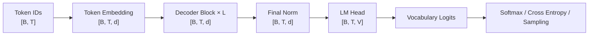

:::tip[本文定位]

上一篇[自回归语言模型](/posts/nlp/06-autoregressive-language-model/)解释了语言模型的概率目标：给定历史 Token，预测下一个 Token。

本文继续回答模型结构问题：**什么样的神经网络将一串 Token 转换为词表上的条件概率分布？** 重点是 Decoder-only Transformer 的整体结构和数据流。RoPE、RMSNorm、SwiGLU、GQA 与 KV Cache 只说明它们在结构中的位置，具体原理留到下一篇。

为便于对应 PyTorch，本文统一采用行优先张量布局：

$$
X\in\mathbb{R}^{B\times T\times d}
$$

其中 $B$ 是批次大小，$T$ 是序列长度，$d$ 是隐藏维度。

:::

## 1. Transformer 的三种架构范式

Transformer 不是某一个固定模型，而是一组以 Attention、前馈网络、残差连接和归一化为基础的架构。根据输入信息如何流动，可以划分为三种常见范式：

| 架构            | 注意力方式                                           | 输入与输出                        | 典型模型             |
| --------------- | ---------------------------------------------------- | --------------------------------- | -------------------- |
| Encoder-only    | 双向 Self-Attention                                  | 输入序列 $\rightarrow$ 上下文表示 | BERT、ViT            |
| Encoder-Decoder | Encoder 双向；Decoder 因果；两者之间 Cross-Attention | 源序列 $\rightarrow$ 目标序列     | 原始 Transformer、T5 |
| Decoder-only    | 因果 Self-Attention                                  | 一个序列持续向后生成              | GPT、LLaMA、MiniMind |

Encoder-only 模型允许每个位置同时访问左右两侧的 Token，适合分类、检索和序列标注等理解任务。Encoder-Decoder 模型先将源序列编码成表示，再由 Decoder 通过 Cross-Attention 读取这些表示，适合翻译、摘要等显式的序列到序列任务。

Decoder-only 模型只保留一条 Token 流。问题、上下文、回答都被拼接到同一序列中，模型始终执行同一个操作：

$$
P_\theta(x_t\mid x_{<t})
$$

它没有独立的 Encoder，也没有连接 Encoder 的 Cross-Attention。这里的“Decoder”表示采用因果信息流并执行自回归生成，不表示模型只能做简单的解码工作。经过多层因果 Self-Attention 后，每个位置仍会形成充分结合历史上下文的表示。

## 2. Decoder-only 的完整数据流

一个 Decoder-only 语言模型可以抽象为以下数据流：



设词表大小为 $V$，一个批次包含 $B$ 条序列，每条序列长度为 $T$。输入 Token ID 可以写成一个整数矩阵：

$$
I=[i_{b,t}]\in\mathbb{Z}^{B\times T},
\qquad 0\le i_{b,t}<V
$$

其中 $i_{b,t}$ 表示第 $b$ 条序列中第 $t$ 个 Token 的词表编号。

:::tip[例子]

例如，当 $B=2$、$T=4$ 时：

```text
I = [
  [1, 35, 102, 2],
  [1, 87,   9, 2]
]
```

矩阵形状是 $[2,4]$，每个元素都是 $0$ 到 $V-1$ 之间的整数。它们只是 Token ID，还不是连续向量。

:::

Embedding 层使用可训练矩阵 $E\in\mathbb{R}^{V\times d}$ 查表，得到初始隐藏状态：

$$
H^{(0)}=E[I]\in\mathbb{R}^{B\times T\times d}
$$

这里的“查表”就是把 Token ID 当作**行号**，从矩阵 $E$ 中取出对应的**一行**。对任意批次位置 $(b,t)$：

$$
H^{(0)}_{b,t,:}=E_{i_{b,t},:}
$$

:::tip[例子]

例如，假设词表大小 $V=5$、隐藏维度 $d=3$，Embedding 矩阵为：

$$
E=
\begin{bmatrix}
0.1&0.2&0.3\\
0.4&0.5&0.6\\
0.7&0.8&0.9\\
1.0&1.1&1.2\\
1.3&1.4&1.5
\end{bmatrix}
$$

输入 Token ID 为：

$$
I=
\begin{bmatrix}
1&3\\
2&1
\end{bmatrix}
$$

那么查表结果为：

$$
H^{(0)}=
\begin{bmatrix}
[0.4,0.5,0.6]&[1.0,1.1,1.2]\\
[0.7,0.8,0.9]&[0.4,0.5,0.6]
\end{bmatrix}
\in\mathbb{R}^{2\times2\times3}
$$

第一条序列中的 Token ID 依次是 1 和 3，所以分别取 $E$ 中行索引为 1 和 3 的向量；第二条序列同理。这里按程序习惯从第 0 行开始编号。

:::

从数学上看，用 ID 为 $v$ 的 one-hot 行向量 $\mathbf{e}_v\in\mathbb{R}^{1\times V}$ 左乘 $E$，也会得到同一个结果：

$$
\mathbf{e}_vE=E_{v,:}
$$

但工程上不需要真的构造长度为 $V$ 的 one-hot 向量，直接用整数索引取行更省内存、计算也更直接。在 PyTorch 中，<code>nn.Embedding(V, d)</code> 内部保存的可训练参数正是这个 $V\times d$ 矩阵。矩阵通常从随机值开始，反向传播时，本批次实际用到的 Token 对应行会获得梯度；同一个 Token 在批次中出现多次时，这些位置产生的梯度会累加到同一行。

经过 $L$ 个 Decoder Block：

$$
H^{(\ell+1)}
=
\operatorname{Block}_{\ell}\left(H^{(\ell)}\right),
\qquad \ell=0,1,\ldots,L-1
$$

最终隐藏状态经过归一化和语言模型输出层：

$$
Z
=
\operatorname{LMHead}\left(\operatorname{Norm}(H^{(L)})\right)
\in\mathbb{R}^{B\times T\times V}
$$

$Z$ 就是上一篇文章中的 logits。它为批次中每个样本、序列中每个位置、词表中每个 Token 分别给出一个未归一化分数。

这条数据流有两个值得注意的特点。

- 第一，Transformer Block 前后的形状始终保持 $[B,T,d]$，因此可以重复堆叠。
- 第二，LM Head 只在最后把隐藏维度 $d$ 投影到词表维度 $V$，模型中间层并不直接处理词表概率。

## 3. Causal Self-Attention

普通 Self-Attention 的 Query、Key 和 Value 都来自同一个输入序列。具体计算已经在[Self-Attention 笔记](/posts/transformer/Trasformer-Attetion/)中展开，这里只补充 Decoder-only 特有的因果约束。

设注意力头数为 $h$，每个头的维度为 $d_h=d/h$。线性投影并拆分多头后：

$$
Q,K,V\in\mathbb{R}^{B\times h\times T\times d_h}
$$

Decoder-only Attention 在缩放点积中加入因果掩码 $M$：

$$
A
=
\operatorname{softmax}
\left(
\frac{QK^\top}{\sqrt{d_h}}+M
\right)
$$

其中：

$$
M_{ij}
=
\begin{cases}
0,&j\le i\\
-\infty,&j>i
\end{cases}
$$

当序列长度为 4 时，掩码可以写成：

$$
M=
\begin{bmatrix}
0&-\infty&-\infty&-\infty\\
0&0&-\infty&-\infty\\
0&0&0&-\infty\\
0&0&0&0
\end{bmatrix}
$$

Softmax 之后，$-\infty$ 对应位置的权重变为 0，因此第 $i$ 个位置不能读取 $j>i$ 的未来信息。注意力输出为：

$$
O=AV
$$

因果掩码约束的是“一个位置可以访问哪些位置”，并不会强迫训练程序逐 Token 循环。训练数据中的整段序列已经给定，所以所有位置的 $QK^\top$ 仍然可以一次性并行计算。

因果掩码和 Padding Mask 也需要区分。Causal Mask 防止看到未来 Token；Padding Mask 则用于忽略为了批处理而补齐的 PAD Token。两者可能同时加入 Attention Score，但解决的是不同问题。

## 4. Decoder Block 与残差路径

一个现代 Decoder Block 通常由两个子层组成：Causal Self-Attention 负责在序列位置之间交换信息，FFN 负责对每个位置的特征进行非线性变换。

以 Pre-Norm 结构为例，一个 Block 可以写成：

$$
\begin{aligned}
U^{(\ell)}
&=
H^{(\ell)}
+
\operatorname{Attention}
\left(
\operatorname{Norm}_1(H^{(\ell)})
\right)\\
H^{(\ell+1)}
&=
U^{(\ell)}
+
\operatorname{FFN}
\left(
\operatorname{Norm}_2(U^{(\ell)})
\right)
\end{aligned}
$$

对应的数据流是：

~~~text
H
├─ Norm → Causal Self-Attention ─┐
└─────────────────────────────────+→ U

U
├─ Norm → FFN ───────────────────┐
└────────────────────────────────+→ H_next
~~~

残差连接使每个子层只需要学习对当前表示的增量，同时为梯度提供直接传播路径；Pre-Norm 则先稳定子层输入，再执行 Attention 或 FFN。相关细节可以回看 [Add & Norm](/posts/transformer/Trasformer-OtherPartsInEncoder-AddAndNorm/) 和 [FFN](/posts/transformer/Trasformer-OtherPartsInEncoder-FFN/)。

与原始 Transformer Decoder 相比，这个 Block 没有 Cross-Attention 子层，因为 Decoder-only 模型不存在单独的 Encoder 输出。所有条件信息都已经作为前缀 Token 放进同一条序列，由 Causal Self-Attention 读取。

## 5. Token Embedding 与 LM Head

输入端的 Token Embedding 本质上是一张可训练查找表：

$$
E\in\mathbb{R}^{V\times d}
$$

Token ID 为 $v$ 时，模型取出第 $v$ 行 $E_v$ 作为初始表示。由于 Self-Attention 本身不感知顺序，模型还必须注入位置信息。原始 Transformer 将正弦位置编码直接加到 Token Embedding 上；现代 Decoder-only 模型常用 RoPE，在生成 Query 和 Key 后再施加旋转。两者都提供位置信号，但介入模型的位置不同。

经过所有 Decoder Block 后，第 $t$ 个位置得到隐藏状态：

$$
h_t\in\mathbb{R}^{d}
$$

LM Head 使用输出矩阵 $W_{\mathrm{out}}\in\mathbb{R}^{V\times d}$ 将它投影到词表：

$$
z_t=W_{\mathrm{out}}h_t\in\mathbb{R}^{V}
$$

其中第 $v$ 个分量表示 Token $v$ 在当前位置的 logit。Softmax 将这些 logits 转成下一个 Token 的条件概率。

许多语言模型会使用 Weight Tying：

$$
W_{\mathrm{out}}=E
$$

输入 Embedding 和输出 LM Head 因而共享同一组 $Vd$ 参数。这样不仅减少了一个词表投影矩阵，也让“如何表示一个 Token”和“如何判断一个 Token 应该被输出”处在同一个向量空间中。Weight Tying 是常见设计，但不是 Decoder-only 架构成立的必要条件。

## 6. 训练前向与自回归生成

训练时输入完整序列，模型一次产生全部位置的 logits：

$$
[B,T]\longrightarrow[B,T,d]\longrightarrow[B,T,V]
$$

随后把 logits 与向右错位一位的标签计算交叉熵：

~~~text
input_ids：[我, 喜欢, 学习, 人工]
labels：   [喜欢, 学习, 人工, 智能]
~~~

这正是 Teacher Forcing：真实历史 Token 已经给定，Causal Mask 又保证每个位置不能看到未来，因此一次前向传播就能计算整段序列的 Next-Token Prediction loss。

推理时没有真实后续 Token，模型只使用最后一个有效位置的 logits 选择下一个 Token，再把结果追加回输入：

~~~text
prompt
  → next token
  → prompt + next token
  → next token
  → ...
~~~

| 维度           | 训练             | 推理                         |
| -------------- | ---------------- | ---------------------------- |
| 输入历史       | 真实 Token       | 模型已经生成的 Token         |
| 使用的 logits  | 通常使用所有位置 | 通常只使用最后一个位置       |
| 序列位置并行   | 可以             | 自回归依赖下通常不可以       |
| 是否计算梯度   | 是               | 否                           |
| Attention 计算 | 整段序列         | 可通过 KV Cache 复用历史 K/V |

KV Cache 不会改变模型概率，只是避免每生成一个 Token 都重新计算全部历史 Token 的 Key 和 Value。它属于推理优化，将在现代 LLM 组件文章中单独展开。

## 7. 张量形状与参数组成

沿着一次前向传播，各张量的形状可以归纳为：

| 位置                | 张量         | 形状          |
| ------------------- | ------------ | ------------- |
| Token IDs           | $I$          | $[B,T]$       |
| Token Embedding     | $H^{(0)}$    | $[B,T,d]$     |
| Q/K/V（拆分多头后） | $Q,K,V$      | $[B,h,T,d_h]$ |
| Attention Score     | $QK^\top$    | $[B,h,T,T]$   |
| Block 输出          | $H^{(\ell)}$ | $[B,T,d]$     |
| LM Head 输出        | $Z$          | $[B,T,V]$     |

如果暂时忽略 bias、Norm 和现代 Attention 变体，标准多头注意力中的 $Q$、$K$、$V$、$O$ 四个投影矩阵大约包含：

$$
4d^2
$$

个参数。两层 FFN 大约包含：

$$
2dd_{\mathrm{ff}}
$$

个参数。因此单个标准 Transformer Block 的主要参数量近似为：

$$
N_{\mathrm{block}}
\approx
4d^2+2dd_{\mathrm{ff}}
$$

当 $d_{\mathrm{ff}}=4d$ 时：

$$
N_{\mathrm{block}}\approx12d^2
$$

此外，Token Embedding 需要 $Vd$ 个参数；如果 LM Head 不共享权重，还要再增加 $Vd$。这解释了为什么小模型对词表大小尤其敏感：隐藏维度和层数较小时，Embedding 与 LM Head 可能占据相当高的参数比例。

参数量与计算量并不是一回事。标准 Self-Attention 需要构造 $T\times T$ 的注意力得分，序列长度相关复杂度约为 $O(T^2d)$；FFN 的主要复杂度约为 $O(Tdd_{\mathrm{ff}})$。上下文变长时，Attention 的二次项会逐渐成为计算和显存瓶颈。

## 8. MiniMind 结构映射

MiniMind 的模型实现遵循上述 Decoder-only 主线。通用概念与本地代码的对应关系如下：

| 通用结构              | MiniMind 对应实现                                        |
| --------------------- | -------------------------------------------------------- |
| 模型配置              | <code>MiniMindConfig</code>                              |
| Token Embedding       | <code>MiniMindModel.embed_tokens</code>                  |
| Decoder Block         | <code>MiniMindBlock</code>                               |
| Causal Self-Attention | <code>Attention</code>，其中 <code>is_causal=True</code> |
| FFN                   | <code>FeedForward</code>                                 |
| Block 堆叠            | <code>MiniMindModel.layers</code>                        |
| Final Norm            | <code>MiniMindModel.norm</code>                          |
| LM Head               | <code>MiniMindForCausalLM.lm_head</code>                 |
| Weight Tying          | <code>tie_word_embeddings</code>                         |

MiniMind 在通用骨架上采用了 RoPE、RMSNorm、SwiGLU、GQA、Q/K Norm、Flash Attention 和 KV Cache 等现代组件。这些部件改变具体计算方式或效率，但不改变主干数据流：

~~~text
Token IDs
→ Embedding
→ Decoder Block × L
→ Final Norm
→ LM Head
→ Vocabulary Logits
~~~


## 9. 现代组件边界与后续路线

从原始 Transformer 到现代 LLM，Decoder-only 骨架保持稳定，常见变化集中在内部组件：

| 通用组件              | 现代常见实现    | 主要作用                  |
| --------------------- | --------------- | ------------------------- |
| LayerNorm             | RMSNorm         | 简化归一化并提高计算效率  |
| 绝对位置编码          | RoPE            | 在 Q/K 中表达相对位置信息 |
| Multi-Head Attention  | GQA / MQA       | 减少 K/V 参数和推理缓存   |
| ReLU/GELU FFN         | SwiGLU          | 引入门控，提高表达能力    |
| 普通 Attention Kernel | Flash Attention | 减少显存访问并提高速度    |
| 重复计算历史 K/V      | KV Cache        | 加速自回归生成            |

理解本文后，应能够沿着输入张量回答三个问题：当前张量是什么形状、下一个模块改变了哪个维度、这个位置是否可能读取未来信息。

还需要保持几个概念边界：Decoder-only 不等于没有上下文表示；Causal Mask 只禁止访问未来，不禁止访问历史；Transformer Block 输出的是隐藏状态，不是 Token；真正将隐藏状态变成词表 logits 的是 LM Head；因果结构不会妨碍训练并行，但会使自由生成具有逐 Token 依赖。

下一篇将进入这些现代组件的具体原理：

> 下一篇：现代 LLM 组件——RoPE、RMSNorm、SwiGLU、GQA 与 KV Cache。
