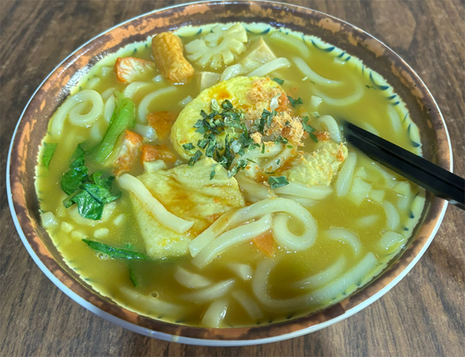
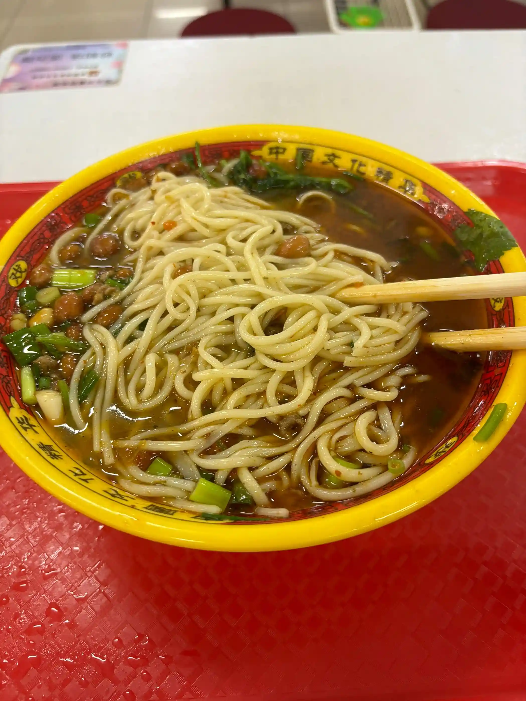
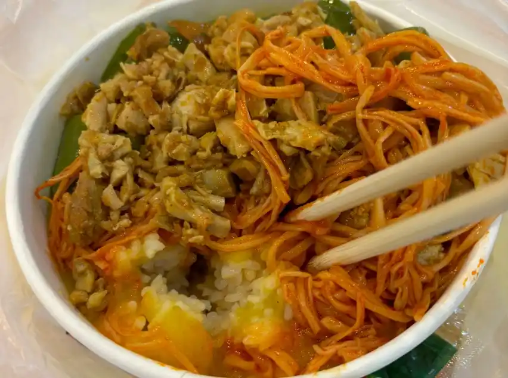
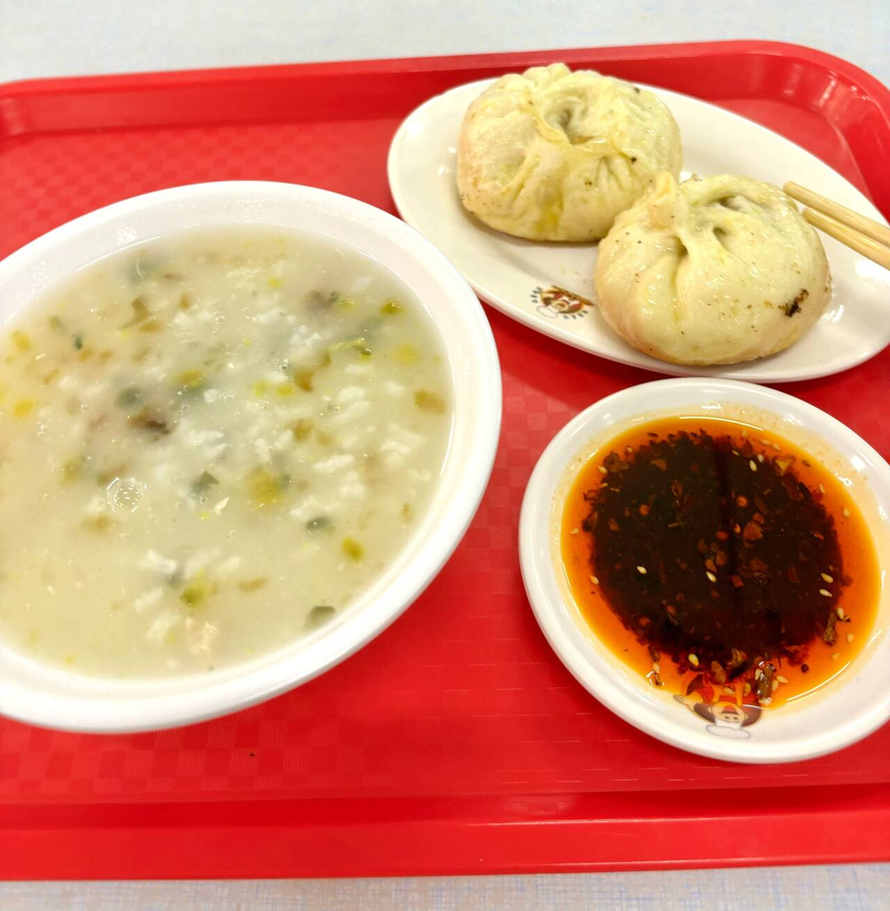
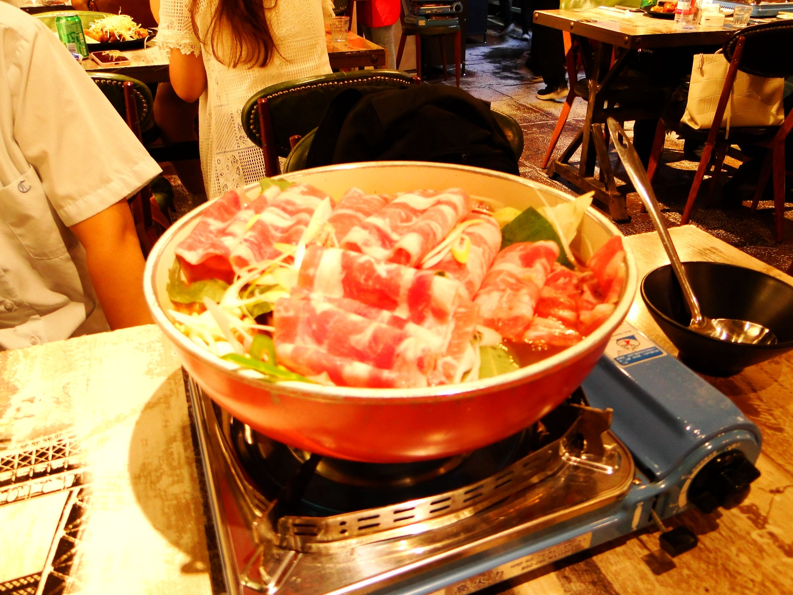
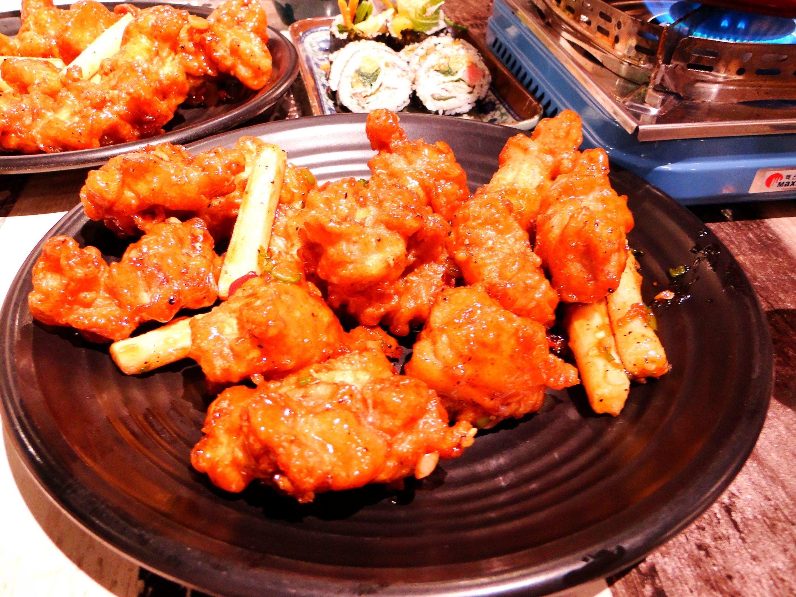
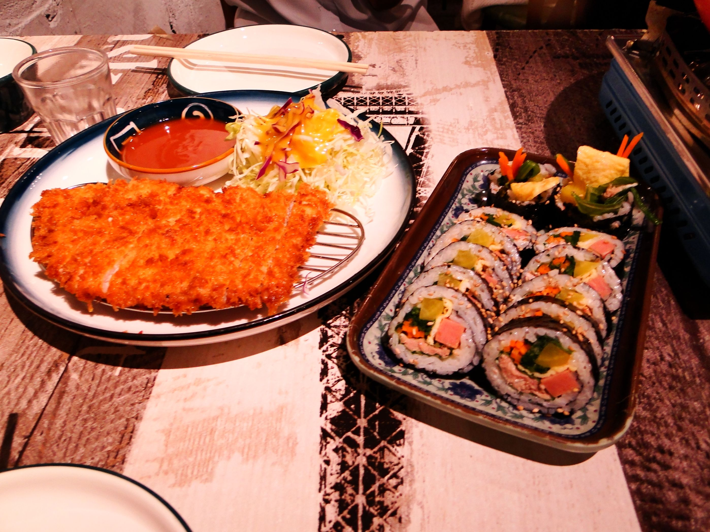

:::warning
一切评价，皆出自个人舌尖之见。味觉这件事，众口难调。主包的胃袋小，分量在别人眼里或许并不算多。请量力点餐，不必浪费。
:::

### 2025.9.1 鸡排饭

~~其实是忘记拍照了~~

位置：工大校园里的家属院飞地里面一家小店，沿着快递站那条路从A01出发往快递站方向走，可以隔着栅栏看见招牌，出门后右拐进入停车场，在一棵大树附近有招牌，往里走就能看见入口。

店面不大，装修倒别有一番风味，后面可能会出专门内饰的照片。

店里主要是日式料理为主，所以做法比较清淡

价格：15

分量：感觉挺多的，我差点没吃完

味道：鸡排炸的比较酥脆，口味比较清淡，吃惯了外面重口炸鸡排的可能会失望。辣度不够$^\text{注}$（个人觉得）当时点的是要辣椒的，但是没有想象中的辣，只有几个辣椒吃起来有辣味，也是当下饭的炫了，整体感觉偏甜口一点，适合不能吃辣的人。配菜不是很多，单吃的话会有点单调，建议配上别的小食之类一起吃。

这家店开在校园边上的小角落里，爬满绿植的铁丝墙掩映着五彩的招牌，装修颇有上世纪风味，显得时光悠长，上菜的时间也是。

### 2025.9.2 咖喱鸡柳面

虽然说这个汤的颜色在镜头下有点诡异，但是实物看上去还是相当有食欲的

位置：同上

价格：18

分量：挺大一碗，爽食之，吃完七八分饱。

味道：面是粗的手擀面条，吃起来很爽。配菜丰富，有鱼豆腐，蛋饺还有小香肠，可以吃一口面捞一口配菜进行一个永动的进食。整体口味比较平和，典型的日式拉面风格。不咸不辣，也不至于寡淡。比较偏甜口。吃完面的时候汤还是热的，味道不错，浓浓的，可惜吃的有点饱了喝不了几口。

### 2025.9.3 重庆小面

位置：学苑楼一楼，进门窗口从右往左数第二个

周三的早八是悲惨的，但食堂的重庆小面是香的；

军训时的军爷是饥饿的，但食堂的重庆小面人很少；

吃完人心情是好的。

价格：8元

分量：作为早餐刚刚好

味道：刚进学苑楼就被排队到门口的军爷吓了一跳，一看之前吃过的粥铺和包子窗口都有人排队了，于是斗胆尝试一下这家。细面条，不是碱面，口感很劲。重庆小面居然能不辣，只是味道厚重，咸鲜。面刚出锅也不烫，适合赶早八的时候吃。嗦面喝汤，丝滑顺溜，全部造了。:yum:

### 2025.9.3 土豆泥烤肉拌饭

有一说一这个名字还是相当的猎奇。（如果不是从正心十楼走楼梯到一楼谁会尝试）

价格：13

分量：碳水配碳水，已经没有分量什么事了

二校区天香食堂二楼烤肉拌饭的权威性在这里再度得到了证明。这个烤肉干巴到嚼一口就能吸干身体水分。我不禁想念二校区天天中午吃饭不用选择的日子。尽管如此，这份饭还是可圈可点的，首先他在价格上略胜于二校区，完胜于一小区食堂的的大部分拌饭类，此乃一胜；再者配菜我选的金针菇加尖椒，金针菇是百分百零食拆包，没有一丝二次烹饪痕迹，纯正的小零食味道，尖椒在下饭和保证维生素摄入这一块还是权威的，此乃二胜；令人惊喜的是土豆泥和米饭的搭配竟然没有想象中的那么猎奇，实话说，还挺好吃，土豆泥的软糯里夹杂米饭的颗粒分明，一口下去碳水的感觉带给身体十分的满足，回到寝室直接晕碳免去午休入睡难的困扰，此乃三胜。
但是，它终究不是二校区的烤肉拌饭。

### 2025.9.4 生煎

早餐里难得的选择，给到夯。

### 2025.9.6

放纵餐这一块

店名：猫头鹰炸鸡。藏在居民楼里的一家小店，地点比较隐蔽，可以从工大西苑餐厅的那个门出来，沿着法院街走街边右手边第一个小区进去就是。

图片高饱和是因为主包相机忘调白平衡和鲜明度了，糊是因为对焦没对上（

价格：191，

**分量很足**。

小店不大，却热闹。店主是个会说中文的韩国人，菜也带着浓浓的韩式风味。

此行一共3人，点了一份火锅，两种口味的炸鸡（香辣和蒜香）炸猪排和金枪鱼饭卷，一瓶可乐以及一瓶啤酒。菜除了寿司都是偏甜口的，但没有想象中的腻。炸鸡是最好，壳酥，肉嫩，口感丰富，表面是一层薄糖浆，再是一层脆酥皮，再往里才能咬到体现炸鸡本味的鸡肉。甜里带辣，酥里透嫩。（两种口味在外观上没有区别，吃到肉时才有分明。）与炸鸡同盘的炸年糕也不容小觑，可惜太占肚子不能多食。火锅，饭卷，猪排倒在其次。猪排炸得很脆，配的酱是甜口，有点上头。

有时候饭要一口酒一口肉一句话的吃才有意思。

### 2024.??.??

这顿饭忽然使我忆起去年某月某日的一顿烤肉，亦是深藏于居民楼之中，店小人多，同一批人，吃得甚爽，
